# Setup Details

## Hardware

The host is a Raspberry Pi 3 with class 10 SD card installed in a plastic case
for basic protection. It's powered through an on/off switch with a 2.5A/5V
power supply on a battery-backed UPS outlet.

* direct ethernet connection to the wifi router (not through a switch that could 
  potentially lose power)
* uninterruptible power supply (UPS) must be connected via USB


----

## Operating System

The operating system choice is [Ubuntu Mate](https://ubuntu-mate.org) because
the Mate desktop is intuitive for our user base. 

> As of mid-October 2018, the latest release for Raspberry Pi 3 is 16.04.2 
> (Xenial) *but* the 18.04 LTS release can be downloaded through standard 
> channels (covered later).

### Expand `/root` filesystem

After burning the image to disc and *before* first boot, use another computer
that has *gparted* installed to double the size of the system partition (`/boot`).
This ensures we have enough room to cache update packages. 

> This step is necessary for sufficient room to upgrade to 18.04 LTS.

1. TODO


### Installation Wizard

On first boot, complete the installation wizard questions. The user you create
here will be the administrator account for the machine. 

When prompted for login type, choose to *automatically login without entering
a password*.

### System Upgrades

On (next) first boot, apply system updates then reboot:
```
sudo apt update
sudo apt dist-upgrade -y
...
sudo reboot
```

When you're ready, trigger the update to 18.04 LTS:
```
sudo do-release-upgrade
```

### Boot Options

The server is intended for headless operation so to preserve system resources, 
have the computer boot into a terminal instead of the graphical desktop. 

> To start the desktop from the command line, run `startx`.
> 
> Graphical (virtual) desktops will be automatically be created for VNC users.

Use *raspi-config* to change the default boot type:
```
sudo raspi-config
```
```
Boot Options -> Desktop / CLI -> Console Text
```

Before exiting, trigger the *raspi-config* internal update tool. 

### Enable SSH Server

If you haven't yet, enable the SSH service using *raspi-config* or *systemctl*:
```
sudo systemctl enable sshd.service
sudo systemctl start sshd.service
```

Then add some keys to `~/.ssh/authorized_keys` and disable password login:
```
sudo nano /etc/sshd_config
```
```diff
 # Change to no to disable tunnelled clear text passwords
-#PasswordAuthentication yes
+PasswordAuthentication no
```

### Enable persistent system logs

Ensure *systemd* keeps logs after reboots by creating log directory:
```
sudo mkdir -p /var/log/journal
```

### Enable the firewall

Ref: <https://www.digitalocean.com/community/tutorials/how-to-setup-a-firewall-with-ufw-on-an-ubuntu-and-debian-cloud-server> 

Set to manually installed:
```
sudo apt install ufw
```

Then apply some default rules:
```
sudo ufw default deny incoming
sudo ufw default allow outgoing
sudo ufw allow ssh

```

As other programs get installed, allow them through too:

| Description | Rule |
|-------------|------|
| VPN server (*ocserv*)         | `allow https` |
| email relay (*postfix*)       | `allow smtp`  |
| VNC server (*tightvncserver*) | 5901/tcp? |
| network UPS tools (*nut*)     | 3493 |

* probably need to enable 443/udp for *ocserv*?

### Fix the `popularity-contest` package

Ubuntu Mate currently has an annoying configuration problem: the file 
`/etc/popularity-contest.conf` is missing so *cron* will send error reports.
To fix it, re-run the package configuration (we chose *Yes* to participate) 
[[ref](http://usefulramblings.org/?page_id=6705)]:
```
sudo dpkg-reconfigure popularity-contest
```

### Fix the default browser issue

Ubuntu Mate also includes a configuration of *Firefox* that crashes in a loop.
Uninstall it and install *Chromium* instead:
```
sudo apt autoremove firefox -y
sudo apt install chromium-browser -y
```

### Fix the *cups-filters* package

By default, an error in the *cups-filters* package configuration will prevent
the *systemd-modules-load.service* from successfully loading. To fix, remove
kernel modules supporting the LP printer port (nonexistent on Raspberry Pi 3).

Resources:
* https://discourse.osmc.tv/t/failed-to-start-load-kernel-modules/3163/13
* https://www.raspberrypi.org/forums/viewtopic.php?p=949249
* https://askubuntu.com/questions/795360/kernel-load-module-error-during-boot-up/795421#795421

Procedure: remove config file, update defaults, then re-install package.
```
sudo rm /etc/modules-load.d/cups-filters.conf
sudo nano /etc/defaults/cups
```
```
LOAD_LP_MODULE=no
```
```
sudo apt install --reinstall cups-filters
sudo reboot
```

Verify service starts okay now:
```
lar@dmz:~$ sudo systemctl status systemd-modules-load.service
● systemd-modules-load.service - Load Kernel Modules
   Loaded: loaded (/lib/systemd/system/systemd-modules-load.service; static; vendor preset: enabled)
   Active: active (exited) since Sun 2018-01-28 07:58:19 PST; 9 months 2 days ago
     Docs: man:systemd-modules-load.service(8)
           man:modules-load.d(5)
  Process: 101 ExecStart=/lib/systemd/systemd-modules-load (code=exited, status=0/SUCCESS)
 Main PID: 101 (code=exited, status=0/SUCCESS)

Jan 28 07:58:19 dmz systemd-modules-load[101]: Inserted module 'bcm2835_v4l2'
Jan 28 07:58:19 dmz systemd-modules-load[101]: Inserted module 'i2c_dev'
Jan 28 07:58:19 dmz systemd-modules-load[101]: Inserted module 'snd_bcm2835'
Jan 28 07:58:19 dmz systemd[1]: Started Load Kernel Modules.
```

### Remove defunct packages

The following packages are not functional, but are still included with Ubuntu
Mate 18.04 LTS. (*Sources indicate this package will be removed in 18.10 and
this procedure will be unnecessary [[ref1](https://launchpad.net/ubuntu/+source/ubuntu-meta),
[ref2](https://askubuntu.com/a/1087007/227779)]*)

```
sudo apt autoremove ureadahead
```

> This will resolve issues with the `ureadahead.service` failing to load.


### Remove unnecessary packages

These packages won't be useful to support the Research Van, and we don't want
to consume bandwidth with potential updates for nothing. Just uninstall them:
```
sudo apt autoremove scratch minecraft-pi thunderbird youtube-dl youtube-dlg sonic-pi brasero rhythmbox qjackctl sense-emu-tools pidgin hexchat ubuntu-mate-welcome
```

### Install other useful packages

Add ability to connect back to WSU VPN (Cisco AnyConnect protocol):
```
sudo apt install network-manager-openconnect-gnome -y
```


### Other things to look into:

#### Screensaver issue

Somehow lost keyboard/mouse input on primary/local (HDMI) display...

Had started by troubleshooting why display blanked out even though screensaver
was disabled... looks like it's power management.

* https://ubuntu-mate.community/t/mate-screensaver-stops-keyboard-from-working/16800/12


To wake up display from console (one-liner did *not* work) [[ref](https://raspberrypi.stackexchange.com/a/48285/54372)]:
```
export DISPLAY=:0
xset s reset
```


**2018-11-01** - found display is still soft-blanked (on, but black, but clearly
has backlighting active). observe through `htop` that `mate-screensaver` has
absurd walltime:

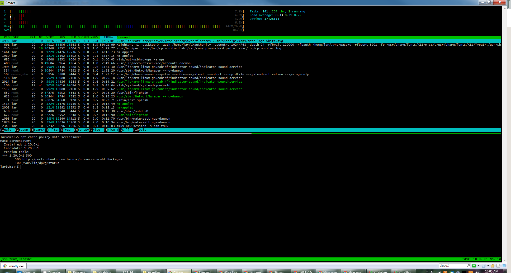

Computer ignores wireless keyboard/mouse combo, wired keyboard and wired mouse.
Switching SD card into another Raspberry Pi does not resolve issue.

Opened forum post about the issue: https://ubuntu-mate.community/t/keyboard-mouse-locked-out-of-local-session/18161


**2018-11-05** - revisiting this issue because was using `rpi-update` incorrectly.

Current situation:
```
lar@dmz:~$ uname -a
Linux dmz 4.14.77-v7+ #1154 SMP Fri Oct 19 16:01:02 BST 2018 armv7l armv7l armv7l GNU/Linux
lar@dmz:~$ lsb_release -a
No LSB modules are available.
Distributor ID: Ubuntu
Description:    Ubuntu 18.04.1 LTS
Release:        18.04
Codename:       bionic
lar@dmz:~$ apt-cache policy ocserv
ocserv:
  Installed: 0.11.9-1build1
  Candidate: 0.11.9-1build1
  Version table:
 *** 0.11.9-1build1 500
        500 http://ports.ubuntu.com bionic/universe armhf Packages
        100 /var/lib/dpkg/status
lar@dmz:~$
```

Going to [re-install Raspberry Pi firmware](https://raspberrypi.stackexchange.com/questions/4355/do-i-still-need-rpi-update-if-i-am-using-the-latest-version-of-raspbian/7302#7302)...
```
sudo apt-get install --reinstall raspberrypi-bootloader raspberrypi-kernel
```
...fails:
```
lar@dmz:~$ sudo apt-get install --reinstall raspberrypi-bootloader raspberrypi-kernel
Reading package lists... Done
Building dependency tree
Reading state information... Done
Reinstallation of raspberrypi-bootloader is not possible, it cannot be downloaded.
Reinstallation of raspberrypi-kernel is not possible, it cannot be downloaded.
0 upgraded, 0 newly installed, 0 to remove and 0 not upgraded.
lar@dmz:~$ sudo apt-get install -f --reinstall raspberrypi-bootloader raspberrypi-kernel
Reading package lists... Done
Building dependency tree
Reading state information... Done
Reinstallation of raspberrypi-bootloader is not possible, it cannot be downloaded.
Reinstallation of raspberrypi-kernel is not possible, it cannot be downloaded.
0 upgraded, 0 newly installed, 0 to remove and 0 not upgraded.
lar@dmz:~$ sudo apt-get install --reinstall raspberrypi-bootloader/bionic raspberrypi-kernel/bionic
Reading package lists... Done
Building dependency tree
Reading state information... Done
E: Release 'bionic' for 'raspberrypi-bootloader' was not found
E: Release 'bionic' for 'raspberrypi-kernel' was not found
lar@dmz:~$ apt-cache policy raspberrypi-bootloader
raspberrypi-bootloader:
  Installed: 1.20161215-1~xenial1.0
  Candidate: 1.20161215-1~xenial1.0
  Version table:
 *** 1.20161215-1~xenial1.0 100
        100 /var/lib/dpkg/status
lar@dmz:~$ apt-cache policy raspberrypi-kernel
raspberrypi-kernel:
  Installed: 1.20161215-1~xenial1.0
  Candidate: 1.20161215-1~xenial1.0
  Version table:
 *** 1.20161215-1~xenial1.0 100
        100 /var/lib/dpkg/status
lar@dmz:~$ sudo apt-get install --reinstall raspberrypi-bootloader/xenial raspberrypi-kernel/xenial --dry-run
Reading package lists... Done
Building dependency tree
Reading state information... Done
E: Release 'xenial' for 'raspberrypi-bootloader' was not found
E: Release 'xenial' for 'raspberrypi-kernel' was not found
lar@dmz:~$
```

Try updating to bleeding edge: `sudo rpi-update`...  
Updated successfully to 4.17.79+: `2267b322afdb18b4abf9603fea836916190b1b5d`

Rebooted... no change: still cannot control keyboard or mouse, but VNC session
works OK. Produces following output when Logitech wireless mouse plugged in:
```
[  148.340201] usb 1-1.5: new full-speed USB device number 5 using dwc_otg
[  148.475087] usb 1-1.5: New USB device found, idVendor=046d, idProduct=c534
[  148.475103] usb 1-1.5: New USB device strings: Mfr=1, Product=2, SerialNumber=0
[  148.475112] usb 1-1.5: Product: USB Receiver
[  148.475121] usb 1-1.5: Manufacturer: Logitech
[  148.481281] input: Logitech USB Receiver as /devices/platform/soc/3f980000.usb/usb1/1-1/1-1.5/1-1.5:1.0/0003:046D:C534.0005/input/input1
[  148.551483] hid-generic 0003:046D:C534.0005: input,hidraw2: USB HID v1.11 Keyboard [Logitech USB Receiver] on usb-3f980000.usb-1.5/input0
[  148.559288] input: Logitech USB Receiver as /devices/platform/soc/3f980000.usb/usb1/1-1/1-1.5/1-1.5:1.1/0003:046D:C534.0006/input/input2
[  148.621036] hid-generic 0003:046D:C534.0006: input,hiddev97,hidraw3: USB HID v1.11 Mouse [Logitech USB Receiver] on usb-3f980000.usb-1.5/input1
```

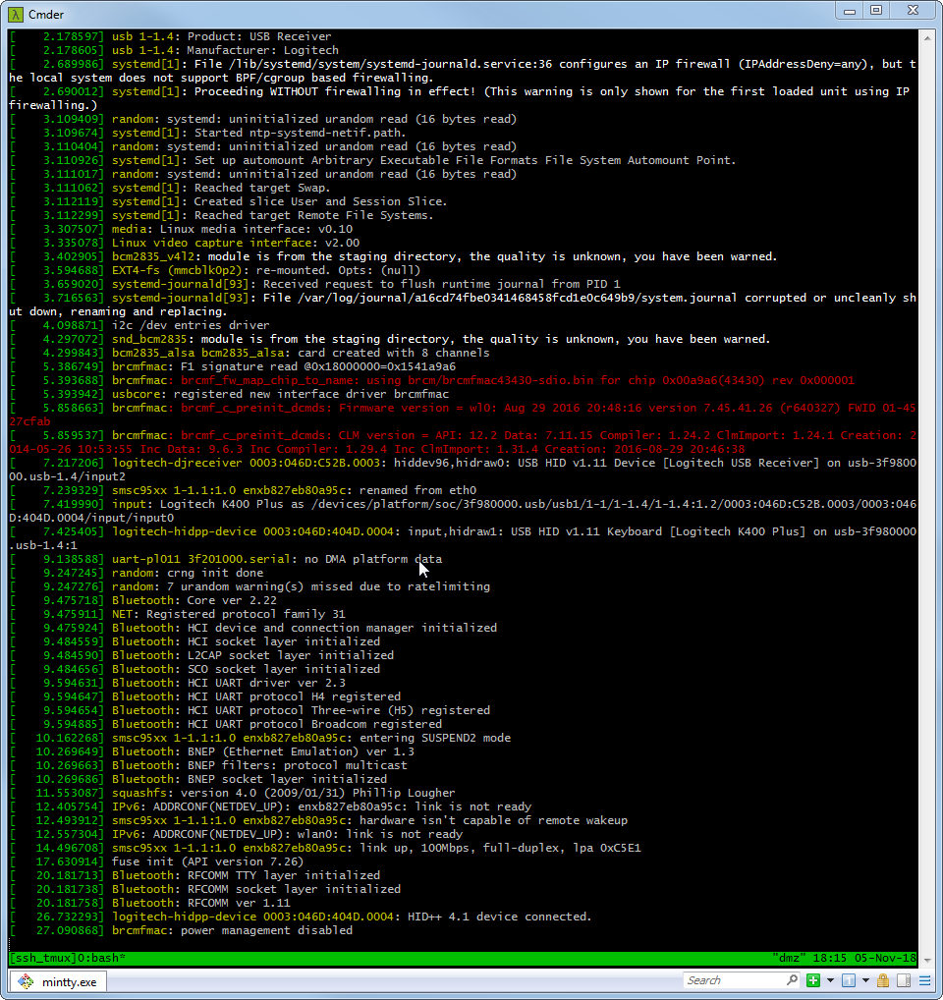
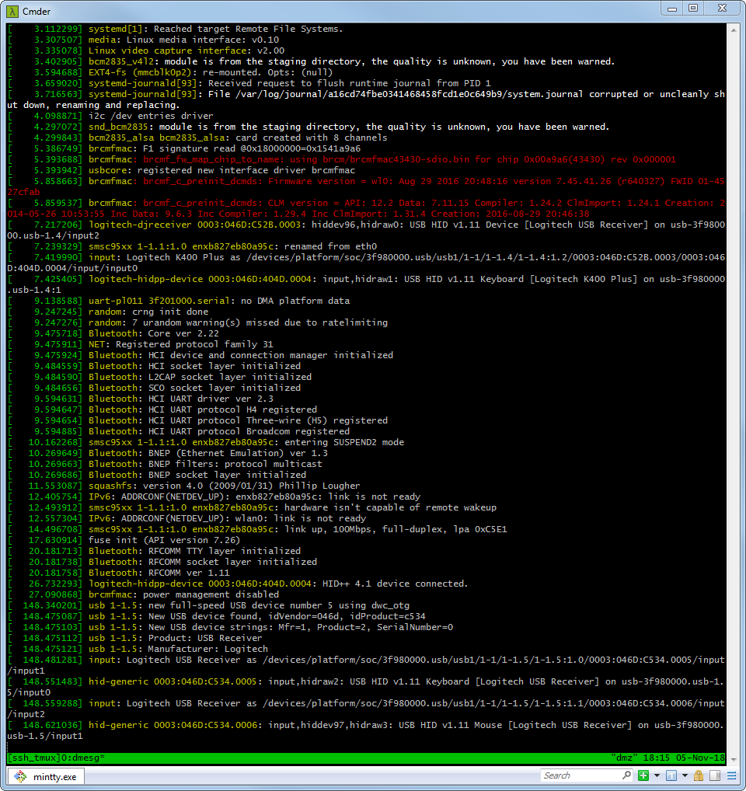

```
lar@dmz:~$ uname -a
Linux dmz 4.14.79-v7+ #1159 SMP Sun Nov 4 17:50:20 GMT 2018 armv7l armv7l armv7l GNU/Linux
lar@dmz:~$ lsb_release -a
No LSB modules are available.
Distributor ID: Ubuntu
Description:    Ubuntu 18.04.1 LTS
Release:        18.04
Codename:       bionic
```

OK, referring to DMZ#1: "current" kernel is 4.14.76 (Oct 15). Reinstall specifying
kernel revision `0018be69dafd215a9bf1c23a887fc15464a754b3`:
```
lar@dmz:~$ uname -a
Linux dmz 4.14.76-v7+ #1150 SMP Mon Oct 15 15:19:23 BST 2018 armv7l armv7l armv7l GNU/Linux
lar@dmz:~$ lsb_release -a
No LSB modules are available.
Distributor ID: Ubuntu
Description:    Ubuntu 18.04.1 LTS
Release:        18.04
Codename:       bionic
```
...NOPE still no keyboard/mouse input on local display.

Trying disabling `vncserver1.service`... reboot... NO DIFFERENCE.

Re-enabled `vncserver1.service` to attempt launching keyboard/mouse settings
using GUI control panel. VERY INTERESTING: keyboard applet will *not* launch:


OK! Here's the error message:
```
mate-keyboard-properties 
[1541475267,000,xklavier.c:xkl_engine_constructor/] 	All backends failed, last result: -1

(mate-keyboard-properties:6264): GLib-CRITICAL **: 19:34:27.906: g_hash_table_destroy: assertion 'hash_table != NULL' failed

(mate-keyboard-properties:6264): GLib-GObject-CRITICAL **: 19:34:27.906: object XklEngine 0x21c63d0 finalized while still in-construction

(mate-keyboard-properties:6264): GLib-GObject-CRITICAL **: 19:34:27.906: Custom constructor for class XklEngine returned NULL (which is invalid). Please use GInitable instead.
Segmentation fault
```


> side note:
> 
> * https://duckduckgo.com/?q=%22No+X+keyboard+found%2C+retrying%22&atb=v102-1_f&ia=qa
> * https://bugs.launchpad.net/onboard/+bug/1001736
> * https://askubuntu.com/questions/458615/cant-type-in-login-password-because-no-keyboard-is-found
> 
> 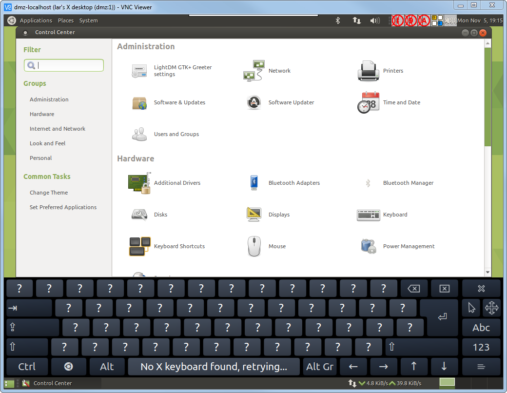


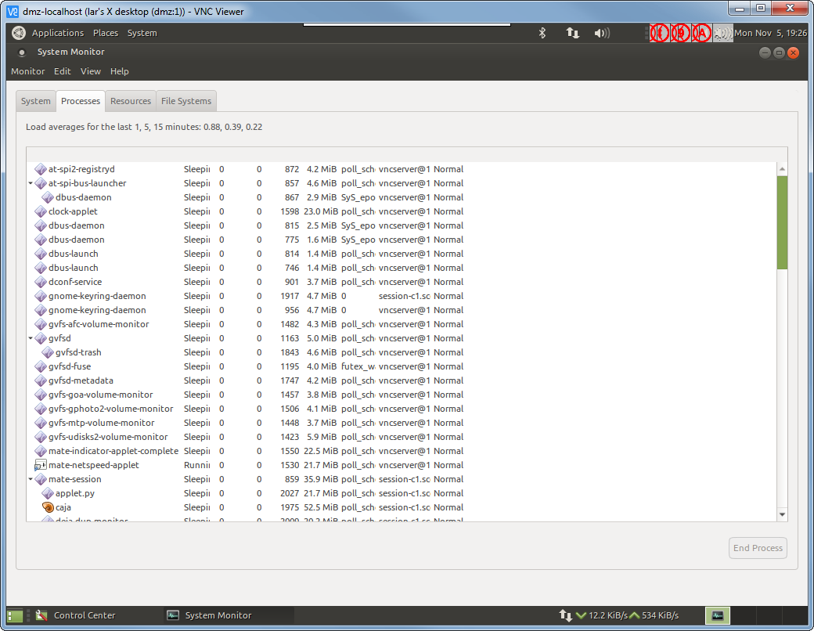

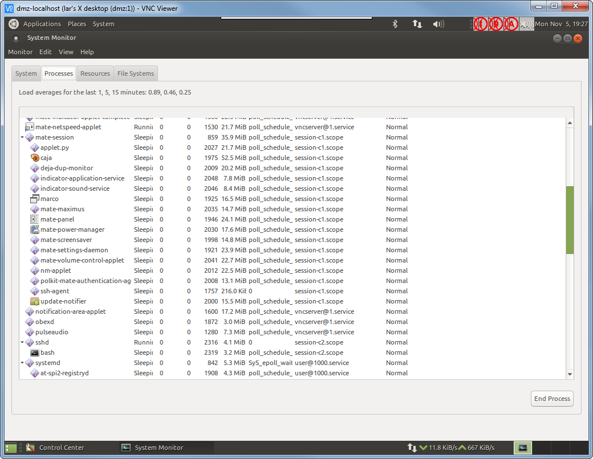

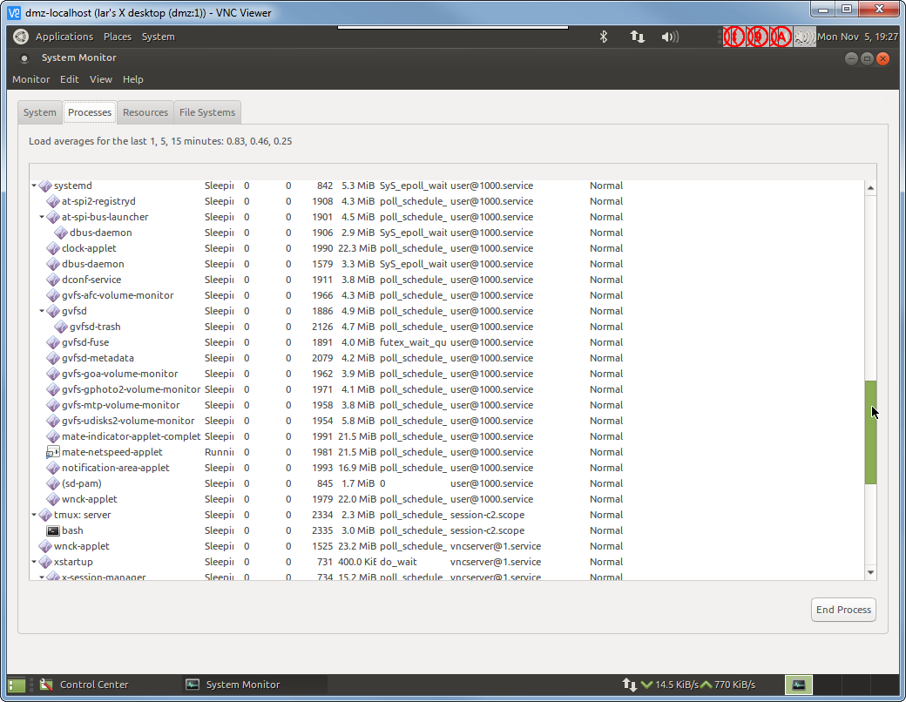

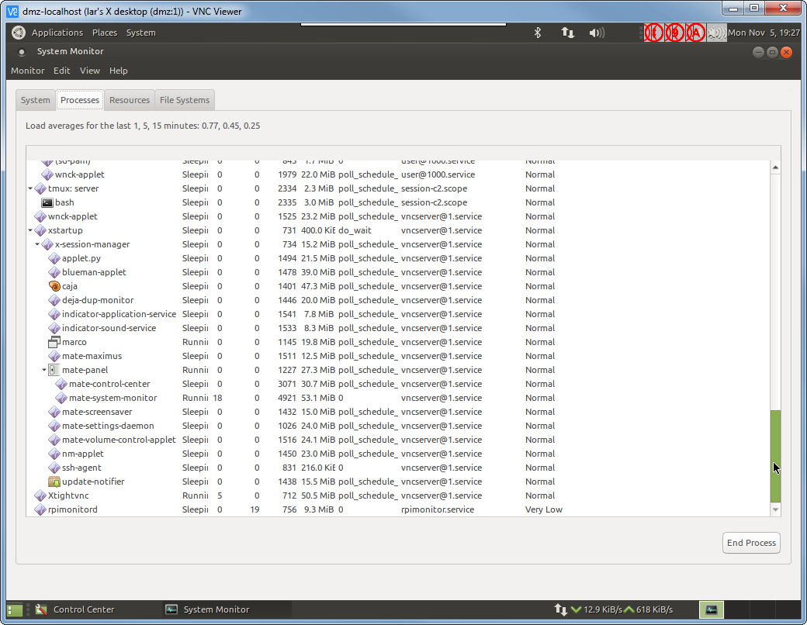

Launched terminal within vnc and reconfigued keyboard with defaults:
```
lar@dmz:~/Desktop$ sudo dpkg-reconfigure keyboard-configuration 
[sudo] password for lar: 
XKB extension not present on :1
Your console font configuration will be updated the next time your system
boots. If you want to update it now, run 'setupcon' from a virtual console.
update-initramfs: deferring update (trigger activated)
Processing triggers for initramfs-tools (0.130ubuntu3.5) ...
```

...Rebooted to make effective. Did not impact the local session - still broken.

Can we boot into recovery mode? https://wiki.ubuntu.com/RecoveryMode
* Hold <Shift> ... NOPE
* Press <Esc> a lot ... NOPE

Continuing to troubleshoot.. which control panel applets don't work? 
* keyboard (we already knew)
* Light DM greeter settings
    * re-try from a terminal: `lightdm-gtk-greeter-settings`
    * received permissions error
    * can browse still: observe *onboard* is the keyboard? for accessibility anyway
      also notice screen-blank-timeout is also 30m here  
      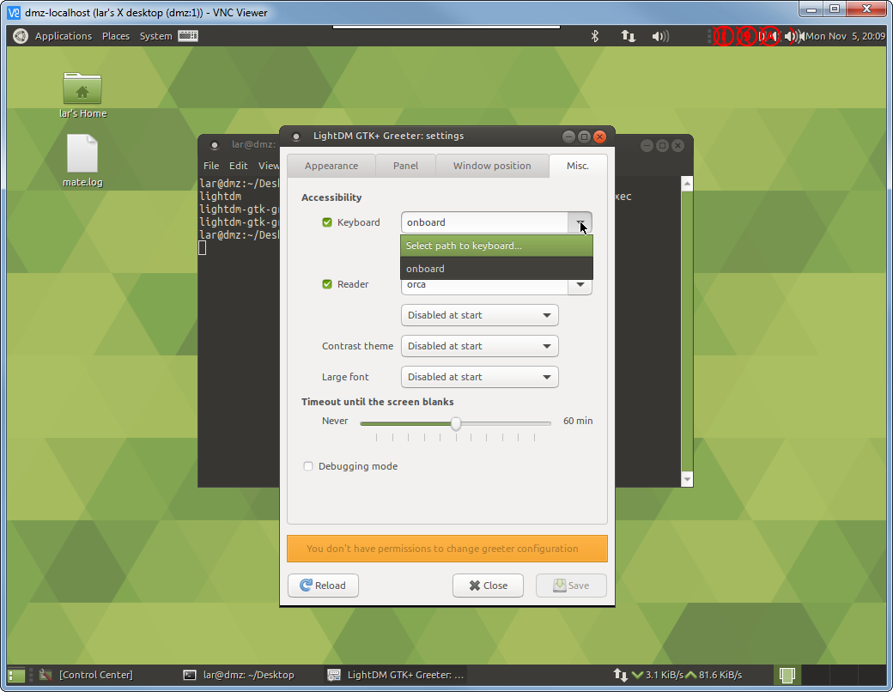

Retry for recovery mode:
* with wired keyboard attached, holding [Shift]... NOPE
* after removing wireless keyboards (ONLY wired), holding [Shift]... NOPE
* swap DMZ#3 back to DMZ#1...
* apparently there is no recovery mode?
    * murmurings
        * https://wiki.ubuntu.com/RecoveryMode
        * https://raspberrypi.stackexchange.com/questions/46875/how-to-enter-recovery-mode-without-usb-keyboard
        * https://raspberrypi.stackexchange.com/questions/59366/unable-to-enter-recovery-mode-on-ubuntu-mate
        * https://www.raspberrypi.org/forums/viewtopic.php?p=611384
    * hold shift -> no
    * rapid press shift -> no
    * project leader says not existant in RPI2: https://ubuntu-mate.community/t/raspberry-pi-recovery-mode-running-ubuntu-mate/2466
    * other people claim they can't avoid it in RPI3:
        * https://ubuntu-mate.community/t/grub-in-raspberry-pi-3/16217
        * https://ubuntu-mate.community/t/raspberry-pi-3-ubuntu-mate-15-10-emergency-mode-every-time/4466
        * https://ubuntu-mate.community/t/getting-emergency-mode-screen-on-boot-up-every-time/2626


Getting *really* desperate:
* reinstall MATE keyboard settings panel.... wonderful! can't do it!
  reinstall the entire mate control panel:
```
lar@dmz:~$ sudo apt-get install --reinstall mate-
mate-accessibility-profiles      mate-common                      mate-desktop-environment-extra   mate-media                       mate-optimus                     mate-screensaver                 mate-settings-daemon-dev         mate-user-share
mate-applet-appmenu              mate-control-center              mate-desktop-environment-extras  mate-media-common                mate-panel                       mate-screensaver-common          mate-system-monitor              mate-user-share-common
mate-applet-brisk-menu           mate-control-center-common       mate-dock-applet                 mate-menu                        mate-panel-common                mate-sensors-applet              mate-system-monitor-common       mate-utils
mate-applets                     mate-core                        mate-hud                         mate-menus                       mate-polkit                      mate-sensors-applet-common       mate-terminal                    mate-utils-common
mate-applets-common              mate-desktop                     mate-icon-theme                  mate-netbook                     mate-polkit-bin                  mate-sensors-applet-nvidia       mate-terminal-common             mate-window-applets-common
mate-backgrounds                 mate-desktop-common              mate-icon-theme-faenza           mate-netbook-common              mate-polkit-common               mate-session-manager             mate-themes                      mate-window-buttons-applet
mate-calc                        mate-desktop-environment         mate-indicator-applet            mate-notification-daemon         mate-power-manager               mate-settings-daemon             mate-tweak                       mate-window-menu-applet
mate-calc-common                 mate-desktop-environment-core    mate-indicator-applet-common     mate-notification-daemon-common  mate-power-manager-common        mate-settings-daemon-common      mate-user-guide                  mate-window-title-applet
lar@dmz:~$ sudo apt-get install --reinstall mate-control-center
[sudo] password for lar:
Reading package lists... Done
Building dependency tree
Reading state information... Done
0 upgraded, 0 newly installed, 1 reinstalled, 0 to remove and 0 not upgraded.
Need to get 202 kB of archives.
After this operation, 0 B of additional disk space will be used.
Get:1 http://ports.ubuntu.com bionic/universe armhf mate-control-center armhf 1.20.2-2ubuntu1 [202 kB]
Fetched 202 kB in 1s (231 kB/s)
(Reading database ... 172570 files and directories currently installed.)
Preparing to unpack .../mate-control-center_1.20.2-2ubuntu1_armhf.deb ...
Unpacking mate-control-center (1.20.2-2ubuntu1) over (1.20.2-2ubuntu1) ...
Processing triggers for mime-support (3.60ubuntu1) ...
Processing triggers for desktop-file-utils (0.23-1ubuntu3.18.04.1) ...
Setting up mate-control-center (1.20.2-2ubuntu1) ...
Processing triggers for bamfdaemon (0.5.3+18.04.20180207.2-0ubuntu1) ...
Rebuilding /usr/share/applications/bamf-2.index...
lar@dmz:~$
```

Try launching from control panel... FAILURE! Try again from command line (as
sudo)... success!
* observe keyboard model is "unknown"
* note keyboard model list is empty

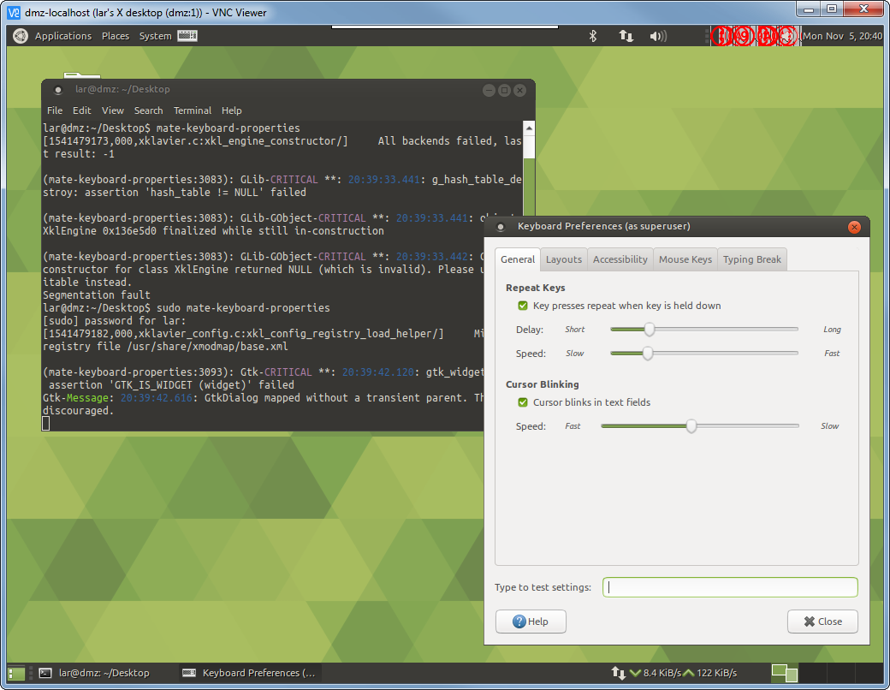
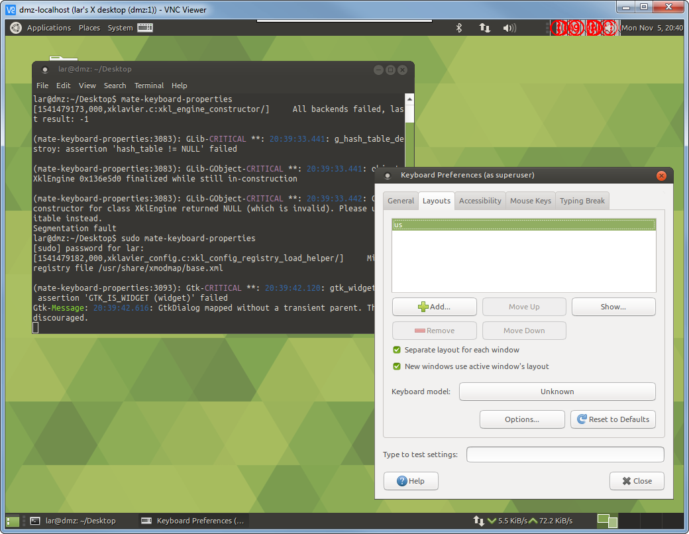
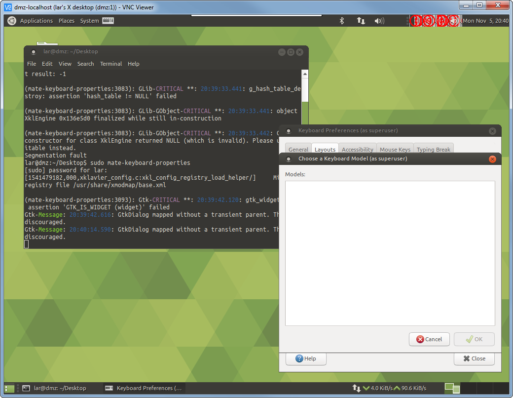


Time for large hammer: TURN OFF AUTOMATIC GUI LOGIN!


#### Cannot control wi-fi issue

Out of the box, cannot connect to wifi networks and cannot modify network 
setting using graphical software. The "Enable Networking" and "Enable Wi-Fi"
options are grayed-out and inaccessible:
> * https://askubuntu.com/questions/668411/failed-to-add-activate-connection-32-insufficient-privileges#752168
> * https://ubuntuforums.org/showthread.php?t=2198703

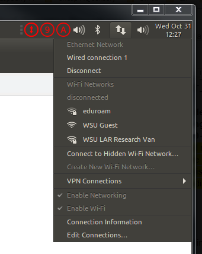

Also, there are constant notifications about being "disconnected" from the wifi:
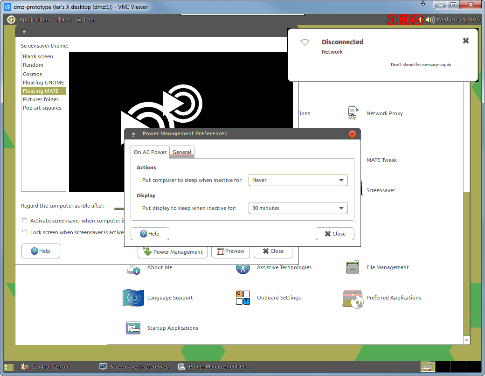

Attempting to open the "Network Connections" results in error message:
* https://askubuntu.com/questions/668411/failed-to-add-activate-connection-32-insufficient-privileges#752168
    * fixing missing policykit rule
* https://askubuntu.com/questions/856007/failed-to-add-activate-connection
    * not a real answer

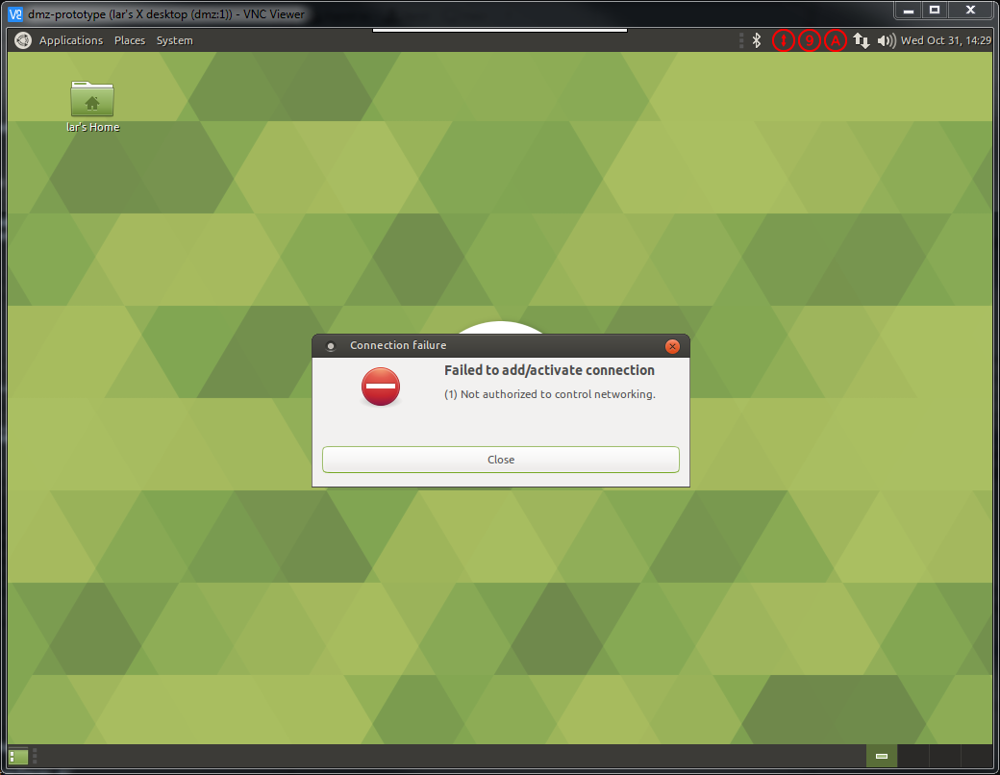

Wi-Fi is there!:
```
lar@dmz:~$ sudo iwconfig
lo        no wireless extensions.

wlan0     IEEE 802.11  ESSID:off/any
          Mode:Managed  Access Point: Not-Associated   Tx-Power=31 dBm
          Retry short limit:7   RTS thr:off   Fragment thr:off
          Encryption key:off
          Power Management:on

enxb827eb6e25b9  no wireless extensions.
```
```
lar@dmz:~$ sudo rfkill list all
0: phy0: Wireless LAN
        Soft blocked: no
        Hard blocked: no
1: hci0: Bluetooth
        Soft blocked: no
        Hard blocked: no
```
```
lar@dmz:~$ sudo lshw -C network
  *-network:0
       description: Wireless interface
       physical id: 2
       logical name: wlan0
       serial: b8:27:eb:3b:70:ec
       capabilities: ethernet physical wireless
       configuration: broadcast=yes driver=brcmfmac driverversion=7.45.41.26 firmware=01-4527cfab multicast=yes wireless=IEEE 802.11
  *-network:1
       description: Ethernet interface
       physical id: 3
       logical name: enxb827eb6e25b9
       serial: b8:27:eb:6e:25:b9
       size: 100Mbit/s
       capacity: 100Mbit/s
       capabilities: ethernet physical tp mii 10bt 10bt-fd 100bt 100bt-fd autonegotiation
       configuration: autonegotiation=on broadcast=yes driver=smsc95xx driverversion=22-Aug-2005 duplex=full firmware=smsc95xx USB 2.0 Ethernet ip=192.168.3.2 link=yes multicast=yes port=MII speed=100Mbit/s
```
```
lar@dmz:~$ sudo ifconfig wlan0
wlan0: flags=4099<UP,BROADCAST,MULTICAST>  mtu 1500
        ether b8:27:eb:3b:70:ec  txqueuelen 1000  (Ethernet)
        RX packets 0  bytes 0 (0.0 B)
        RX errors 0  dropped 0  overruns 0  frame 0
        TX packets 0  bytes 0 (0.0 B)
        TX errors 0  dropped 0 overruns 0  carrier 0  collisions 0
```

Verified that `/etc/NetworkManager/NetworkManager.conf` already contains flag
to fix MAC address randomization:
> * https://askubuntu.com/questions/904844/cant-connect-to-wifi-on-ubuntu-17-04
> * https://ubuntu-mate.community/t/wifi-issue-in-17-04/12622/15?u=steven
```
[main]
plugins=ifupdown,keyfile

[ifupdown]
managed=false

[device]
wifi.scan-rand-mac-address=no
```

Per 16.04 release notes, try rebooting to "fix" wifi
(https://bugs.launchpad.net/ubuntu/+source/network-manager/+bug/1572956)...
*DOES NOT HELP*

Supporting evidence for missing policykit file

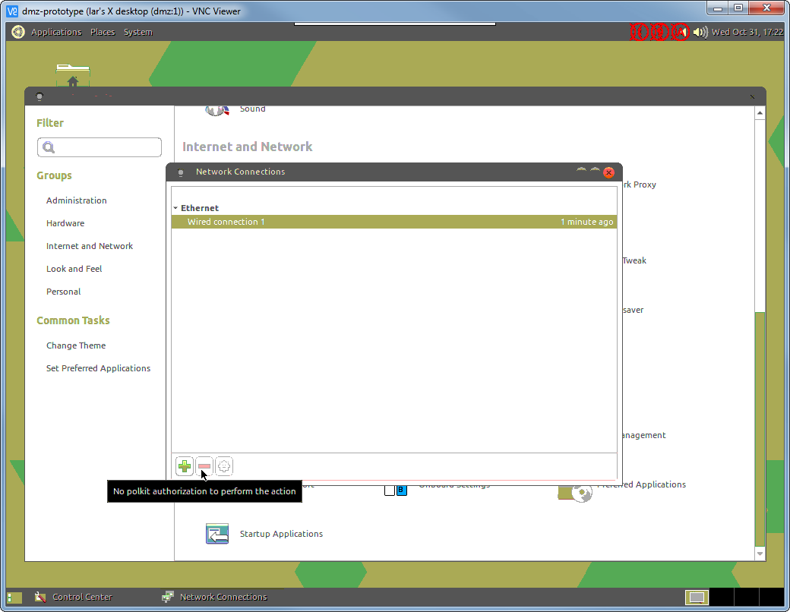

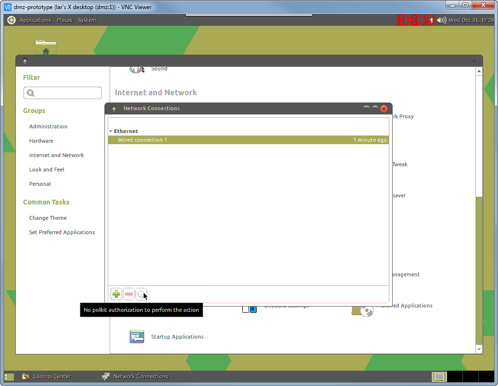

---

OK, fixing missing policy kit file...

Determine policykit agent IS running:
```
lar@dmz:~$ ps -ef | grep kit | grep agent
lar       1973   856  0 12:52 ?        00:00:00 /usr/lib/arm-linux-gnueabihf/polkit-mate/polkit-mate-authentication-agent-1
```

And version is 1.20.0-1:
```
lar@dmz:~$ apt-cache policy mate-polkit
mate-polkit:
  Installed: 1.20.0-1
  Candidate: 1.20.0-1
  Version table:
 *** 1.20.0-1 500
        500 http://ports.ubuntu.com bionic/universe armhf Packages
        100 /var/lib/dpkg/status
```

BUT there is no policy file:
```
lar@dmz:~$ sudo ls /etc/polkit-1/localauthority/ -lR
[sudo] password for lar:
/etc/polkit-1/localauthority/:
total 20
drwxr-xr-x 2 root root 4096 Nov  1 15:36 10-vendor.d
drwxr-xr-x 2 root root 4096 Jan 17  2016 20-org.d
drwxr-xr-x 2 root root 4096 Jan 17  2016 30-site.d
drwxr-xr-x 2 root root 4096 Jan 17  2016 50-local.d
drwxr-xr-x 2 root root 4096 Jan 17  2016 90-mandatory.d

/etc/polkit-1/localauthority/10-vendor.d:
total 0

/etc/polkit-1/localauthority/20-org.d:
total 0

/etc/polkit-1/localauthority/30-site.d:
total 0

/etc/polkit-1/localauthority/50-local.d:
total 0

/etc/polkit-1/localauthority/90-mandatory.d:
total 0
```

Create new file `/etc/polkit-1/localauthority/10-vendor.d/org.freedesktop.NetworkManager.pkla`
```
[nm-applet]
Identity=unix-user:lar
Action=org.freedesktop.NetworkManager.*
ResultAny=yes
ResultInactive=no
ResultActive=yes
```

Then copy into `/etc/polkit-1/localauthority/50-local.d/`... OKworks again... 
tested OK using VNC connection.

BUT still has strange errors:
- local user session is dead (no keyboard/mouse still)
- cannot log out or shut down computer using VNC
    * can log out from VNC, and log back in... computer is *NOT* shutting down

```
(nm-applet:18538): Gtk-WARNING **: 15:50:30.381: Can't set a parent on widget which has a parent
Gtk-Message: 15:50:54.456: GtkDialog mapped without a transient parent. This is discouraged.
Window manager warning: CurrentTime used to choose focus window; focus window may not be correct.
Window manager warning: Got a request to focus the no_focus_window with a timestamp of 0.  This shouldn't happen!
[1541107988,000,xklavier.c:xkl_engine_constructor/]     All backends failed, last result: -1
x-session-manager[18367]: WARNING: Unable to restart system: Interactive authentication required.
```


This is still completely fucked. Booted out of dmz#3 and returned to dmz#1...
Works perfectly!:
* keyboard/mouse local display works perfectly fine
* can enable/disable wifi using network manager applet
* can log out! and back in!
```
lar@dmz:~$ uname -a
Linux dmz 4.14.76-v7+ #1150 SMP Mon Oct 15 15:19:23 BST 2018 armv7l armv7l armv7l GNU/Linux
```
```
lar@dmz:~$ lsb_release -a
No LSB modules are available.
Distributor ID: Ubuntu
Description:    Ubuntu 16.04.5 LTS
Release:        16.04
Codename:       xenial
```
```
lar@dmz:~$ apt-cache policy mate-polkit
mate-polkit:
  Installed: 1.16.0-1~xenial3.1
  Candidate: 1.16.0-1~xenial3.1
  Version table:
 *** 1.16.0-1~xenial3.1 500
        500 http://ppa.launchpad.net/ubuntu-mate-dev/xenial-mate/ubuntu xenial/main armhf Packages
        100 /var/lib/dpkg/status
     1.12.0-3 500
        500 http://ports.ubuntu.com xenial/universe armhf Packages
        500 http://ports.ubuntu.com/ubuntu-ports xenial/universe armhf Packages
```
```
lar@dmz:~$ sudo ls /etc/polkit-1/localauthority/ -lR
[sudo] password for lar:
/etc/polkit-1/localauthority/:
total 20
drwxr-xr-x 2 root root 4096 Jan 17  2016 10-vendor.d
drwxr-xr-x 2 root root 4096 Jan 17  2016 20-org.d
drwxr-xr-x 2 root root 4096 Jan 17  2016 30-site.d
drwxr-xr-x 2 root root 4096 Jan 17  2016 50-local.d
drwxr-xr-x 2 root root 4096 Jan 17  2016 90-mandatory.d

/etc/polkit-1/localauthority/10-vendor.d:
total 0

/etc/polkit-1/localauthority/20-org.d:
total 0

/etc/polkit-1/localauthority/30-site.d:
total 0

/etc/polkit-1/localauthority/50-local.d:
total 0

/etc/polkit-1/localauthority/90-mandatory.d:
total 0
```
```
lar@dmz:~$ apt-cache policy mate-desktop
mate-desktop:
  Installed: 1.16.2-1~xenial1.0
  Candidate: 1.16.2-1~xenial1.0
  Version table:
 *** 1.16.2-1~xenial1.0 500
        500 http://ppa.launchpad.net/ubuntu-mate-dev/xenial-mate/ubuntu xenial/main armhf Packages
        100 /var/lib/dpkg/status
     1.12.1-1 500
        500 http://ports.ubuntu.com xenial/universe armhf Packages
        500 http://ports.ubuntu.com/ubuntu-ports xenial/universe armhf Packages
```

OKAY now going from dmz#1 to dmz#2...
* Does not boot into GUI... logged in OK... issued `startx`... OK!
* Local desktop session works OK... it's *really* slow though
* Observe very similar problems to dmz#3:
    * notification area is missing all icons except volume
    * windows are opened in background (eg control center windows get opened
      underneath control center, must raise by selecting window)
* Except:
    * *can* edit network connections
    * *and* it's using a different IP address for some fucking reason
        * should have not changed since same MAC should get same IP within this building

```
lar@dmz:~$ uname -a
Linux dmz 4.14.73-v7+ #1148 SMP Mon Oct 1 16:57:50 BST 2018 armv7l armv7l armv7l GNU/Linux
```
```
lar@dmz:~$ lsb_release -a
No LSB modules are available.
Distributor ID: Ubuntu
Description:    Ubuntu 18.04.1 LTS
Release:        18.04
Codename:       bionic
```
```
lar@dmz:~$ apt-cache policy mate-polkit
mate-polkit:
  Installed: 1.20.0-1
  Candidate: 1.20.0-1
  Version table:
 *** 1.20.0-1 500
        500 http://ports.ubuntu.com bionic/universe armhf Packages
        100 /var/lib/dpkg/status
```
```
/etc/polkit-1/localauthority/:
total 20
drwxr-xr-x 2 root root 4096 Jan 17  2016 10-vendor.d
drwxr-xr-x 2 root root 4096 Jan 17  2016 20-org.d
drwxr-xr-x 2 root root 4096 Jan 17  2016 30-site.d
drwxr-xr-x 2 root root 4096 Jan 17  2016 50-local.d
drwxr-xr-x 2 root root 4096 Jan 17  2016 90-mandatory.d

/etc/polkit-1/localauthority/10-vendor.d:
total 0

/etc/polkit-1/localauthority/20-org.d:
total 0

/etc/polkit-1/localauthority/30-site.d:
total 0

/etc/polkit-1/localauthority/50-local.d:
total 0

/etc/polkit-1/localauthority/90-mandatory.d:
total 0
```


----
possibly related to panel icons:

confirm there is no file `~/.config/autostart/nm-applet.desktop` [[ref](https://askubuntu.com/questions/1031950/can-t-get-network-applet-back-in-ubuntu-mate-18-04)]


----
side note wrt the screen blanking: possibly seeing kernel errors?
```
[    2.168579] usb 1-1.4: New USB device strings: Mfr=1, Product=2, SerialNumber=0
[    2.168588] usb 1-1.4: Product: USB Receiver
[    2.168596] usb 1-1.4: Manufacturer: Logitech
[    2.764705] systemd[1]: File /lib/systemd/system/systemd-journald.service:36 configures an IP firewall (IPAddressDeny=any), but the local system does not support BPF/cgroup based firewalling.
[    2.764730] systemd[1]: Proceeding WITHOUT firewalling in effect! (This warning is only shown for the first loaded unit using IP firewalling.)
[    3.227178] random: systemd: uninitialized urandom read (16 bytes read)
[    3.227455] systemd[1]: Started ntp-systemd-netif.path.
[    3.227874] random: systemd: uninitialized urandom read (16 bytes read)
[    3.227929] systemd[1]: Reached target Remote File Systems.
[    3.228014] random: systemd: uninitialized urandom read (16 bytes read)
[    3.228057] systemd[1]: Reached target Swap.
[    3.228392] systemd[1]: Started Forward Password Requests to Wall Directory Watch.
[    3.229382] systemd[1]: Set up automount Arbitrary Executable File Formats File System Automount Point.
[    3.409116] media: Linux media interface: v0.10
[    3.438415] Linux video capture interface: v2.00
[    3.521409] bcm2835_v4l2: module is from the staging directory, the quality is unknown, you have been warned.
[    3.697127] EXT4-fs (mmcblk0p2): re-mounted. Opts: (null)
[    3.761809] systemd-journald[100]: Received request to flush runtime journal from PID 1
[    3.825364] systemd-journald[100]: File /var/log/journal/a16cd74fbe0341468458fcd1e0c649b9/system.journal corrupted or uncleanly shut down, renaming and replacing.
[    4.214488] i2c /dev entries driver
[    4.425362] snd_bcm2835: module is from the staging directory, the quality is unknown, you have been warned.
[    4.428196] bcm2835_alsa bcm2835_alsa: card created with 8 channels
[    5.502668] brcmfmac: F1 signature read @0x18000000=0x1541a9a6
[    5.513209] brcmfmac: brcmf_fw_map_chip_to_name: using brcm/brcmfmac43430-sdio.bin for chip 0x00a9a6(43430) rev 0x000001
[    5.513501] usbcore: registered new interface driver brcmfmac
[    5.865757] brcmfmac: brcmf_c_preinit_dcmds: Firmware version = wl0: Aug 29 2016 20:48:16 version 7.45.41.26 (r640327) FWID 01-4527cfab
[    5.866669] brcmfmac: brcmf_c_preinit_dcmds: CLM version = API: 12.2 Data: 7.11.15 Compiler: 1.24.2 ClmImport: 1.24.1 Creation: 2014-05-26 10:53:55 Inc Data: 9.6.3 Inc Compiler: 1.29.4 Inc ClmImport: 1.31.4 Creation: 2016-08-29 20:46:38
[    7.406122] logitech-djreceiver 0003:046D:C52B.0003: hiddev96,hidraw0: USB HID v1.11 Device [Logitech USB Receiver] on usb-3f980000.usb-1.4/input2
[    7.417542] smsc95xx 1-1.1:1.0 enxb827eb80a95c: renamed from eth0
[    7.601427] input: Logitech K400 Plus as /devices/platform/soc/3f980000.usb/usb1/1-1/1-1.4/1-1.4:1.2/0003:046D:C52B.0003/0003:046D:404D.0004/input/input0
[    7.608438] logitech-hidpp-device 0003:046D:404D.0004: input,hidraw1: USB HID v1.11 Keyboard [Logitech K400 Plus] on usb-3f980000.usb-1.4:1
[    8.426628] uart-pl011 3f201000.serial: no DMA platform data
[    8.520194] random: crng init done
[    8.520209] random: 7 urandom warning(s) missed due to ratelimiting
[    8.687549] Bluetooth: Core ver 2.22
[    8.687639] NET: Registered protocol family 31
[    8.687646] Bluetooth: HCI device and connection manager initialized
[    8.687671] Bluetooth: HCI socket layer initialized
[    8.687686] Bluetooth: L2CAP socket layer initialized
[    8.687720] Bluetooth: SCO socket layer initialized
[    8.822881] Bluetooth: HCI UART driver ver 2.3
[    8.822898] Bluetooth: HCI UART protocol H4 registered
[    8.822904] Bluetooth: HCI UART protocol Three-wire (H5) registered
[    8.823129] Bluetooth: HCI UART protocol Broadcom registered
[   10.040793] squashfs: version 4.0 (2009/01/31) Phillip Lougher
[   10.162386] smsc95xx 1-1.1:1.0 enxb827eb80a95c: entering SUSPEND2 mode
[   10.585565] Bluetooth: BNEP (Ethernet Emulation) ver 1.3
[   10.585599] Bluetooth: BNEP filters: protocol multicast
[   10.585993] Bluetooth: BNEP socket layer initialized
[   11.814551] IPv6: ADDRCONF(NETDEV_UP): enxb827eb80a95c: link is not ready
[   11.903791] smsc95xx 1-1.1:1.0 enxb827eb80a95c: hardware isn't capable of remote wakeup
[   11.952491] IPv6: ADDRCONF(NETDEV_UP): wlan0: link is not ready
[   11.992428] IPv6: ADDRCONF(NETDEV_UP): wlan0: link is not ready
[   11.992449] brcmfmac: power management disabled
[   12.588217] IPv6: ADDRCONF(NETDEV_UP): wlan0: link is not ready
[   13.427442] smsc95xx 1-1.1:1.0 enxb827eb80a95c: link up, 100Mbps, full-duplex, lpa 0xC5E1
[   17.183453] fuse init (API version 7.26)
[   18.537759] Bluetooth: RFCOMM TTY layer initialized
[   18.537785] Bluetooth: RFCOMM socket layer initialized
[   18.537809] Bluetooth: RFCOMM ver 1.11
[  353.752375] logitech-hidpp-device 0003:046D:404D.0004: Can not get the protocol version.
[ 2748.881645] logitech-hidpp-device 0003:046D:404D.0004: Can not get the protocol version.
[ 6464.655663] logitech-hidpp-device 0003:046D:404D.0004: Can not get the protocol version.
[ 7686.502306] logitech-hidpp-device 0003:046D:404D.0004: Can not get the protocol version.
[10135.872491] logitech-hidpp-device 0003:046D:404D.0004: Can not get the protocol version.
```

Without errors, would expect to see "HID++ 2.0 device connected"...
[[reference](https://elixir.bootlin.com/linux/v4.14.77/source/drivers/hid/hid-logitech-hidpp.c#L2860)]

Removed keyboard dongle and plugged into different USB port:
```
[11958.826264] logitech-hidpp-device 0003:046D:404D.0004: HID++ 4.1 device connected.
[11959.125474] brcmfmac: power management disabled
[11964.319072] usb 1-1.4: reset full-speed USB device number 4 using dwc_otg
[11964.419068] usb 1-1.4: device descriptor read/64, error -32
[11965.289985] usb 1-1.4: USB disconnect, device number 4
[11971.179094] usb 1-1.5: new full-speed USB device number 5 using dwc_otg
[11971.326100] usb 1-1.5: New USB device found, idVendor=046d, idProduct=c52b
[11971.326115] usb 1-1.5: New USB device strings: Mfr=1, Product=2, SerialNumber=0
[11971.326124] usb 1-1.5: Product: USB Receiver
[11971.326132] usb 1-1.5: Manufacturer: Logitech
[11971.357241] logitech-djreceiver 0003:046D:C52B.0007: hiddev96,hidraw0: USB HID v1.11 Device [Logitech USB Receiver] on usb-3f980000.usb-1.5/input2
[11971.506872] input: Logitech K400 Plus as /devices/platform/soc/3f980000.usb/usb1/1-1/1-1.5/1-1.5:1.2/0003:046D:C52B.0007/0003:046D:404D.0008/input/input1
[11971.507641] logitech-hidpp-device 0003:046D:404D.0008: input,hidraw1: USB HID v1.11 Keyboard [Logitech K400 Plus] on usb-3f980000.usb-1.5:1
[11990.662279] logitech-hidpp-device 0003:046D:404D.0008: HID++ 4.1 device connected.
```

Unplug:
```
[12156.271104] usb 1-1.5: USB disconnect, device number 5
```

Plug back into original location:
```
[12172.909886] usb 1-1.4: new full-speed USB device number 6 using dwc_otg
[12173.056854] usb 1-1.4: New USB device found, idVendor=046d, idProduct=c52b
[12173.056870] usb 1-1.4: New USB device strings: Mfr=1, Product=2, SerialNumber=0
[12173.056879] usb 1-1.4: Product: USB Receiver
[12173.056887] usb 1-1.4: Manufacturer: Logitech
[12173.088535] logitech-djreceiver 0003:046D:C52B.000B: hiddev96,hidraw0: USB HID v1.11 Device [Logitech USB Receiver] on usb-3f980000.usb-1.4/input2
[12173.239392] input: Logitech K400 Plus as /devices/platform/soc/3f980000.usb/usb1/1-1/1-1.4/1-1.4:1.2/0003:046D:C52B.000B/0003:046D:404D.000C/input/input2
[12173.243794] logitech-hidpp-device 0003:046D:404D.000C: input,hidraw1: USB HID v1.11 Keyboard [Logitech K400 Plus] on usb-3f980000.usb-1.4:1
```

Press [enter] key several times:
```
[12219.433281] logitech-hidpp-device 0003:046D:404D.000C: HID++ 4.1 device connected.
```


---


#### Mate "Power Statistics" panel

* observed on this panel: `cannot enable timerstats`
    * symptoms mirror: https://bugzilla.redhat.com/show_bug.cgi?id=1427621
        * basically `/proc/timer_stats` is no longer a valid file but *upower*
          continues to rely on it?


----

## Software

### Automatic Package Updates (*unattended-upgrades*)

Install *unattended-upgrades*:
```
sudo apt install unattended-upgrades
```

Verify configuration includes security updates...:
```
sudo nano /etc/apt.conf.d/50unattended-upgrades
```
```
// Automatically upgrade packages from these (origin:archive) pairs
Unattended-Upgrade::Allowed-Origins {
        "${distro_id}:${distro_codename}";
        "${distro_id}:${distro_codename}-security";
        // Extended Security Maintenance; doesn't necessarily exist for
        // every release and this system may not have it installed, but if
        // available, the policy for updates is such that unattended-upgrades
        // should also install from here by default.
        "${distro_id}ESM:${distro_codename}";
//      "${distro_id}:${distro_codename}-updates";
//      "${distro_id}:${distro_codename}-proposed";
//      "${distro_id}:${distro_codename}-backports";
};
```

> 2018-10-30 enabled `-updates` as well as `-security` packages, enabled
> option for automatic `autoremove`, and enabled automatic reboots @ 2AM

...and that automatic upgrades are enabled:
```
sudo nano /etc/apt/apt.conf.d/20auto-upgrades
```
```
APT::Periodic::Update-Package-Lists "1";
APT::Periodic::Unattended-Upgrade "1";
```

Enable email reports to user "*root*" (messages will be automatically forwarded
by *postfix* to a monitored email address):
```
sudo nano /etc/apt.conf.d/50unattended-upgrades
```
```diff
 // Send email to this address for problems or packages upgrades
 // If empty or unset then no email is sent, make sure that you
 // have a working mail setup on your system. A package that provides
 // 'mailx' must be installed. E.g. "user@example.com"
-//Unattended-Upgrade::Mail "root";
+Unattended-Upgrade::Mail "root";
```

After confirming email reports work correctly, optionally change to only report
errors:
```
sudo nano /etc/apt.conf.d/50unattended-upgrades
```
```diff
 // Set this value to "true" to get emails only on errors. Default
 // is to always send a mail if Unattended-Upgrade::Mail is set
-//Unattended-Upgrade::MailOnlyOnError "true";
+Unattended-Upgrade::MailOnlyOnError "true";
```

References:
* https://help.ubuntu.com/lts/serverguide/automatic-updates.html


### Terminal Session Manager (*tmux*)

Install *tmux*:
```
sudo apt install tmux
```

Configure so *tmux* starts automatically with each SSH login 
[[ref](https://stackoverflow.com/a/40192494/2946116)]:
```
nano ~/.bashrc
```
```diff
+if [[ -z "$TMUX" ]] && [ "$SSH_CONNECTION" != "" ]; then
+    tmux attach-session -t ssh_tmux || tmux new-session -s ssh_tmux
+fi
```

> Do not use *sudo* to launch *nano* in this instance. The command should be
> run as the user that will be used for SSH logins.

> *Future work?* <https://github.com/tmux-plugins/tmux-continuum>


### VNC Server (*tightvncserver*)

> *FUTURE: possibly use Google Chrome Remote Desktop for screen sharing?
> As of 2018-10-31, share feature is not available for this platform.*

> *FUTURE: share HDMI desktop session by using `x11vnc` server instead?*
> * https://raspberrypi.stackexchange.com/questions/28369/how-to-control-pi-hdmi-output-from-laptop-via-vnc?rq=1
> * https://wiki.xdroop.com//space/Linux/x11vnc+setup
> * https://serverfault.com/questions/27044/how-to-vnc-into-an-existing-x-session
> * https://askubuntu.com/questions/107239/vnc-with-current-desktop

> *Follow up on : https://askubuntu.com/questions/611544/mate-desktop-weird-red-icons-in-top-right-corner-how-to-remove-fix?rq=1*

Install *tightvncserver*:
```
sudo apt install tightvncserver
```

Configure using *vncserver* command (as admin user, not root):
```
vncserver
```
* Specify a password 
* Optionally, specify a view-only password

Now, test the connection over SSH:
* Establish a tunnel: `ssh user@server.tld -L 5901:localhost:5901`
* Connect to `127.0.0.1:5901` using compatible viewer 
  (such as [VNC Viewer](https://www.realvnc.com/en/connect/download/viewer/))

Should work OK. Finally, create a *systemd* service file:
```
sudo nano /etc/systemd/system/vncserver@.service
```
```
[Unit]
Description=Start TightVNC server at startup
After=syslog.target network.target

[Service]
Type=forking
User=lar
Group=lar
WorkingDirectory=/home/lar

PIDFile=/home/lar/.vnc/%H:%i.pid
ExecStartPre=-/usr/bin/vncserver -kill :%i > /dev/null 2>&1
ExecStart=/usr/bin/vncserver :%i
ExecStop=/usr/bin/vncserver -kill :%i

[Install]
WantedBy=multi-user.target
```

Enable and start the new service:
```
sudo systemctl daemon-reload
sudo systemctl enable vncserver@1.service
sudo systemctl start vncserver@1
sudo systemctl status vncserver@1
```

References:
* <https://www.digitalocean.com/community/tutorials/how-to-install-and-configure-vnc-on-ubuntu-18-04>


### VPN Server (*ocserv*)


> ***TODO***


### Email relay (*postfix*)

Ref: <https://devops.profitbricks.com/tutorials/configure-a-postfix-relay-through-gmail-on-ubuntu/>

Install *postfix* and follow prompts from package installer:
```
sudo apt install postfix
```
* Configure as *Satellite* site
* *Just provide hostname for FQDN - revisit later*
* Specify smtp server (*smtp.gmail.com*)

Enable SASL:
```
sudo nano /etc/postfix/main.cf
```
```diff
+smtp_use_tls = yes
+smtp_sasl_auth_enable = yes
+smtp_sasl_password_maps = hash:/etc/postfix/sasl/sasl_password
+smtp_sasl_security_options = noanonymous
+smtp_sasl_tls_security_options = noanonymous
```

Create credentials files and secure their file permissions:
> *For maximum security, you should use an 
> [app password](https://support.google.com/accounts/answer/185833?hl=en)
> instead of the account password.*
```
sudo nano /etc/postfix/sasl/sasl_password
```
```
smtp.gmail.com yourusername@gmail.com:password
```
```
sudo postmap /etc/postfix/sasl/sasl_password
sudo chown -R root:postfix /etc/postfix/sasl
sudo chmod 640 /etc/postfix/sasl/*
sudo chmod 750 /etc/postfix/sasl
```

Restart the service and test (*mail* is in *mailutils*):
```
sudo systemctl restart postfix
```
```
sudo apt install mailutils -y
echo "postfix test" | mail -s "test message" myemail@example.com
```

Now configure *postfix* as an open relay on the local area network. First,
add the LAN address (ex: 192.168.1.0/24) to the source network list. Then
enable listening on all interfaces (for simplicity, you could be more specific
too).
```
sudo nano /etc/postfix/main.cf
```
```diff
-mynetworks = 127.0.0.0/8 [::ffff:127.0.0.0]/104 [::1]/128
+mynetworks = 127.0.0.0/8 [::ffff:127.0.0.0]/104 [::1]/128 192.168.1.0/24
```
```dif
-inet_interfaces = loopback-only
+inet_interfaces = all
```

Finally, configure local mail forwarding using `/etc/aliases`
[[ref](https://unix.stackexchange.com/a/21582/160424)]:
```
sudo nano /etc/aliases
```
```diff
 # See man 5 aliases for format
 postmaster:    root
+root:   myadminuser
+myadminuser: myemail@example.com
```
```
sudo newaliases
```

Now test... somehow.


* https://blog.dantup.com/2016/04/setting-up-raspberry-pi-raspbian-jessie-to-send-email/
    * if hangs at start-up
* https://gist.github.com/dwilkie/41ae0c7acc48186e6058
    * hints on UFW rules
* https://www.linuxbabe.com/ubuntu/automatic-security-update-unattended-upgrades-ubuntu-18-04


### Network UPS Tools (*nut*)

Install *nut*:
```
sudo apt install nut -y
```

Ensure UPS is plugged in via USB. Add basic config options:
> *Use the [Hardware compatibility list](https://networkupstools.org/stable-hcl.html)
> to identify the correct driver type for your UPS.*
```
sudo nano /etc/nut/ups.conf
```
```diff
+[ups]
+        driver = usbhid-ups
+        port = auto
+        desc = "Data system UPS"
```

Expose the service to the local area network:
```
sudo nano /etc/nut/upsd.conf
```
```diff
 # =======================================================================
 # LISTEN <address> [<port>]
 # LISTEN 127.0.0.1 3493
 # LISTEN ::1 3493
+LISTEN 0.0.0.0 3493
 #
```

Finally, enable the service:
```
sudo nano /etc/nut/nut.conf
```
```diff
-MODE=none
+MODE=netserver
```
```
sudo systemctl restart nut-server.service
```

#### Graphical UPS Monitor (*NUT-Monitor*)

It is recommended to have *NUT-Monitor* installed so desktop users can easily
review the UPS status.
```
sudo apt install nut-monitor -y
```

Launch the program from the *Applications > Internet* menu.


### System Monitoring Service (*RPi-Monitor*)

> Very seriously look at disabling the so-called predictable network interface names!

Install *rpimonitor* 
[[ref](https://xavierberger.github.io/RPi-Monitor-docs/11_installation.html)]:
```
sudo apt-get install dirmngr
sudo apt-key adv --recv-keys --keyserver keyserver.ubuntu.com 2C0D3C0F
sudo wget http://goo.gl/vewCLL -O /etc/apt/sources.list.d/rpimonitor.list
sudo apt-get update
sudo apt install rpimonitor -y
```

Initialize:
```
sudo /etc/init.d/rpimonitor update
```

Then fixup the networking configuration:
```
sudo nano /etc/rpimonitor/template/network.conf
```

Also enable the *Top3* addon for monitoring processes:
```
sudo cp /usr/share/rpimonitor/web/addons/top3/top3.cron /etc/cron.d/top3
```
```
sudo nano /etc/rpimonitor/data.conf
```
```diff
 #web.addons.4.name=Custom addons
 #web.addons.4.addons=custom
 #web.addons.4.showTitle=0
 #web.addons.4.url=/addons/custom/custominfo.html
 
-#web.addons.5.name=Top3
-#web.addons.5.addons=top3
+web.addons.5.name=Top3
+web.addons.5.addons=top3
```
```
sudo nano /etc/rpimonitor/template/cpu.conf
```
```diff
 web.status.1.content.1.name=CPU
 web.status.1.content.1.icon=cpu.png
 #web.status.1.content.1.line.1="Loads: <b>" + data.load1 + "</b> [1min] - <b>" + data.load5 + "</b> [5min] - <b>" + data.load15 + "$
 web.status.1.content.1.line.1=JustGageBar("Load", "1min", 0, data.load1, data.max_proc, 100, 80)+" "+JustGageBar("Load", "5min", 0,$
 web.status.1.content.1.line.2="CPU frequency: <b>" + data.cpu_frequency + "MHz</b> Voltage: <b>" + data.cpu_voltage + "V</b>"
 web.status.1.content.1.line.3="Scaling governor: <b>" + data.scaling_governor + "</b>"
-#web.status.1.content.1.line.4=InsertHTML("/addons/top3/top3.html")
+web.status.1.content.1.line.4=InsertHTML("/addons/top3/top3.html")
```

Enable services status badges on the homepage:
```
sudo nano /etc/rpimonitor/data.conf
```
```diff
 ...
 include=/etc/rpimonitor/template/version.conf
 include=/etc/rpimonitor/template/uptime.conf
+include=/etc/rpimonitor/template/services.conf
 include=/etc/rpimonitor/template/cpu.conf
 include=/etc/rpimonitor/template/temperature.conf
 include=/etc/rpimonitor/template/memory.conf
 include=/etc/rpimonitor/template/swap.conf
 include=/etc/rpimonitor/template/sdcard.conf
 include=/etc/rpimonitor/template/network.conf
```
```
sudo nano /etc/rpimonitor/template/services.conf
```
```diff
 ...
-dynamic.3.name=http
-dynamic.3.source=netstat -nlt
-dynamic.3.regexp=tcp .*:(80).*LISTEN
-
-dynamic.4.name=https
-dynamic.4.source=netstat -nlt
-dynamic.4.regexp=tcp .*:(443).*LISTEN
-
-dynamic.5.name=mysql
-dynamic.5.source=netstat -nlt
-dynamic.5.regexp=tcp .*:(3306).*LISTEN
+#dynamic.3.name=http
+#dynamic.3.source=netstat -nlt
+#dynamic.3.regexp=tcp .*:(80).*LISTEN
+
+#dynamic.4.name=https
+#dynamic.4.source=netstat -nlt
+#dynamic.4.regexp=tcp .*:(443).*LISTEN
+
+#dynamic.5.name=mysql
+#dynamic.5.source=netstat -nlt
+#dynamic.5.regexp=tcp .*:(3306).*LISTEN
+
+dynamic.6.name=vpn
+dynamic.6.source=netstat -nlt
+dynamic.6.regexp=tcp .*:(443).*LISTEN
+
+dynamic.7.name=vnc
+dynamic.7.source=netstat -nlt
+dynamic.7.regexp=tcp .*:(5901).*LISTEN
+
+dynamic.8.name=vncx11
+dynamic.8.source=netstat -nlt
+dynamic.8.regexp=tcp .*:(6001).*LISTEN
+
+dynamic.9.name=smtp
+dynamic.9.source=netstat -nlt
+dynamic.9.regexp=tcp .*:(25).*LISTEN
+
+dynamic.10.name=nut
+dynamic.10.source=netstat -nlt
+dynamic.10.regexp=tcp .*:(3493).*LISTEN
+
+dynamic.11.name=ftp
+dynamic.11.source=netstat -nlt
+dynamic.11.regexp=tcp .*:(21).*LISTEN

 web.status.1.content.1.name=Servers
 web.status.1.content.1.icon=daemons.png
-web.status.1.content.1.line.1="<b>ssh</b> : "+Label(data.ssh,"==22","OK","success")+Label(data.ssh,"!=22","KO","danger")+" <b>rpimonitor</b> : "+Label(data.rpimonitor,"==8888","OK","success")+Label(data.rpimonitor,"!=8888","KO","danger")+" <b>nginx http</b> : "+Label(data.http,"==80","OK","success")+Label(data.http,"!=80","KO","danger")+" <b>nginx https</b> : "+Label(data.https,"==443","OK","success")+Label(data.https,"!=443","KO","danger")+" <b>mysql</b> : "+Label(data.mysql,"==3306","OK","success")+Label(data.mysql,"!=3306","KO","danger")
+#web.status.1.content.1.line.1="<b>ssh</b> : "+Label(data.ssh,"==22","OK","success")+Label(data.ssh,"!=22","KO","danger")+" <b>rpimonitor</b> : "+Label(data.rpimonitor,"==8888","OK","success")+Label(data.rpimonitor,"!=8888","KO","danger")+" <b>nginx http</b> : "+Label(data.http,"==80","OK","success")+Label(data.http,"!=80","KO","danger")+" <b>nginx https</b> : "+Label(data.https,"==443","OK","success")+Label(data.https,"!=443","KO","danger")+" <b>mysql</b> : "+Label(data.mysql,"==3306","OK","success")+Label(data.mysql,"!=3306","KO","danger")
+web.status.1.content.1.line.1="<b>ssh</b> "+Label(data.ssh,"==22","OK","success")+Label(data.ssh,"!=22","KO","danger")+" | <b>rpimonitor</b> "+Label(data.rpimonitor,"==8888","OK","success")+Label(data.rpimonitor,"!=8888","KO","danger")+" | <b>ocserv vpn</b> "+Label(data.vpn,"==443","OK","success")+Label(data.vpn,"!=443","KO","danger")+" | <b>tightvnc vnc</b> "+Label(data.vnc,"==5901","OK","success")+Label(data.vnc,"!=5901","KO","danger")+" | <b>tightvnc x11</b> "+Label(data.vncx11,"==6001","OK","success")+Label(data.vncx11,"!=6001","KO","danger")
+web.status.1.content.1.line.2="<b>postfix smtp</b> "+Label(data.smtp,"==25","OK","success")+Label(data.smtp,"!=25","KO","danger")+" | <b>nut-server</b> "+Label(data.nut,"==3493","OK","success")+Label(data.nut,"!=3493","KO","danger")+" | <b>ftp</b> "+Label(data.ftp,"==21","OK","success")+Label(data.ftp,"!=21","KO","danger")
```

> **Performance testing notes**
>
> The following items have been held back so that RPi-Monitor can collect
> baseline performance data:
>
> * graphical vs. command line desktop boot
> * for the VPN (ocserv), the use of DTLS vs. TCP BBR


### FTP Server (*vsftpd*)

Install so the Conext Combox has somewhere to push event log files?
* https://www.digitalocean.com/community/tutorials/how-to-set-up-vsftpd-for-a-user-s-directory-on-ubuntu-16-04
* https://help.ubuntu.com/lts/serverguide/ftp-server.html

Probably better approach: enable FTP service on NAS unit (Synology DS218?)


