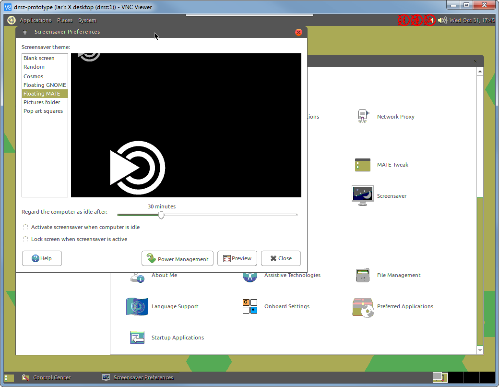
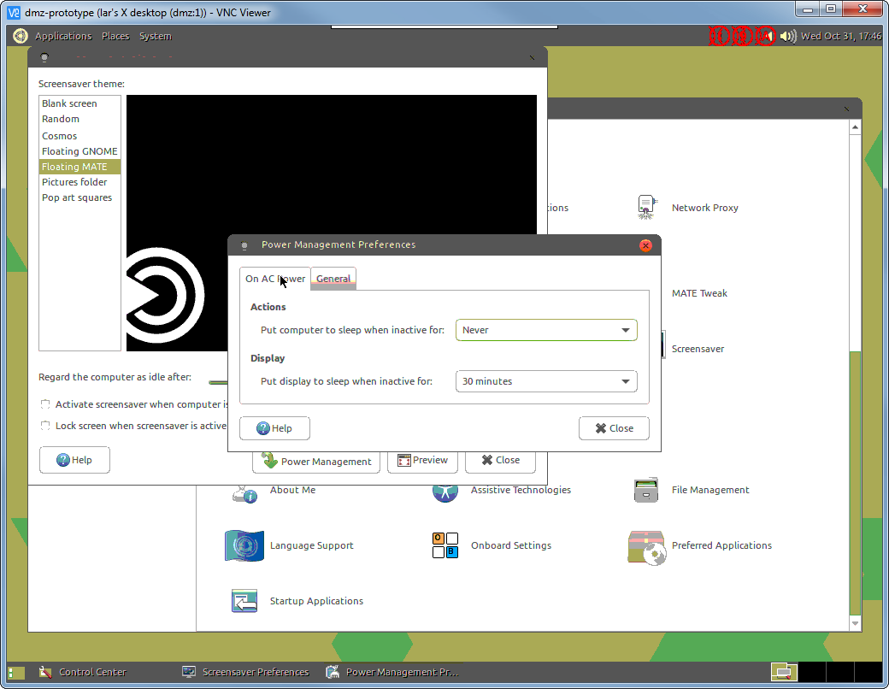

# Setup Details

## Hardware

The host is a Raspberry Pi 3 with class 10 SD card installed in a plastic case
for basic protection. It's powered through an on/off switch with a 2.5A/5V
power supply on a battery-backed UPS outlet.

* direct ethernet connection to the wifi router (not through a switch that could 
  potentially lose power)
* uninterruptible power supply (UPS) must be connected via USB


----

## Operating System

The operating system choice is [Ubuntu Mate](https://ubuntu-mate.org) because
the Mate desktop is intuitive for our user base. 

> As of mid-October 2018, the latest release for Raspberry Pi 3 is 16.04.2 
> (Xenial) *but* the 18.04 LTS release can be downloaded through standard 
> channels (covered later).

### Expand `/root` filesystem

After burning the image to disc and *before* first boot, use another computer
that has *gparted* installed to double the size of the system partition (`/boot`).
This ensures we have enough room to cache update packages. 

> This step is necessary for sufficient room to upgrade to 18.04 LTS.

1. TODO


### Installation Wizard

On first boot, complete the installation wizard questions. The user you create
here will be the administrator account for the machine. 

When prompted for login type, choose to *automatically login without entering
a password*.

### System Upgrades

Immediately after first boot, apply system updates:
```
sudo apt update
sudo apt upgrade
```

Then check for Raspberry Pi firmware updates:
```
sudo apt install rpi-update -y
sudo rpi-update
```

When you're ready, trigger the update to 18.04 LTS:
```
sudo do-release-upgrade
```

### Boot Options

The server is intended for headless operation so to preserve system resources, 
have the computer boot into a terminal instead of the graphical desktop. 

> To start the desktop from the command line, run `startx`.
> 
> Graphical (virtual) desktops will be automatically be created for VNC users.

Use *raspi-config* to change the default boot type:
```
sudo raspi-config
```
```
Boot Options -> Desktop / CLI -> Console Text
```

Before exiting, trigger the *raspi-config* internal update tool. 

### Enable SSH Server

If you haven't yet, enable the SSH service using *raspi-config* or *systemctl*:
```
sudo systemctl enable sshd.service
sudo systemctl start sshd.service
```

Then add some keys to `~/.ssh/authorized_keys` and disable password login:
```
sudo nano /etc/sshd_config
```
```diff
 # Change to no to disable tunnelled clear text passwords
-#PasswordAuthentication yes
+PasswordAuthentication no
```

### Enable persistent system logs

Ensure *systemd* keeps logs after reboots by creating log directory:
```
sudo mkdir -p /var/log/journal
```

### Enable the firewall

Ref: <https://www.digitalocean.com/community/tutorials/how-to-setup-a-firewall-with-ufw-on-an-ubuntu-and-debian-cloud-server> 

Set to manually installed:
```
sudo apt install ufw
```

Then apply some default rules:
```
sudo ufw default deny incoming
sudo ufw default allow outgoing
sudo ufw allow ssh

```

As other programs get installed, allow them through too:

| Description | Rule |
|-------------|------|
| VPN server (*ocserv*)         | `allow https` |
| email relay (*postfix*)       | `allow smtp`  |
| VNC server (*tightvncserver*) | 5901/tcp? |
| network UPS tools (*nut*)     | 3493 |

* probably need to enable 443/udp for *ocserv*?

### Fix the `popularity-contest` package

Ubuntu Mate currently has an annoying configuration problem: the file 
`/etc/popularity-contest.conf` is missing so *cron* will send error reports.
To fix it, re-run the package configuration (we chose *Yes* to participate) 
[[ref](http://usefulramblings.org/?page_id=6705)]:
```
sudo dpkg-reconfigure popularity-contest
```

### Fix the default browser issue

Ubuntu Mate also includes a configuration of *Firefox* that crashes in a loop.
Uninstall it and install *Chromium* instead:
```
sudo apt autoremove firefox -y
sudo apt install chromium-browser -y
```

### Fix the *cups-filters* package

By default, an error in the *cups-filters* package configuration will prevent
the *systemd-modules-load.service* from successfully loading. To fix, remove
kernel modules supporting the LP printer port (nonexistent on Raspberry Pi 3).

Resources:
* https://discourse.osmc.tv/t/failed-to-start-load-kernel-modules/3163/13
* https://www.raspberrypi.org/forums/viewtopic.php?p=949249
* https://askubuntu.com/questions/795360/kernel-load-module-error-during-boot-up/795421#795421

Procedure: remove config file, update defaults, then re-install package.
```
sudo rm /etc/modules-load.d/cups-filters.conf
sudo nano /etc/defaults/cups
```
```
LOAD_LP_MODULE=no
```
```
sudo apt install --reinstall cups-filters
sudo reboot
```

Verify service starts okay now:
```
lar@dmz:~$ sudo systemctl status systemd-modules-load.service
● systemd-modules-load.service - Load Kernel Modules
   Loaded: loaded (/lib/systemd/system/systemd-modules-load.service; static; vendor preset: enabled)
   Active: active (exited) since Sun 2018-01-28 07:58:19 PST; 9 months 2 days ago
     Docs: man:systemd-modules-load.service(8)
           man:modules-load.d(5)
  Process: 101 ExecStart=/lib/systemd/systemd-modules-load (code=exited, status=0/SUCCESS)
 Main PID: 101 (code=exited, status=0/SUCCESS)

Jan 28 07:58:19 dmz systemd-modules-load[101]: Inserted module 'bcm2835_v4l2'
Jan 28 07:58:19 dmz systemd-modules-load[101]: Inserted module 'i2c_dev'
Jan 28 07:58:19 dmz systemd-modules-load[101]: Inserted module 'snd_bcm2835'
Jan 28 07:58:19 dmz systemd[1]: Started Load Kernel Modules.
```

### Remove defunct packages

The following packages are not functional, but are still included with Ubuntu
Mate 18.04 LTS. (*Sources indicate this package will be removed in 18.10 and
this procedure will be unnecessary [[ref1](https://launchpad.net/ubuntu/+source/ubuntu-meta),
[ref2](https://askubuntu.com/a/1087007/227779)]*)

```
sudo apt autoremove ureadahead
```

> This will resolve issues with the `ureadahead.service` failing to load.


### Remove unnecessary packages

These packages won't be useful to support the Research Van, and we don't want
to consume bandwidth with potential updates for nothing. Just uninstall them:
```
sudo apt autoremove scratch minecraft-pi thunderbird youtube-dl youtube-dlg sonic-pi brasero rhythmbox qjackctl sense-emu-tools pidgin hexchat ubuntu-mate-welcome
```

### Install other useful packages

Add ability to connect back to WSU VPN (Cisco AnyConnect protocol):
```
sudo apt install network-manager-openconnect-gnome -y
```


### Other things to look into:

#### Screensaver issue

Does not wake up from screensaver due to local keyboard/mouse input..
* https://ubuntu-mate.community/t/mate-screensaver-stops-keyboard-from-working/16800/12






#### Mate "Power Statistics" panel

* observed on this panel: `cannot enable timerstats`
    * symptoms mirror: https://bugzilla.redhat.com/show_bug.cgi?id=1427621
        * basically `/proc/timer_stats` is no longer a valid file but *upower*
          continues to rely on it?


----

## Software

### Automatic Package Updates (*unattended-upgrades*)

Install *unattended-upgrades*:
```
sudo apt install unattended-upgrades
```

Verify configuration includes security updates...:
```
sudo nano /etc/apt.conf.d/50unattended-upgrades
```
```
// Automatically upgrade packages from these (origin:archive) pairs
Unattended-Upgrade::Allowed-Origins {
        "${distro_id}:${distro_codename}";
        "${distro_id}:${distro_codename}-security";
        // Extended Security Maintenance; doesn't necessarily exist for
        // every release and this system may not have it installed, but if
        // available, the policy for updates is such that unattended-upgrades
        // should also install from here by default.
        "${distro_id}ESM:${distro_codename}";
//      "${distro_id}:${distro_codename}-updates";
//      "${distro_id}:${distro_codename}-proposed";
//      "${distro_id}:${distro_codename}-backports";
};
```

> 2018-10-30 enabled `-updates` as well as `-security` packages, enabled
> option for automatic `autoremove`, and enabled automatic reboots @ 2AM

...and that automatic upgrades are enabled:
```
sudo nano /etc/apt/apt.conf.d/20auto-upgrades
```
```
APT::Periodic::Update-Package-Lists "1";
APT::Periodic::Unattended-Upgrade "1";
```

Enable email reports to user "*root*" (messages will be automatically forwarded
by *postfix* to a monitored email address):
```
sudo nano /etc/apt.conf.d/50unattended-upgrades
```
```diff
 // Send email to this address for problems or packages upgrades
 // If empty or unset then no email is sent, make sure that you
 // have a working mail setup on your system. A package that provides
 // 'mailx' must be installed. E.g. "user@example.com"
-//Unattended-Upgrade::Mail "root";
+Unattended-Upgrade::Mail "root";
```

After confirming email reports work correctly, optionally change to only report
errors:
```
sudo nano /etc/apt.conf.d/50unattended-upgrades
```
```diff
 // Set this value to "true" to get emails only on errors. Default
 // is to always send a mail if Unattended-Upgrade::Mail is set
-//Unattended-Upgrade::MailOnlyOnError "true";
+Unattended-Upgrade::MailOnlyOnError "true";
```

References:
* https://help.ubuntu.com/lts/serverguide/automatic-updates.html


### Terminal Session Manager (*tmux*)

Install *tmux*:
```
sudo apt install tmux
```

Configure so *tmux* starts automatically with each SSH login 
[[ref](https://stackoverflow.com/a/40192494/2946116)]:
```
nano ~/.bashrc
```
```diff
+if [[ -z "$TMUX" ]] && [ "$SSH_CONNECTION" != "" ]; then
+    tmux attach-session -t ssh_tmux || tmux new-session -s ssh_tmux
+fi
```

> Do not use *sudo* to launch *nano* in this instance. The command should be
> run as the user that will be used for SSH logins.

> *Future work?* <https://github.com/tmux-plugins/tmux-continuum>


### VNC Server (*tightvncserver*)

> *FUTURE: possibly use Google Chrome Remote Desktop for screen sharing?
> As of 2018-10-31, share feature is not available for this platform.*

> *FUTURE: share HDMI desktop session by using `x11vnc` server instead?*
> * https://raspberrypi.stackexchange.com/questions/28369/how-to-control-pi-hdmi-output-from-laptop-via-vnc?rq=1
> * https://wiki.xdroop.com//space/Linux/x11vnc+setup
> * https://serverfault.com/questions/27044/how-to-vnc-into-an-existing-x-session
> * https://askubuntu.com/questions/107239/vnc-with-current-desktop

> *Follow up on : https://askubuntu.com/questions/611544/mate-desktop-weird-red-icons-in-top-right-corner-how-to-remove-fix?rq=1*

Install *tightvncserver*:
```
sudo apt install tightvncserver
```

Configure using *vncserver* command (as admin user, not root):
```
vncserver
```
* Specify a password 
* Optionally, specify a view-only password

Now, test the connection over SSH:
* Establish a tunnel: `ssh user@server.tld -L 5901:localhost:5901`
* Connect to `127.0.0.1:5901` using compatible viewer 
  (such as [VNC Viewer](https://www.realvnc.com/en/connect/download/viewer/))

Should work OK. Finally, create a *systemd* service file:
```
sudo nano /etc/systemd/system/vncserver@.service
```
```
[Unit]
Description=Start TightVNC server at startup
After=syslog.target network.target

[Service]
Type=forking
User=lar
Group=lar
WorkingDirectory=/home/lar

PIDFile=/home/lar/.vnc/%H:%i.pid
ExecStartPre=-/usr/bin/vncserver -kill :%i > /dev/null 2>&1
ExecStart=/usr/bin/vncserver :%i
ExecStop=/usr/bin/vncserver -kill :%i

[Install]
WantedBy=multi-user.target
```

Enable and start the new service:
```
sudo systemctl daemon-reload
sudo systemctl enable vncserver@1.service
sudo systemctl start vncserver@1
sudo systemctl status vncserver@1
```

References:
* <https://www.digitalocean.com/community/tutorials/how-to-install-and-configure-vnc-on-ubuntu-18-04>


### VPN Server (*ocserv*)


> ***TODO***


### Email relay (*postfix*)

Ref: <https://devops.profitbricks.com/tutorials/configure-a-postfix-relay-through-gmail-on-ubuntu/>

Install *postfix* and follow prompts from package installer:
```
sudo apt install postfix
```
* Configure as *Satellite* site
* *Just provide hostname for FQDN - revisit later*
* Specify smtp server (*smtp.gmail.com*)

Enable SASL:
```
sudo nano /etc/postfix/main.cf
```
```diff
+smtp_use_tls = yes
+smtp_sasl_auth_enable = yes
+smtp_sasl_password_maps = hash:/etc/postfix/sasl/sasl_password
+smtp_sasl_security_options = noanonymous
+smtp_sasl_tls_security_options = noanonymous
```

Create credentials files and secure their file permissions:
> *For maximum security, you should use an 
> [app password](https://support.google.com/accounts/answer/185833?hl=en)
> instead of the account password.*
```
sudo nano /etc/postfix/sasl/sasl_password
```
```
smtp.gmail.com yourusername@gmail.com:password
```
```
sudo postmap /etc/postfix/sasl/sasl_password
sudo chown -R root:postfix /etc/postfix/sasl
sudo chmod 640 /etc/postfix/sasl/*
sudo chmod 750 /etc/postfix/sasl
```

Restart the service and test (*mail* is in *mailutils*):
```
sudo systemctl restart postfix
```
```
sudo apt install mailutils -y
echo "postfix test" | mail -s "test message" myemail@example.com
```

Now configure *postfix* as an open relay on the local area network. First,
add the LAN address (ex: 192.168.1.0/24) to the source network list. Then
enable listening on all interfaces (for simplicity, you could be more specific
too).
```
sudo nano /etc/postfix/main.cf
```
```diff
-mynetworks = 127.0.0.0/8 [::ffff:127.0.0.0]/104 [::1]/128
+mynetworks = 127.0.0.0/8 [::ffff:127.0.0.0]/104 [::1]/128 192.168.1.0/24
```
```dif
-inet_interfaces = loopback-only
+inet_interfaces = all
```

Finally, configure local mail forwarding using `/etc/aliases`
[[ref](https://unix.stackexchange.com/a/21582/160424)]:
```
sudo nano /etc/aliases
```
```diff
 # See man 5 aliases for format
 postmaster:    root
+root:   myadminuser
+myadminuser: myemail@example.com
```
```
sudo newaliases
```

Now test... somehow.


* https://blog.dantup.com/2016/04/setting-up-raspberry-pi-raspbian-jessie-to-send-email/
    * if hangs at start-up
* https://gist.github.com/dwilkie/41ae0c7acc48186e6058
    * hints on UFW rules
* https://www.linuxbabe.com/ubuntu/automatic-security-update-unattended-upgrades-ubuntu-18-04


### Network UPS Tools (*nut*)

Install *nut*:
```
sudo apt install nut -y
```

Ensure UPS is plugged in via USB. Add basic config options:
> *Use the [Hardware compatibility list](https://networkupstools.org/stable-hcl.html)
> to identify the correct driver type for your UPS.*
```
sudo nano /etc/nut/ups.conf
```
```diff
+[ups]
+        driver = usbhid-ups
+        port = auto
+        desc = "Data system UPS"
```

Expose the service to the local area network:
```
sudo nano /etc/nut/upsd.conf
```
```diff
 # =======================================================================
 # LISTEN <address> [<port>]
 # LISTEN 127.0.0.1 3493
 # LISTEN ::1 3493
+LISTEN 0.0.0.0 3493
 #
```

Finally, enable the service:
```
sudo nano /etc/nut/nut.conf
```
```diff
-MODE=none
+MODE=netserver
```
```
sudo systemctl restart nut-server.service
```

#### Graphical UPS Monitor (*NUT-Monitor*)

It is recommended to have *NUT-Monitor* installed so desktop users can easily
review the UPS status.
```
sudo apt install nut-monitor -y
```

Launch the program from the *Applications > Internet* menu.


### System Monitoring Service (*RPi-Monitor*)

> Very seriously look at disabling the so-called predictable network interface names!

Install *rpimonitor* 
[[ref](https://xavierberger.github.io/RPi-Monitor-docs/11_installation.html)]:
```
sudo apt-get install dirmngr
sudo apt-key adv --recv-keys --keyserver keyserver.ubuntu.com 2C0D3C0F
sudo wget http://goo.gl/vewCLL -O /etc/apt/sources.list.d/rpimonitor.list
sudo apt-get update
sudo apt install rpimonitor -y
```

Initialize:
```
sudo /etc/init.d/rpimonitor update
```

Then fixup the networking configuration:
```
sudo nano /etc/rpimonitor/template/network.conf
```

Also enable the *Top3* addon for monitoring processes:
```
sudo cp /usr/share/rpimonitor/web/addons/top3/top3.cron /etc/cron.d/top3
```
```
sudo nano /etc/rpimonitor/data.conf
```
```diff
 #web.addons.4.name=Custom addons
 #web.addons.4.addons=custom
 #web.addons.4.showTitle=0
 #web.addons.4.url=/addons/custom/custominfo.html
 
-#web.addons.5.name=Top3
-#web.addons.5.addons=top3
+web.addons.5.name=Top3
+web.addons.5.addons=top3
```
```
sudo nano /etc/rpimonitor/template/cpu.conf
```
```diff
 web.status.1.content.1.name=CPU
 web.status.1.content.1.icon=cpu.png
 #web.status.1.content.1.line.1="Loads: <b>" + data.load1 + "</b> [1min] - <b>" + data.load5 + "</b> [5min] - <b>" + data.load15 + "$
 web.status.1.content.1.line.1=JustGageBar("Load", "1min", 0, data.load1, data.max_proc, 100, 80)+" "+JustGageBar("Load", "5min", 0,$
 web.status.1.content.1.line.2="CPU frequency: <b>" + data.cpu_frequency + "MHz</b> Voltage: <b>" + data.cpu_voltage + "V</b>"
 web.status.1.content.1.line.3="Scaling governor: <b>" + data.scaling_governor + "</b>"
-#web.status.1.content.1.line.4=InsertHTML("/addons/top3/top3.html")
+web.status.1.content.1.line.4=InsertHTML("/addons/top3/top3.html")
```

Enable services status badges on the homepage:
```
sudo nano /etc/rpimonitor/data.conf
```
```diff
 ...
 include=/etc/rpimonitor/template/version.conf
 include=/etc/rpimonitor/template/uptime.conf
+include=/etc/rpimonitor/template/services.conf
 include=/etc/rpimonitor/template/cpu.conf
 include=/etc/rpimonitor/template/temperature.conf
 include=/etc/rpimonitor/template/memory.conf
 include=/etc/rpimonitor/template/swap.conf
 include=/etc/rpimonitor/template/sdcard.conf
 include=/etc/rpimonitor/template/network.conf
```
```
sudo nano /etc/rpimonitor/template/services.conf
```
```diff
 ...
-dynamic.3.name=http
-dynamic.3.source=netstat -nlt
-dynamic.3.regexp=tcp .*:(80).*LISTEN
-
-dynamic.4.name=https
-dynamic.4.source=netstat -nlt
-dynamic.4.regexp=tcp .*:(443).*LISTEN
-
-dynamic.5.name=mysql
-dynamic.5.source=netstat -nlt
-dynamic.5.regexp=tcp .*:(3306).*LISTEN
+#dynamic.3.name=http
+#dynamic.3.source=netstat -nlt
+#dynamic.3.regexp=tcp .*:(80).*LISTEN
+
+#dynamic.4.name=https
+#dynamic.4.source=netstat -nlt
+#dynamic.4.regexp=tcp .*:(443).*LISTEN
+
+#dynamic.5.name=mysql
+#dynamic.5.source=netstat -nlt
+#dynamic.5.regexp=tcp .*:(3306).*LISTEN
+
+dynamic.6.name=vpn
+dynamic.6.source=netstat -nlt
+dynamic.6.regexp=tcp .*:(443).*LISTEN
+
+dynamic.7.name=vnc
+dynamic.7.source=netstat -nlt
+dynamic.7.regexp=tcp .*:(5901).*LISTEN
+
+dynamic.8.name=vncx11
+dynamic.8.source=netstat -nlt
+dynamic.8.regexp=tcp .*:(6001).*LISTEN
+
+dynamic.9.name=smtp
+dynamic.9.source=netstat -nlt
+dynamic.9.regexp=tcp .*:(25).*LISTEN
+
+dynamic.10.name=nut
+dynamic.10.source=netstat -nlt
+dynamic.10.regexp=tcp .*:(3493).*LISTEN
+
+dynamic.11.name=ftp
+dynamic.11.source=netstat -nlt
+dynamic.11.regexp=tcp .*:(21).*LISTEN

 web.status.1.content.1.name=Servers
 web.status.1.content.1.icon=daemons.png
-web.status.1.content.1.line.1="<b>ssh</b> : "+Label(data.ssh,"==22","OK","success")+Label(data.ssh,"!=22","KO","danger")+" <b>rpimonitor</b> : "+Label(data.rpimonitor,"==8888","OK","success")+Label(data.rpimonitor,"!=8888","KO","danger")+" <b>nginx http</b> : "+Label(data.http,"==80","OK","success")+Label(data.http,"!=80","KO","danger")+" <b>nginx https</b> : "+Label(data.https,"==443","OK","success")+Label(data.https,"!=443","KO","danger")+" <b>mysql</b> : "+Label(data.mysql,"==3306","OK","success")+Label(data.mysql,"!=3306","KO","danger")
+#web.status.1.content.1.line.1="<b>ssh</b> : "+Label(data.ssh,"==22","OK","success")+Label(data.ssh,"!=22","KO","danger")+" <b>rpimonitor</b> : "+Label(data.rpimonitor,"==8888","OK","success")+Label(data.rpimonitor,"!=8888","KO","danger")+" <b>nginx http</b> : "+Label(data.http,"==80","OK","success")+Label(data.http,"!=80","KO","danger")+" <b>nginx https</b> : "+Label(data.https,"==443","OK","success")+Label(data.https,"!=443","KO","danger")+" <b>mysql</b> : "+Label(data.mysql,"==3306","OK","success")+Label(data.mysql,"!=3306","KO","danger")
+web.status.1.content.1.line.1="<b>ssh</b> "+Label(data.ssh,"==22","OK","success")+Label(data.ssh,"!=22","KO","danger")+" | <b>rpimonitor</b> "+Label(data.rpimonitor,"==8888","OK","success")+Label(data.rpimonitor,"!=8888","KO","danger")+" | <b>ocserv vpn</b> "+Label(data.vpn,"==443","OK","success")+Label(data.vpn,"!=443","KO","danger")+" | <b>tightvnc vnc</b> "+Label(data.vnc,"==5901","OK","success")+Label(data.vnc,"!=5901","KO","danger")+" | <b>tightvnc x11</b> "+Label(data.vncx11,"==6001","OK","success")+Label(data.vncx11,"!=6001","KO","danger")
+web.status.1.content.1.line.2="<b>postfix smtp</b> "+Label(data.smtp,"==25","OK","success")+Label(data.smtp,"!=25","KO","danger")+" | <b>nut-server</b> "+Label(data.nut,"==3493","OK","success")+Label(data.nut,"!=3493","KO","danger")+" | <b>ftp</b> "+Label(data.ftp,"==21","OK","success")+Label(data.ftp,"!=21","KO","danger")
```

> **Performance testing notes**
>
> The following items have been held back so that RPi-Monitor can collect
> baseline performance data:
>
> * graphical vs. command line desktop boot
> * for the VPN (ocserv), the use of DTLS vs. TCP BBR


### FTP Server (*vsftpd*)

Install so the Conext Combox has somewhere to push event log files?
* https://www.digitalocean.com/community/tutorials/how-to-set-up-vsftpd-for-a-user-s-directory-on-ubuntu-16-04
* https://help.ubuntu.com/lts/serverguide/ftp-server.html

Probably better approach: enable FTP service on NAS unit (Synology DS218?)


