### VNC can't display panel icons

OK, persistent issue with panel tray icons over VNC appearing as red circles:
* https://askubuntu.com/questions/611544/mate-desktop-weird-red-icons-in-top-right-corner-how-to-remove-fix
    * it's the scroll/num/caps lock applet: `mate-applet-lockkeys`
    * provided answer does *not* work
* https://askubuntu.com/questions/899033/what-are-those-weird-circle-red-icons-at-the-top-right-in-ubuntu-mate-desktop?rq=1

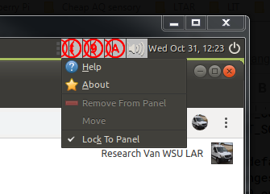
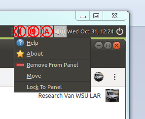

It's not just red circles though: they block access to other normally visible
icons like network manager and bluetooth.

Upon fresh vnc login, will be displayed overlapped:
> Issue on Github describing icons being cut in half vertically:
> https://github.com/mate-desktop/mate-panel/issues/746
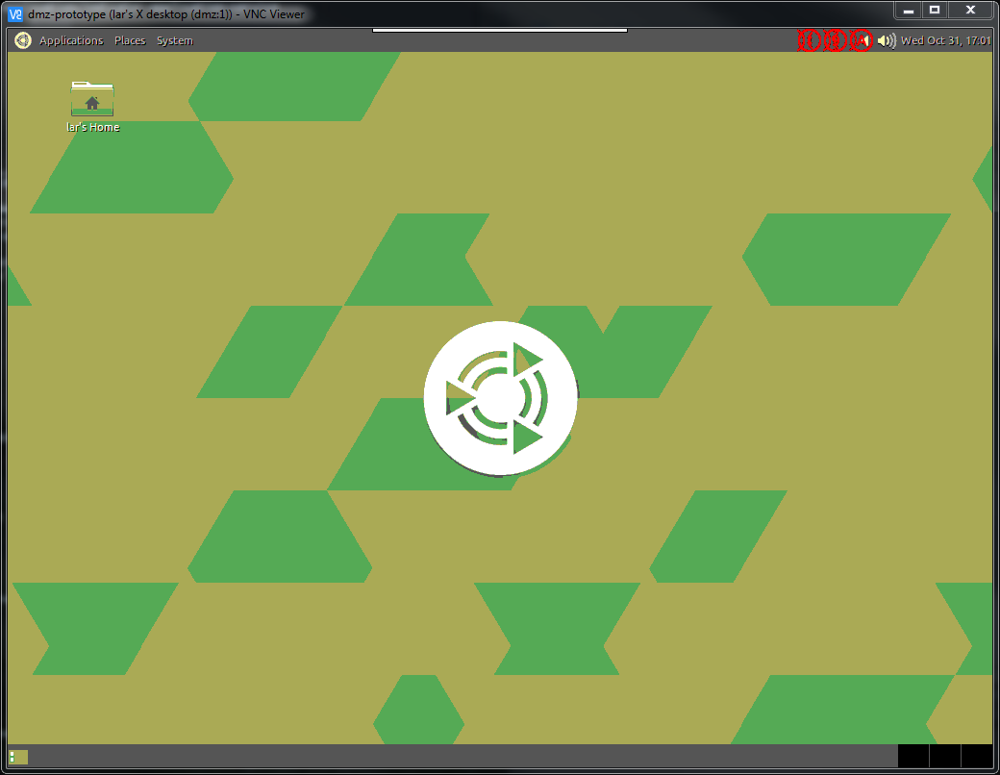

But after changing something using *MATE Tweak* to force a display refresh,
icons are presented at least not overlapping one another:
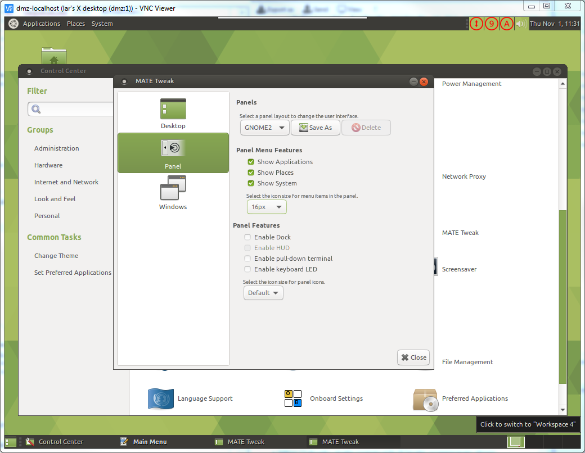

OK, not exactly... reverting "icon size" back to default caused some kind of
regression - window borders and panels completely disappear:
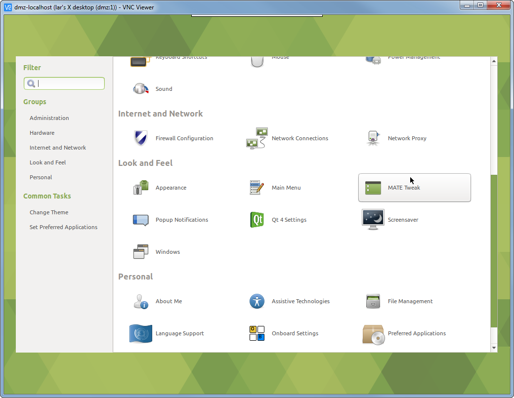
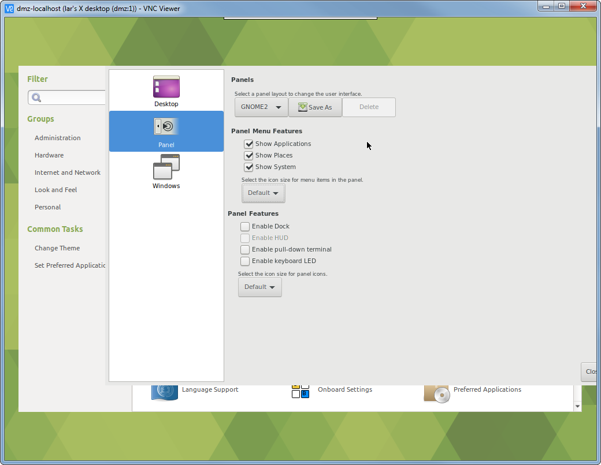

Something is totally fucked - the window manager has crashed:
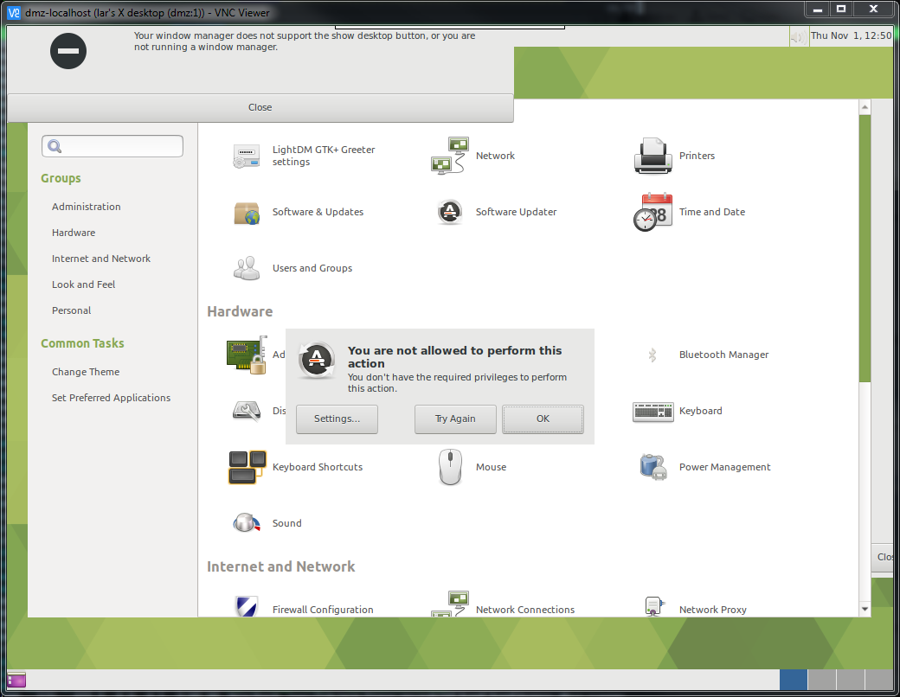

OK.. rebooting.

So, for comparison the red icons that appear over VNC do **not** appear on the
local desktop:


AND we don't even have `mate-applet-lockkeys` installed:
```
lar@dmz:~$ which mate-
mate-about                                  mate-dictionary                             mate-mouse-properties                       mate-power-preferences                      mate-session-properties                     mate-typing-monitor
mate-about-me                               mate-disk-usage-analyzer                    mate-network-properties                     mate-power-statistics                       mate-session-save                           mate-volume-control
mate-appearance-properties                  mate-display-properties                     mate-notification-properties                mate-screensaver                            mate-settings-daemon                        mate-volume-control-applet
mate-at-properties                          mate-display-properties-install-systemwide  mate-open                                   mate-screensaver-command                    mate-system-log                             mate-window-properties
mate-color-select                           mate-font-viewer                            mate-panel                                  mate-screensaver-preferences                mate-system-monitor                         mate-wm
mate-control-center                         mate-keybinding-properties                  mate-panel-screenshot                       mate-screenshot                             mate-terminal
mate-cpufreq-selector                       mate-keyboard-properties                    mate-panel-test-applets                     mate-search-tool                            mate-terminal.wrapper
mate-default-applications-properties        mate-maximus                                mate-power-backlight-helper                 mate-session                                mate-thumbnail-font
mate-desktop-item-edit                      mate-menu                                   mate-power-manager                          mate-session-inhibit                        mate-tweak
```
```
lar@dmz:~$ ps aux | grep mate
lar        856  0.1  3.8 150952 36788 ?        Ssl  12:52   0:01 mate-session
lar        990  0.1  2.6 404840 24796 ?        Sl   12:52   0:01 /usr/bin/mate-settings-daemon
lar       1274  0.3  2.8 117760 27404 ?        Sl   12:52   0:03 mate-panel
lar       1452  0.1  2.4  99676 23216 ?        Sl   12:52   0:01 /usr/lib/mate-panel/wnck-applet
lar       1469  0.0  1.5  56816 14824 ?        Sl   12:52   0:00 mate-screensaver
lar       1556  0.0  1.3  54760 12732 ?        Sl   12:52   0:00 mate-maximus
lar       1576  0.0  2.5 346808 23916 ?        Sl   12:52   0:00 mate-volume-control-applet
lar       1605  0.0  2.4 102252 23140 ?        Sl   12:52   0:00 /usr/lib/mate-panel/clock-applet
lar       1607  0.0  1.8  66128 17664 ?        Sl   12:52   0:00 /usr/lib/mate-panel/notification-area-applet
lar       1735  0.0  0.0   3024   216 ?        Ss   12:52   0:00 /usr/bin/ssh-agent /usr/bin/im-launch mate-session
lar       1894  0.1  2.5 404100 24328 ?        Sl   12:52   0:01 /usr/bin/mate-settings-daemon
lar       1919  0.1  2.5 110504 24448 ?        Sl   12:52   0:01 mate-panel
lar       1952  0.0  2.3  99224 22400 ?        Sl   12:52   0:00 /usr/lib/mate-panel/wnck-applet
lar       1957  0.0  2.3 101276 22476 ?        Sl   12:52   0:00 /usr/lib/mate-panel/clock-applet
lar       1959  0.0  1.8  66064 17468 ?        Sl   12:52   0:00 /usr/lib/mate-panel/notification-area-applet
lar       1967  0.0  1.5  56460 15144 ?        Sl   12:52   0:00 mate-screensaver
lar       1973  0.0  1.4  46540 13468 ?        Sl   12:52   0:00 /usr/lib/arm-linux-gnueabihf/polkit-mate/polkit-mate-authentication-agent-1
lar       1997  0.0  1.8  66956 17908 ?        Sl   12:52   0:00 mate-power-manager
lar       2000  0.0  1.5  56208 15044 ?        Sl   12:52   0:00 mate-maximus
lar       2005  0.0  2.4 345800 22968 ?        Sl   12:52   0:00 mate-volume-control-applet
lar       5696  0.0  0.0   4292   584 pts/1    S+   13:12   0:00 grep --color=auto mate
```

Try to add new user and see if their profile is screwed up... cannot make any
changes to system using GUI...
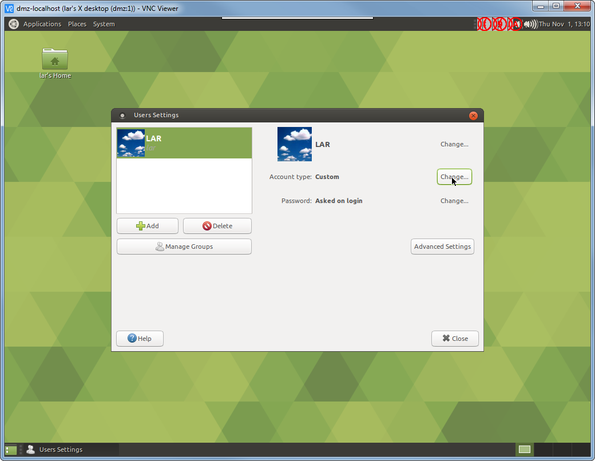
```
lar@dmz:~$ sudo ls -lR /etc/polkit-1/
[sudo] password for lar:
/etc/polkit-1/:
total 12
drwx------ 7 root root 4096 Feb 11  2017 localauthority
drwxr-xr-x 2 root root 4096 Oct 25 18:37 localauthority.conf.d
drwxr-xr-x 2 root root 4096 Oct 25 18:37 nullbackend.conf.d

/etc/polkit-1/localauthority:
total 20
drwxr-xr-x 2 root root 4096 Jan 17  2016 10-vendor.d
drwxr-xr-x 2 root root 4096 Jan 17  2016 20-org.d
drwxr-xr-x 2 root root 4096 Jan 17  2016 30-site.d
drwxr-xr-x 2 root root 4096 Jan 17  2016 50-local.d
drwxr-xr-x 2 root root 4096 Jan 17  2016 90-mandatory.d

/etc/polkit-1/localauthority/10-vendor.d:
total 0

/etc/polkit-1/localauthority/20-org.d:
total 0

/etc/polkit-1/localauthority/30-site.d:
total 0

/etc/polkit-1/localauthority/50-local.d:
total 0

/etc/polkit-1/localauthority/90-mandatory.d:
total 0

/etc/polkit-1/localauthority.conf.d:
total 8
-rw-r--r-- 1 root root 267 Jan 17  2016 50-localauthority.conf
-rw-r--r-- 1 root root  65 Jan 17  2016 51-ubuntu-admin.conf

/etc/polkit-1/nullbackend.conf.d:
total 4
-rw-r--r-- 1 root root 455 Jan 17  2016 50-nullbackend.conf
```

* Enter interactive admin shell: `sudo -i`
* Create two new users (vpn/cougars) and (patrick/patrick) using `adduser`
* Grant admin rights to patrick with `usermod -aG sudo patrick`
* Tried logging out of desktop session in VNC... stalled out:
  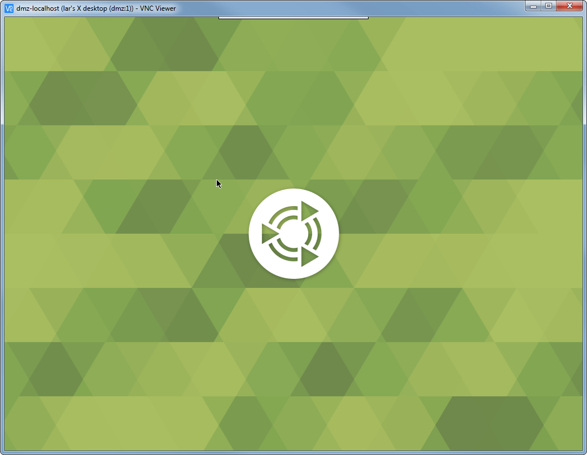

----

Current service status:
```
lar@dmz:~$ sudo systemctl status vncserver@1.service
● vncserver@1.service - Start TightVNC server at startup
   Loaded: loaded (/etc/systemd/system/vncserver@.service; indirect; vendor preset: enabled)
   Active: active (running) since Thu 2018-11-01 12:52:04 PDT; 46min ago
  Process: 693 ExecStart=/usr/bin/vncserver :1 (code=exited, status=0/SUCCESS)
  Process: 651 ExecStartPre=/usr/bin/vncserver -kill :1 > /dev/null 2>&1 (code=exited, status=2)
 Main PID: 706 (Xtightvnc)
   CGroup: /system.slice/system-vncserver.slice/vncserver@1.service
           ├─ 706 Xtightvnc :1 -desktop X -auth /home/lar/.Xauthority -geometry 1024x768 -depth 24 -rfbwait 120000 -rfbauth /home/lar/.vnc/passwd -rfbport 5901 -fp /usr/share/fonts/X11/misc/,/usr/share/fonts/X11/Type1/,/usr/share/fonts/X11/75dpi/,/usr/share/fonts/X11/100
           ├─ 745 dbus-launch --autolaunch a16cd74fbe0341468458fcd1e0c649b9 --binary-syntax --close-stderr
           ├─ 746 /usr/bin/dbus-daemon --syslog-only --fork --print-pid 5 --print-address 7 --session
           ├─ 820 /usr/bin/dbus-launch --exit-with-session --sh-syntax
           ├─ 822 /usr/bin/dbus-daemon --syslog --fork --print-pid 5 --print-address 7 --session
           ├─ 908 /usr/lib/dconf/dconf-service
           ├─ 954 gnome-keyring-daemon --start
           ├─1116 /usr/lib/gvfs/gvfsd
           ├─1155 /usr/lib/gvfs/gvfsd-fuse /home/lar/.gvfs -f -o big_writes
           ├─1259 /usr/bin/pulseaudio --start --log-target=syslog
           ├─1433 /usr/lib/gvfs/gvfs-udisks2-volume-monitor
           ├─1446 /usr/lib/gvfs/gvfs-mtp-volume-monitor
           ├─1454 /usr/lib/gvfs/gvfs-goa-volume-monitor
           ├─1467 /usr/lib/gvfs/gvfs-afc-volume-monitor
           ├─1469 mate-screensaver
           ├─1474 update-notifier
           ├─1479 /usr/lib/gvfs/gvfs-gphoto2-volume-monitor
           ├─1490 /usr/lib/deja-dup/deja-dup-monitor
           ├─1502 nm-applet
           ├─1514 /usr/bin/python3 /usr/bin/blueman-applet
           ├─1539 /usr/bin/python3 /usr/share/system-config-printer/applet.py
           ├─1556 mate-maximus
           ├─1576 mate-volume-control-applet
           ├─1582 /usr/lib/arm-linux-gnueabihf/indicator-sound/indicator-sound-service
           ├─1586 /usr/lib/arm-linux-gnueabihf/indicator-application/indicator-application-service
           ├─1786 /usr/lib/gvfs/gvfsd-trash --spawner :1.12 /org/gtk/gvfs/exec_spaw/0
           ├─1826 /usr/lib/bluetooth/obexd
           ├─3268 /usr/lib/gvfs/gvfsd-network --spawner :1.12 /org/gtk/gvfs/exec_spaw/3
           └─3296 /usr/lib/gvfs/gvfsd-dnssd --spawner :1.12 /org/gtk/gvfs/exec_spaw/7

Nov 01 12:52:13 dmz clock-applet[1605]: Negative content width -1 (allocation 1, extents 1x1) while allocating gadget (node button, owner GtkToggleButton)
Nov 01 12:52:15 dmz dbus-daemon[822]: [session uid=1000 pid=819] Activating service name='org.bluez.obex' requested by ':1.40' (uid=1000 pid=1514 comm="/usr/bin/python3 /usr/bin/blueman-applet ")
Nov 01 12:52:15 dmz obexd[1826]: OBEX daemon 5.48
Nov 01 12:52:15 dmz dbus-daemon[822]: [session uid=1000 pid=819] Successfully activated service 'org.bluez.obex'
Nov 01 12:59:31 dmz org.gtk.vfs.Daemon[822]: got no contact to IPC$
Nov 01 12:59:31 dmz org.gtk.vfs.Daemon[822]: got no contact to IPC$
Nov 01 12:59:31 dmz org.gtk.vfs.Daemon[822]: got no contact to IPC$
Nov 01 12:59:31 dmz org.gtk.vfs.Daemon[822]: got no contact to IPC$
Nov 01 12:59:31 dmz org.gtk.vfs.Daemon[822]: got no contact to IPC$
Nov 01 12:59:31 dmz org.gtk.vfs.Daemon[822]: got no contact to IPC$
```

Complete log since reboot:
```
-- Reboot --
Nov 01 12:52:02 dmz systemd[1]: Starting Start TightVNC server at startup...
-- Subject: Unit vncserver@1.service has begun start-up
-- Defined-By: systemd
-- Support: http://www.ubuntu.com/support
--
-- Unit vncserver@1.service has begun starting up.
Nov 01 12:52:04 dmz vncserver[693]: New 'X' desktop is dmz:1
Nov 01 12:52:04 dmz vncserver[693]: Starting applications specified in /home/lar/.vnc/xstartup
Nov 01 12:52:04 dmz vncserver[693]: Log file is /home/lar/.vnc/dmz:1.log
Nov 01 12:52:04 dmz systemd[1]: Started Start TightVNC server at startup.
-- Subject: Unit vncserver@1.service has finished start-up
-- Defined-By: systemd
-- Support: http://www.ubuntu.com/support
--
-- Unit vncserver@1.service has finished starting up.
--
-- The start-up result is RESULT.
Nov 01 12:52:06 dmz dbus-daemon[822]: [session uid=1000 pid=819] Activating service name='org.a11y.Bus' requested by ':1.3' (uid=1000 pid=733 comm="x-session-manager ")
Nov 01 12:52:06 dmz dbus-daemon[822]: [session uid=1000 pid=819] Successfully activated service 'org.a11y.Bus'
Nov 01 12:52:06 dmz org.a11y.Bus[822]: dbus-daemon[883]: Activating service name='org.a11y.atspi.Registry' requested by ':1.0' (uid=1000 pid=733 comm="x-session-manager ")
Nov 01 12:52:06 dmz dbus-daemon[822]: [session uid=1000 pid=819] Activating service name='org.freedesktop.systemd1' requested by ':1.5' (uid=1000 pid=733 comm="x-session-manager ")
Nov 01 12:52:06 dmz dbus-daemon[822]: [session uid=1000 pid=819] Activated service 'org.freedesktop.systemd1' failed: Process org.freedesktop.systemd1 exited with status 1
Nov 01 12:52:06 dmz org.a11y.Bus[822]: dbus-daemon[883]: Successfully activated service 'org.a11y.atspi.Registry'
Nov 01 12:52:06 dmz org.a11y.Bus[822]: SpiRegistry daemon is running with well-known name - org.a11y.atspi.Registry
Nov 01 12:52:06 dmz dbus-daemon[822]: [session uid=1000 pid=819] Activating service name='org.freedesktop.systemd1' requested by ':1.6' (uid=1000 pid=733 comm="x-session-manager ")
Nov 01 12:52:06 dmz dbus-daemon[822]: [session uid=1000 pid=819] Activated service 'org.freedesktop.systemd1' failed: Process org.freedesktop.systemd1 exited with status 1
Nov 01 12:52:06 dmz dbus-daemon[822]: [session uid=1000 pid=819] Activating service name='org.freedesktop.systemd1' requested by ':1.6' (uid=1000 pid=733 comm="x-session-manager ")
Nov 01 12:52:06 dmz dbus-daemon[822]: [session uid=1000 pid=819] Activated service 'org.freedesktop.systemd1' failed: Process org.freedesktop.systemd1 exited with status 1
Nov 01 12:52:06 dmz dbus-daemon[822]: [session uid=1000 pid=819] Activating service name='org.freedesktop.systemd1' requested by ':1.6' (uid=1000 pid=733 comm="x-session-manager ")
Nov 01 12:52:06 dmz dbus-daemon[822]: [session uid=1000 pid=819] Activated service 'org.freedesktop.systemd1' failed: Process org.freedesktop.systemd1 exited with status 1
Nov 01 12:52:06 dmz dbus-daemon[822]: [session uid=1000 pid=819] Activating service name='ca.desrt.dconf' requested by ':1.6' (uid=1000 pid=733 comm="x-session-manager ")
Nov 01 12:52:06 dmz dbus-daemon[822]: [session uid=1000 pid=819] Successfully activated service 'ca.desrt.dconf'
Nov 01 12:52:06 dmz dbus-daemon[822]: [session uid=1000 pid=819] Activating service name='org.freedesktop.systemd1' requested by ':1.6' (uid=1000 pid=733 comm="x-session-manager ")
Nov 01 12:52:06 dmz dbus-daemon[822]: [session uid=1000 pid=819] Activated service 'org.freedesktop.systemd1' failed: Process org.freedesktop.systemd1 exited with status 1
Nov 01 12:52:07 dmz dbus-daemon[822]: [session uid=1000 pid=819] Activating service name='org.freedesktop.systemd1' requested by ':1.6' (uid=1000 pid=733 comm="x-session-manager ")
Nov 01 12:52:07 dmz dbus-daemon[822]: [session uid=1000 pid=819] Activated service 'org.freedesktop.systemd1' failed: Process org.freedesktop.systemd1 exited with status 1
Nov 01 12:52:07 dmz x-session-manager[733]: WARNING: GSIdleMonitor: IDLETIME counter not found
Nov 01 12:52:07 dmz x-session-manager[733]: GLib-GObject-CRITICAL: object GSIdleMonitor 0xdbbc80 finalized while still in-construction
Nov 01 12:52:07 dmz x-session-manager[733]: GLib-GObject-CRITICAL: Custom constructor for class GSIdleMonitor returned NULL (which is invalid). Please use GInitable instead.
Nov 01 12:52:07 dmz x-session-manager[733]: WARNING: Unable to find provider '' of required component 'dock'
Nov 01 12:52:07 dmz dbus-daemon[822]: [session uid=1000 pid=819] Activating service name='org.freedesktop.systemd1' requested by ':1.6' (uid=1000 pid=733 comm="x-session-manager ")
Nov 01 12:52:07 dmz dbus-daemon[822]: [session uid=1000 pid=819] Activated service 'org.freedesktop.systemd1' failed: Process org.freedesktop.systemd1 exited with status 1
Nov 01 12:52:07 dmz dbus-daemon[822]: [session uid=1000 pid=819] Activating service name='org.freedesktop.systemd1' requested by ':1.6' (uid=1000 pid=733 comm="x-session-manager ")
Nov 01 12:52:07 dmz dbus-daemon[822]: [session uid=1000 pid=819] Activated service 'org.freedesktop.systemd1' failed: Process org.freedesktop.systemd1 exited with status 1
Nov 01 12:52:07 dmz dbus-daemon[822]: [session uid=1000 pid=819] Activating service name='org.freedesktop.systemd1' requested by ':1.6' (uid=1000 pid=733 comm="x-session-manager ")
Nov 01 12:52:07 dmz dbus-daemon[822]: [session uid=1000 pid=819] Activated service 'org.freedesktop.systemd1' failed: Process org.freedesktop.systemd1 exited with status 1
Nov 01 12:52:07 dmz dbus-daemon[822]: [session uid=1000 pid=819] Activating service name='org.freedesktop.systemd1' requested by ':1.6' (uid=1000 pid=733 comm="x-session-manager ")
Nov 01 12:52:07 dmz dbus-daemon[822]: [session uid=1000 pid=819] Activated service 'org.freedesktop.systemd1' failed: Process org.freedesktop.systemd1 exited with status 1
Nov 01 12:52:07 dmz dbus-daemon[822]: [session uid=1000 pid=819] Activating service name='org.gtk.vfs.Daemon' requested by ':1.10' (uid=1000 pid=990 comm="/usr/bin/mate-settings-daemon ")
Nov 01 12:52:07 dmz dbus-daemon[822]: [session uid=1000 pid=819] Successfully activated service 'org.gtk.vfs.Daemon'
Nov 01 12:52:09 dmz pulseaudio[1259]: [pulseaudio] backend-ofono.c: Failed to register as a handsfree audio agent with ofono: org.freedesktop.DBus.Error.ServiceUnknown: The name org.ofono was not provided by any .service files
Nov 01 12:52:10 dmz dbus-daemon[822]: [session uid=1000 pid=819] Activating service name='org.gtk.vfs.UDisks2VolumeMonitor' requested by ':1.10' (uid=1000 pid=990 comm="/usr/bin/mate-settings-daemon ")
Nov 01 12:52:10 dmz dbus-daemon[822]: [session uid=1000 pid=819] Successfully activated service 'org.gtk.vfs.UDisks2VolumeMonitor'
Nov 01 12:52:10 dmz dbus-daemon[822]: [session uid=1000 pid=819] Activating service name='org.gtk.vfs.MTPVolumeMonitor' requested by ':1.10' (uid=1000 pid=990 comm="/usr/bin/mate-settings-daemon ")
Nov 01 12:52:10 dmz dbus-daemon[822]: [session uid=1000 pid=819] Activating service name='org.mate.panel.applet.WnckletFactory' requested by ':1.15' (uid=1000 pid=1274 comm="mate-panel ")
Nov 01 12:52:10 dmz dbus-daemon[822]: [session uid=1000 pid=819] Successfully activated service 'org.gtk.vfs.MTPVolumeMonitor'
Nov 01 12:52:10 dmz dbus-daemon[822]: [session uid=1000 pid=819] Activating service name='org.gtk.vfs.GoaVolumeMonitor' requested by ':1.10' (uid=1000 pid=990 comm="/usr/bin/mate-settings-daemon ")
Nov 01 12:52:10 dmz dbus-daemon[822]: [session uid=1000 pid=819] Successfully activated service 'org.gtk.vfs.GoaVolumeMonitor'
Nov 01 12:52:10 dmz dbus-daemon[822]: [session uid=1000 pid=819] Activating service name='org.gtk.vfs.AfcVolumeMonitor' requested by ':1.10' (uid=1000 pid=990 comm="/usr/bin/mate-settings-daemon ")
Nov 01 12:52:10 dmz x-session-manager[733]: WARNING: Could not launch application 'indicator-messages.desktop': Unable to start application: Failed to execute child process “/usr/lib/arm-linux-gnueabihf/indicator-messages/indicator-messages-service” (No such file or dire
Nov 01 12:52:10 dmz org.gtk.vfs.AfcVolumeMonitor[822]: Volume monitor alive
Nov 01 12:52:10 dmz dbus-daemon[822]: [session uid=1000 pid=819] Successfully activated service 'org.gtk.vfs.AfcVolumeMonitor'
Nov 01 12:52:10 dmz dbus-daemon[822]: [session uid=1000 pid=819] Activating service name='org.gtk.vfs.GPhoto2VolumeMonitor' requested by ':1.10' (uid=1000 pid=990 comm="/usr/bin/mate-settings-daemon ")
Nov 01 12:52:10 dmz dbus-daemon[822]: [session uid=1000 pid=819] Successfully activated service 'org.mate.panel.applet.WnckletFactory'
Nov 01 12:52:10 dmz gnome-keyring-daemon[954]: The Secret Service was already initialized
Nov 01 12:52:10 dmz dbus-daemon[822]: [session uid=1000 pid=819] Successfully activated service 'org.gtk.vfs.GPhoto2VolumeMonitor'
Nov 01 12:52:10 dmz gnome-keyring-daemon[954]: The PKCS#11 component was already initialized
Nov 01 12:52:10 dmz pulseaudio[1259]: [alsa-sink-bcm2835 ALSA] alsa-sink.c: ALSA woke us up to write new data to the device, but there was actually nothing to write.
Nov 01 12:52:10 dmz pulseaudio[1259]: [alsa-sink-bcm2835 ALSA] alsa-sink.c: Most likely this is a bug in the ALSA driver '(null)'. Please report this issue to the ALSA developers.
Nov 01 12:52:10 dmz pulseaudio[1259]: [alsa-sink-bcm2835 ALSA] alsa-sink.c: We were woken up with POLLOUT set -- however a subsequent snd_pcm_avail() returned 0 or another value < min_avail.
Nov 01 12:52:10 dmz pulseaudio[1259]: [pulseaudio] module-x11-bell.c: XkbQueryExtension() failed
Nov 01 12:52:10 dmz pulseaudio[1259]: [pulseaudio] module.c: Failed to load module "module-x11-bell" (argument: "display=:1 sample=bell.ogg"): initialization failed.
Nov 01 12:52:10 dmz gnome-keyring-daemon[954]: The SSH agent was already initialized
Nov 01 12:52:10 dmz x-session-manager[733]: WARNING: Could not launch application 'ubuntu-mate-welcome.desktop': Unable to start application: Failed to execute child process “ubuntu-mate-welcome” (No such file or directory)
Nov 01 12:52:11 dmz x-session-manager[733]: WARNING: Could not launch application 'indicator-session.desktop': Unable to start application: Failed to execute child process “/usr/lib/arm-linux-gnueabihf/indicator-session/indicator-session-service” (No such file or directo
Nov 01 12:52:11 dmz x-session-manager[733]: WARNING: Could not launch application 'indicator-power.desktop': Unable to start application: Failed to execute child process “/usr/lib/arm-linux-gnueabihf/indicator-power/indicator-power-service” (No such file or directory)
Nov 01 12:52:11 dmz dbus-daemon[822]: [session uid=1000 pid=819] Activating service name='org.mate.panel.applet.ClockAppletFactory' requested by ':1.15' (uid=1000 pid=1274 comm="mate-panel ")
Nov 01 12:52:11 dmz dbus-daemon[822]: [session uid=1000 pid=819] Activating service name='org.mate.panel.applet.NotificationAreaAppletFactory' requested by ':1.15' (uid=1000 pid=1274 comm="mate-panel ")
Nov 01 12:52:11 dmz dbus-daemon[822]: [session uid=1000 pid=819] Successfully activated service 'org.mate.panel.applet.NotificationAreaAppletFactory'
Nov 01 12:52:11 dmz dbus-daemon[822]: [session uid=1000 pid=819] Successfully activated service 'org.mate.panel.applet.ClockAppletFactory'
Nov 01 12:52:12 dmz wnck-applet[1452]: g_object_set: assertion 'G_IS_OBJECT (object)' failed
Nov 01 12:52:13 dmz notification-ar[1607]: GDBus.Error:org.freedesktop.DBus.GLib.ErrorError: Method invoked for RegisterStatusNotifierHost returned FALSE but did not set error
Nov 01 12:52:13 dmz clock-applet[1605]: Negative content width -1 (allocation 1, extents 1x1) while allocating gadget (node button, owner GtkToggleButton)
Nov 01 12:52:15 dmz dbus-daemon[822]: [session uid=1000 pid=819] Activating service name='org.bluez.obex' requested by ':1.40' (uid=1000 pid=1514 comm="/usr/bin/python3 /usr/bin/blueman-applet ")
Nov 01 12:52:15 dmz obexd[1826]: OBEX daemon 5.48
Nov 01 12:52:15 dmz dbus-daemon[822]: [session uid=1000 pid=819] Successfully activated service 'org.bluez.obex'
Nov 01 12:59:31 dmz org.gtk.vfs.Daemon[822]: got no contact to IPC$
Nov 01 12:59:31 dmz org.gtk.vfs.Daemon[822]: got no contact to IPC$
Nov 01 12:59:31 dmz org.gtk.vfs.Daemon[822]: got no contact to IPC$
Nov 01 12:59:31 dmz org.gtk.vfs.Daemon[822]: got no contact to IPC$
Nov 01 12:59:31 dmz org.gtk.vfs.Daemon[822]: got no contact to IPC$
Nov 01 12:59:31 dmz org.gtk.vfs.Daemon[822]: got no contact to IPC$
lines 1050-1116/1116 (END)
```

That `org.freedesktop.systemd1` service has an interesting name...
* https://serverfault.com/questions/887283/systemctl-user-process-org-freedesktop-systemd1-exited-with-status-1#887298
```
lar@dmz:~$ echo $XDG_RUNTIME_DIR
/run/user/1000
lar@dmz:~$ echo /run/user/$(id -u)
/run/user/1000
```

* Downloaded files from `/home/lar/`:
    * [`~/.vnc/dmz:1.log`](dmz%3A1.log)
    * [`.xsession-errors`](xsession-errors.txt)
    * [`.xsession-errors.old`](xsession-errors.txt.old)

Observe in `.xsession-errors`:
> * https://ubuntu-mate.community/t/gtk-message-failed-to-load-module-topmenu-gtk-module/4964
> * https://bugs.launchpad.net/ubuntu/+source/network-manager-applet/+bug/1754458
> * https://zxtech.wordpress.com/2018/06/15/how-to-fix-topmenu-gtk-module-error-in-ubuntu-18-04-lts/
>   * possible solution: reinstall `topmenu-gtk3` from Xenial repositories
> * https://zxtech.wordpress.com/2018/06/15/how-to-fix-topmenu-gtk-module-error-in-ubuntu-18-04-lts/
>   * another hopeful solution
> * https://askubuntu.com/questions/1031950/can-t-get-network-applet-back-in-ubuntu-mate-18-04
>   * suggests answer with *MATE Tweak* that doesn't work
```
Gtk-Message: 12:52:23.240: Failed to load module "topmenu-gtk-module"
```


----

Restarted vncserver service in order to fix user-session-stalled-on-logout as
shown above.

Determine the applet containing red circles is the "Notification Area" v1.20.1:
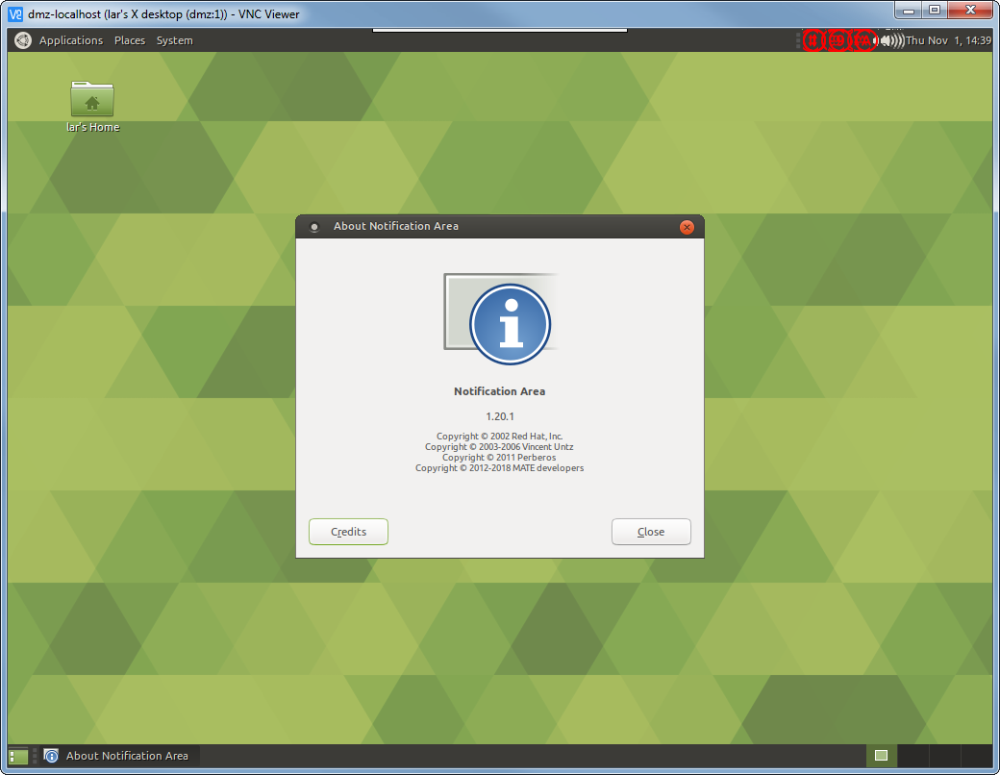

Observe that a *second* notification area will contain no icons:
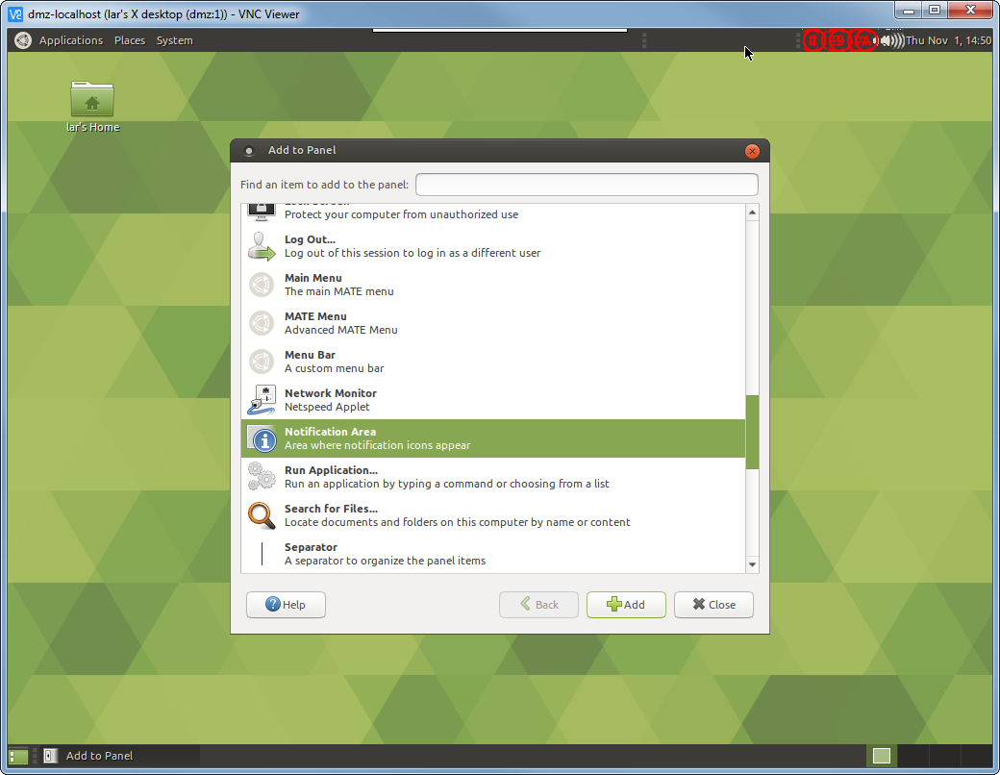

For comparison,the "Indicator Applet" contains icons as expected:
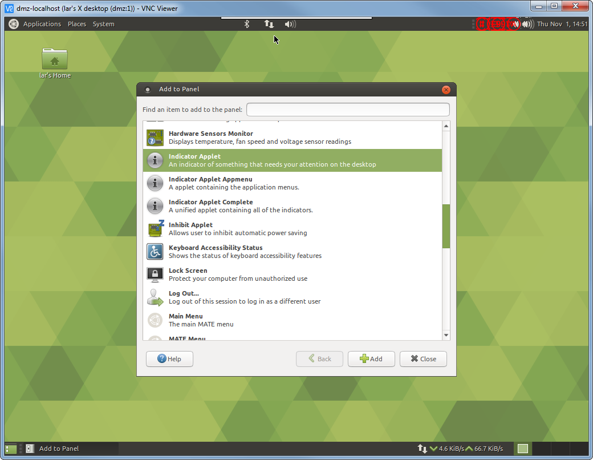

...the "Indicator Applet Appmenu":
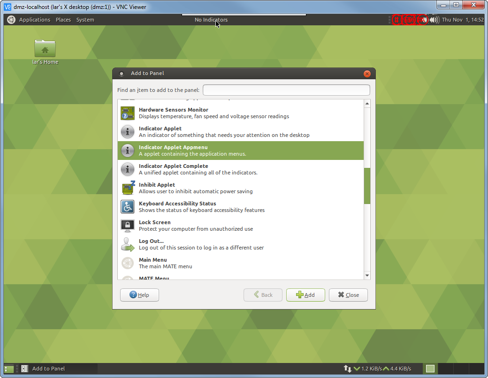


...and the "Indicator Applet Complete":
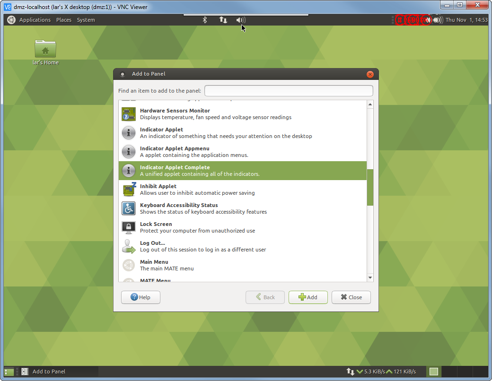

Very interesting because of [this question](https://askubuntu.com/questions/1031950/can-t-get-network-applet-back-in-ubuntu-mate-18-04)
and the fact only volume control applet listed below:
```
lar@dmz:~$ ls .config/autostart/
mate-volume-control-applet.desktop  ubuntu-mate-welcome.desktop
```

