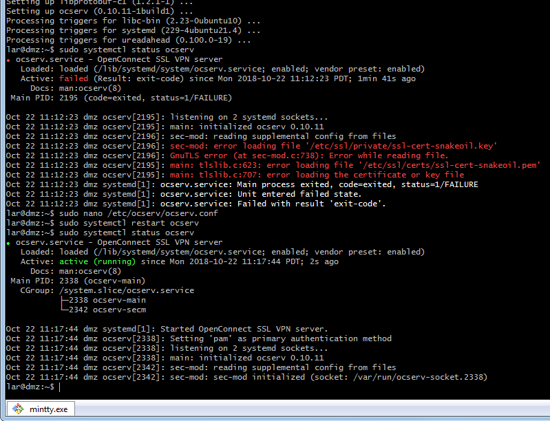
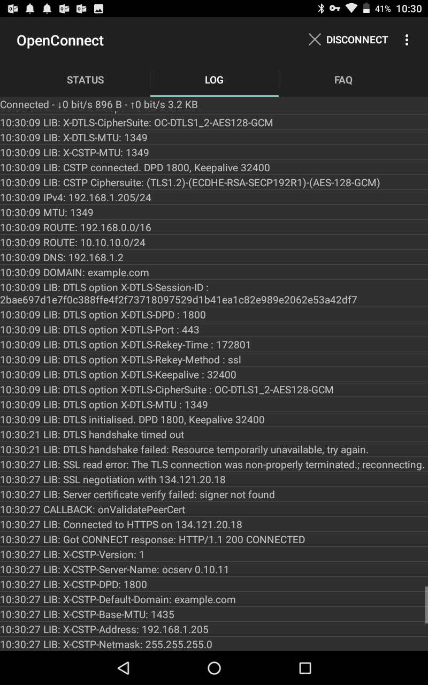
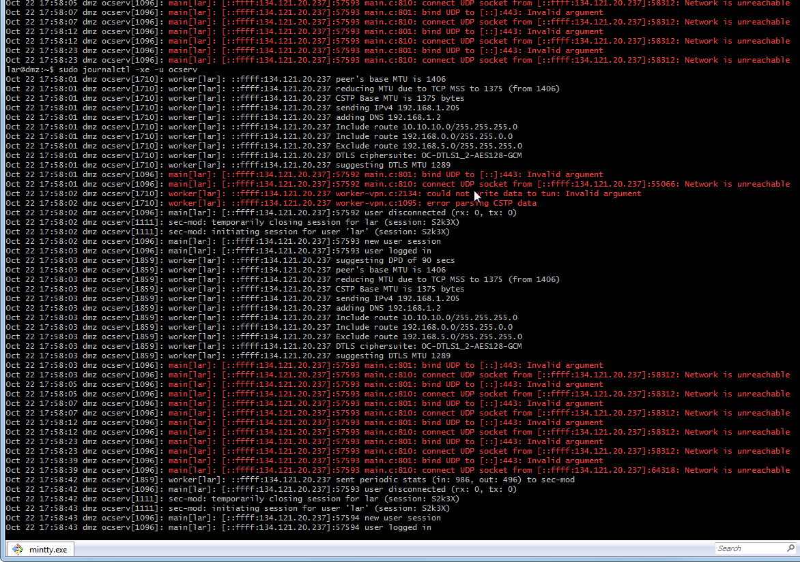
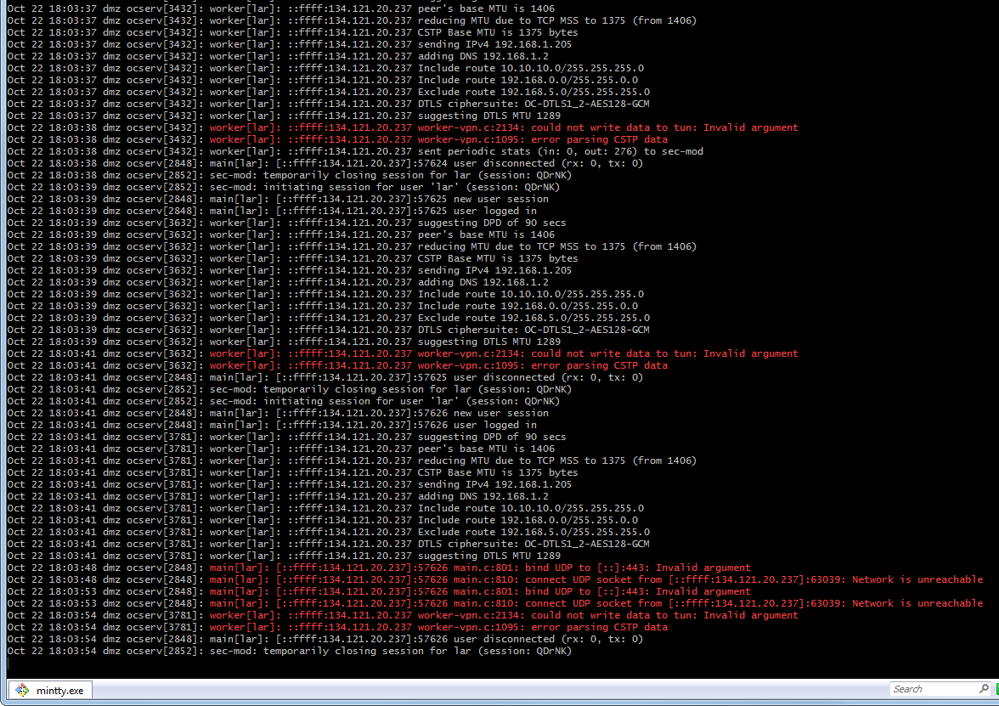
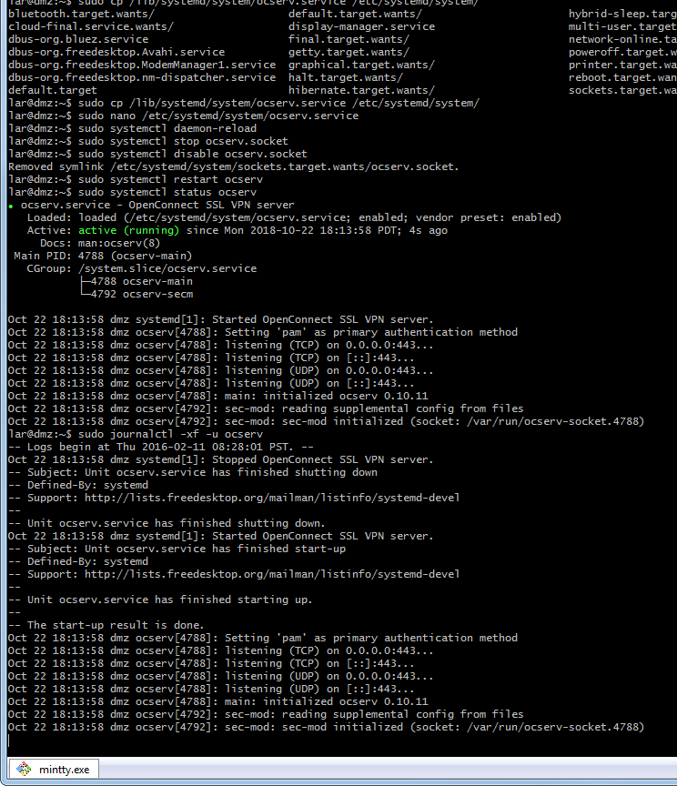
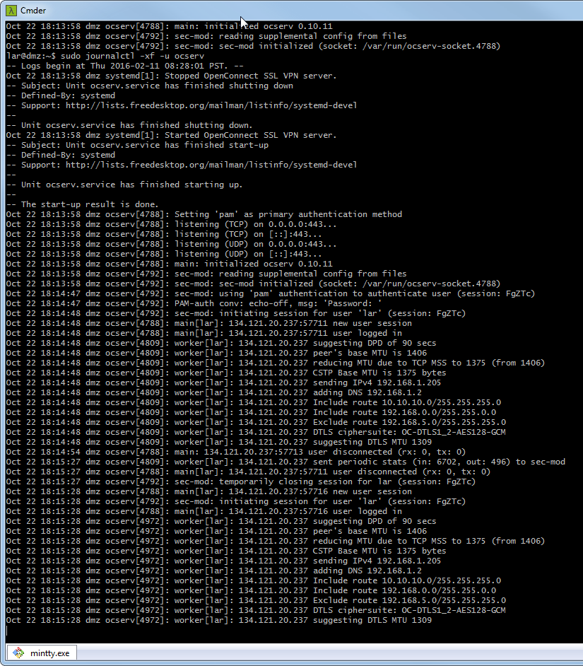
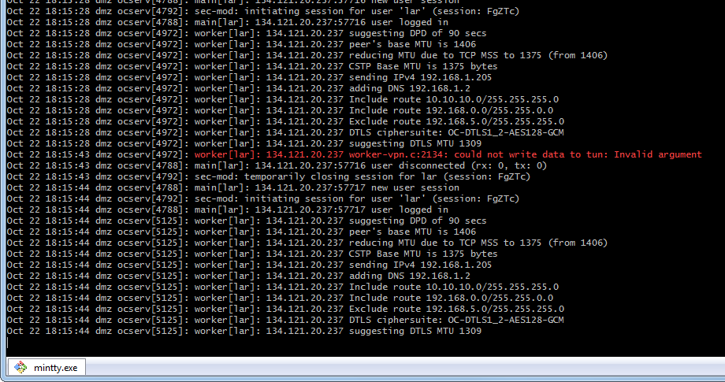
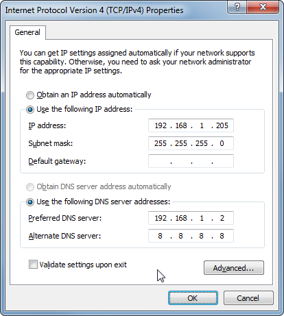
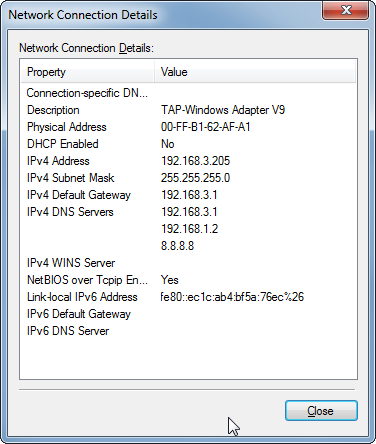
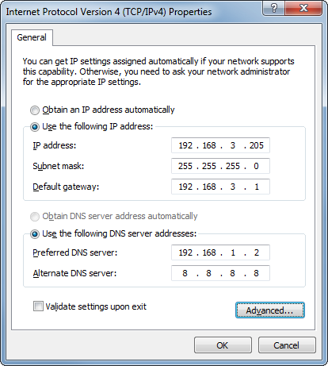

## VPN Setup Notes


### First attempt

Installed `ocserv` on Ubuntu Mate 16.04 LTS... followed the [most popular
tutorial](https://www.linuxbabe.com/ubuntu/openconnect-vpn-server-ocserv-ubuntu-16-04-17-10-lets-encrypt)
but got stuck at the point of testing out TCP BBR: could not update the kernel
due to lack of space on `/boot`.

Original Google Doc notes:

> * Create self-signed SSL certificate (for now)
>     * https://www.digitalocean.com/community/tutorials/how-to-create-a-self-signed-ssl-certificate-for-apache-in-ubuntu-16-04
> * Modify config file
>     * Update paths to SSL certificate & key
>     * Increase VPN identical clients (`max-same-clients = 6`)
>     * Enable MTU discovery (`try-mtu-discovery = true`)
>     * Specify the domain (`default-domain = modem.public.ip.address`)
>     * Specify DHCP addresses (`ipv4-network = 192.168.3.230/27`)
>         * Should be subset of LAN (see router config)
>         * Specify last 32 hosts on the subnet: 192.168.3.224 - 192.168.3.255
>     * Specify DNS addresses... **WORK IN PROGRESS**
>         * The router: 192.168.3.1
>         * WSU DNS #1: 134.121.139.10
>         * WSU DNS #2: 134.121.80.36
>         * Google DNS?
>         * Cloudflare free DNS?
>     * Enable ping-lease checks (`ping-leases = true`)
>     * Add LAN-specific route (`route = 192.168.3.0/255.255.255.0`)
> * Disable socket to prevent DTLS failure
>     * https://www.linuxbabe.com/ubuntu/openconnect-vpn-server-ocserv-ubuntu-16-04-17-10-lets-encrypt
>     * Copy `/lib/systemd/system/ocserv.service` to `/etc/...`
>     * Remove references to ocserv.socket in copied file
>     * Disable systemd ocserv.socket service
>     * Reboot
> * Enable Proxy ARP (required for IP addresses in LAN subnet)
>     * https://www.infradead.org/ocserv/recipes-ocserv-pseudo-bridge.html 
>     * Add to `/etc/sysctl.conf` new line with:  
>       `net.ipv4.conf.all.proxy_arp = 1`
>     * Apply changes immediately using `sysctl -p`
>     * Enable TCP BBR (boosts remote access speed)
>         * https://www.linuxbabe.com/ubuntu/enable-google-tcp-bbr-ubuntu
>         * https://www.cyberciti.biz/cloud-computing/increase-your-linux-server-internet-speed-with-tcp-bbr-congestion-control/
>     * Apply firmware updates to obtain kernel 4.9+ (currently 4.14):  
>       `apt-get install rpi-update -y`  
>       `rpi-update`
>     * Double-check TCP BBR compatibility:  
>       `grep ‘CONFIG_TCP_CONG_BBR’ /boot/config-$(uname -r)`  
>       `grep ‘CONFIG_NET_SCH_FQ’ /boot/config-$(uname -r)`
>     * Enable TCP BBR:  
>       `echo "net.core.default_qdisc=fq`  
>       `net.ipv4.tcp_congestion_control=bbr” > /etc/sysctl.d/10-enable-tcp-bbr.conf`

### Second attempt

> 2018-10-05 - finished re-setting up ocserv on new prototyping Pi… used 
> `rpi-update` to update Pi firmware and obtain kernel 4.14… prepared file per 
> above step, but left disabled via `.disabled` file extension… need to perform speed tests downloading files from LAN via modem+VPN… then enable BBR and re-test

* immediately upgraded it to 18.04 LTS
* did *not* observe more reliable connections


### Third attempt

Started again with fresh Ubuntu Mate 16.04 LTS and before first run, used
*gparted* to double the size of `/boot` partition. Burned Fri, Oct 19, 2018.

* Setup with the same username/password combo
* Booted into desktop
* Ran `sudo apt-get update && sudo apt-get upgrade -y` and took all new updates
* **Did** upgrade to latest Pi firmware: `4.4.38-v7+` &rarr; `4.14.77-v7+`
* Did **not** update 16.04 &rarr; 18.04 LTS yet

----

* Enable ssh server using systemctl
* Add authorized keys and test... OK
* Create new SSL cert:  
  `sudo openssl req -x509 -nodes -days 365 -newkey rsa:2048 -keyout /etc/ssl/private/testing.key -out /etc/ssl/certs/testing.pem`

---

* Install *ocserv*.... ("`Setting up ocserv (0.10.11-build1) ...`")
  * Out of the box, won't work (missing ssl certs)
  * After updating ssl, service runs: 

Test login from office tower... connects OK but, yes, constant DTLS errors in
client logs. Also, it's not acting as default gateway: Internet sees my 
workstation IP, not the VPN public IP.
```
2018-10-22 11:20:23 | 2fe4 | DTLS option X-DTLS-Session-ID : 3cfe1454e6aa393fd89f6432330bbf375f8c002d1ac8bbb3af24d2deb11f6735
2018-10-22 11:20:23 | 2fe4 | DTLS option X-DTLS-DPD : 90
2018-10-22 11:20:23 | 2fe4 | DTLS option X-DTLS-Port : 443
2018-10-22 11:20:23 | 2fe4 | DTLS option X-DTLS-Rekey-Time : 172823
2018-10-22 11:20:23 | 2fe4 | DTLS option X-DTLS-Rekey-Method : ssl
2018-10-22 11:20:23 | 2fe4 | DTLS option X-DTLS-Keepalive : 32400
2018-10-22 11:20:23 | 2fe4 | DTLS option X-DTLS-CipherSuite : OC-DTLS1_2-AES128-GCM
2018-10-22 11:20:23 | 2fe4 | DTLS option X-DTLS-MTU : 1320
2018-10-22 11:20:23 | 2fe4 | DTLS initialised. DPD 90, Keepalive 32400
2018-10-22 11:20:35 | 2fe4 | DTLS handshake timed out
2018-10-22 11:20:35 | 2fe4 | DTLS handshake failed: Resource temporarily unavailable, try again.
```
```
2018-10-22 11:20:56 | 2fe4 | X-DTLS-Session-ID: 58170679fefe10285f0ff2c2e6646e87957cb66fe4e29434fe60bc06306442a7
2018-10-22 11:20:56 | 2fe4 | X-DTLS-DPD: 90
2018-10-22 11:20:56 | 2fe4 | X-DTLS-Port: 443
2018-10-22 11:20:56 | 2fe4 | X-DTLS-Rekey-Time: 172808
2018-10-22 11:20:56 | 2fe4 | X-DTLS-Rekey-Method: ssl
2018-10-22 11:20:56 | 2fe4 | X-DTLS-Keepalive: 32400
2018-10-22 11:20:56 | 2fe4 | X-DTLS-CipherSuite: OC-DTLS1_2-AES128-GCM
2018-10-22 11:20:56 | 2fe4 | X-DTLS-MTU: 1320
2018-10-22 11:20:56 | 2fe4 | X-CSTP-MTU: 1320
2018-10-22 11:20:56 | 2fe4 | CSTP connected. DPD 90, Keepalive 32400
2018-10-22 11:20:56 | 2fe4 | CSTP Ciphersuite: (TLS1.2)-(ECDHE-RSA-SECP256R1)-(AES-128-GCM)
2018-10-22 11:21:08 | 2fe4 | DTLS handshake timed out
2018-10-22 11:21:08 | 2fe4 | DTLS handshake failed: Resource temporarily unavailable, try again.
```


Test login from tablet... connects OK
* Limited network connectivity:
    * Was unable to upload screenshot to Onedrive due to network failures...
    * Was not able to DNS resolve `wtfismyip.com`
    * Port Authority literally says "Couldn't get your external IP"
* Observe the same DTLS handshake failures in client log:  
  


---

Power off vpn computer in my office (134.121.20.18) and install O/S into rack computer.

* Connect to virgin machine behind van LAN... works OK.

Nothing extraordinary in the client log, just an instance of:
```
2018-10-22 17:57:23 |  b80 | DTLS initialised. DPD 90, Keepalive 32400
2018-10-22 17:57:35 |  b80 | DTLS handshake timed out
2018-10-22 17:57:35 |  b80 | DTLS handshake failed: Resource temporarily unavailable, try again.
```

But do observe all kinds of UDP related errors... should check out mtu 
discovery (wasn't enabled yet)



* Enable `try-mtu-discovery` within ocserv config file.

No effect, still lots of errors:



And corresponding excerpt from client log:
```
2018-10-22 18:03:37 | 2548 | CSTP connected. DPD 90, Keepalive 32400
2018-10-22 18:03:37 | 2548 | CSTP Ciphersuite: (TLS1.2)-(ECDHE-RSA-SECP256R1)-(AES-128-GCM)
2018-10-22 18:03:38 | 2548 | SSL read error: Success.; reconnecting.
2018-10-22 18:03:38 | 2548 | SSL negotiation with <REDACTED>
2018-10-22 18:03:38 | 2548 | Server certificate verify failed: signer not found
2018-10-22 18:03:38 | 2548 | Connected to HTTPS on <REDACTED>
2018-10-22 18:03:39 | 2548 | Got CONNECT response: HTTP/1.1 200 CONNECTED
2018-10-22 18:03:39 | 2548 | X-CSTP-Version: 1
2018-10-22 18:03:39 | 2548 | X-CSTP-Server-Name: ocserv 0.10.11
2018-10-22 18:03:39 | 2548 | X-CSTP-DPD: 90
2018-10-22 18:03:39 | 2548 | X-CSTP-Default-Domain: example.com
2018-10-22 18:03:39 | 2548 | X-CSTP-Base-MTU: 1375
2018-10-22 18:03:39 | 2548 | X-CSTP-Address: 192.168.1.205
2018-10-22 18:03:39 | 2548 | X-CSTP-Netmask: 255.255.255.0
2018-10-22 18:03:39 | 2548 | X-CSTP-DNS: 192.168.1.2
2018-10-22 18:03:39 | 2548 | X-CSTP-Split-Include: 10.10.10.0/255.255.255.0
2018-10-22 18:03:39 | 2548 | X-CSTP-Split-Include: 192.168.0.0/255.255.0.0
2018-10-22 18:03:39 | 2548 | X-CSTP-Tunnel-All-DNS: false
2018-10-22 18:03:39 | 2548 | X-CSTP-Split-Exclude: 192.168.5.0/255.255.255.0
2018-10-22 18:03:39 | 2548 | X-CSTP-Keepalive: 32400
2018-10-22 18:03:39 | 2548 | X-CSTP-Idle-Timeout: none
2018-10-22 18:03:39 | 2548 | X-CSTP-Smartcard-Removal-Disconnect: true
2018-10-22 18:03:39 | 2548 | X-CSTP-Rekey-Time: 172778
2018-10-22 18:03:39 | 2548 | X-CSTP-Rekey-Method: ssl
2018-10-22 18:03:39 | 2548 | X-CSTP-Session-Timeout: none
2018-10-22 18:03:39 | 2548 | X-CSTP-Disconnected-Timeout: none
2018-10-22 18:03:39 | 2548 | X-CSTP-Keep: true
2018-10-22 18:03:39 | 2548 | X-CSTP-TCP-Keepalive: true
2018-10-22 18:03:39 | 2548 | X-CSTP-License: accept
2018-10-22 18:03:39 | 2548 | X-DTLS-Session-ID: 8dfde34679b857442fe0ed12014fff1e0b889780342614dc10265586578ff121
2018-10-22 18:03:39 | 2548 | X-DTLS-DPD: 90
2018-10-22 18:03:39 | 2548 | X-DTLS-Port: 443
2018-10-22 18:03:39 | 2548 | X-DTLS-Rekey-Time: 172788
2018-10-22 18:03:39 | 2548 | X-DTLS-Rekey-Method: ssl
2018-10-22 18:03:39 | 2548 | X-DTLS-Keepalive: 32400
2018-10-22 18:03:39 | 2548 | X-DTLS-CipherSuite: OC-DTLS1_2-AES128-GCM
2018-10-22 18:03:39 | 2548 | X-DTLS-MTU: 1289
2018-10-22 18:03:39 | 2548 | X-CSTP-MTU: 1289
2018-10-22 18:03:39 | 2548 | CSTP connected. DPD 90, Keepalive 32400
2018-10-22 18:03:39 | 2548 | CSTP Ciphersuite: (TLS1.2)-(ECDHE-RSA-SECP256R1)-(AES-128-GCM)
2018-10-22 18:03:41 | 2548 | SSL read error: Success.; reconnecting.
2018-10-22 18:03:41 | 2548 | SSL negotiation with <REDACTED>
2018-10-22 18:03:41 | 2548 | Server certificate verify failed: signer not found
2018-10-22 18:03:41 | 2548 | Connected to HTTPS on <REDACTED>
2018-10-22 18:03:41 | 2548 | Got CONNECT response: HTTP/1.1 200 CONNECTED
2018-10-22 18:03:41 | 2548 | X-CSTP-Version: 1
2018-10-22 18:03:41 | 2548 | X-CSTP-Server-Name: ocserv 0.10.11
2018-10-22 18:03:41 | 2548 | X-CSTP-DPD: 90
2018-10-22 18:03:41 | 2548 | X-CSTP-Default-Domain: example.com
2018-10-22 18:03:41 | 2548 | X-CSTP-Base-MTU: 1375
2018-10-22 18:03:41 | 2548 | X-CSTP-Address: 192.168.1.205
2018-10-22 18:03:41 | 2548 | X-CSTP-Netmask: 255.255.255.0
2018-10-22 18:03:41 | 2548 | X-CSTP-DNS: 192.168.1.2
2018-10-22 18:03:41 | 2548 | X-CSTP-Split-Include: 10.10.10.0/255.255.255.0
2018-10-22 18:03:41 | 2548 | X-CSTP-Split-Include: 192.168.0.0/255.255.0.0
2018-10-22 18:03:41 | 2548 | X-CSTP-Tunnel-All-DNS: false
2018-10-22 18:03:41 | 2548 | X-CSTP-Split-Exclude: 192.168.5.0/255.255.255.0
2018-10-22 18:03:41 | 2548 | X-CSTP-Keepalive: 32400
2018-10-22 18:03:41 | 2548 | X-CSTP-Idle-Timeout: none
2018-10-22 18:03:41 | 2548 | X-CSTP-Smartcard-Removal-Disconnect: true
2018-10-22 18:03:41 | 2548 | X-CSTP-Rekey-Time: 172824
2018-10-22 18:03:41 | 2548 | X-CSTP-Rekey-Method: ssl
2018-10-22 18:03:41 | 2548 | X-CSTP-Session-Timeout: none
2018-10-22 18:03:41 | 2548 | X-CSTP-Disconnected-Timeout: none
2018-10-22 18:03:41 | 2548 | X-CSTP-Keep: true
2018-10-22 18:03:41 | 2548 | X-CSTP-TCP-Keepalive: true
2018-10-22 18:03:41 | 2548 | X-CSTP-License: accept
2018-10-22 18:03:41 | 2548 | X-DTLS-Session-ID: 5a449daae4b9c651d93a000c7ab08b38655463cebd410913a7d5af2a7aa4dec9
2018-10-22 18:03:41 | 2548 | X-DTLS-DPD: 90
2018-10-22 18:03:41 | 2548 | X-DTLS-Port: 443
2018-10-22 18:03:41 | 2548 | X-DTLS-Rekey-Time: 172834
2018-10-22 18:03:41 | 2548 | X-DTLS-Rekey-Method: ssl
2018-10-22 18:03:41 | 2548 | X-DTLS-Keepalive: 32400
2018-10-22 18:03:41 | 2548 | X-DTLS-CipherSuite: OC-DTLS1_2-AES128-GCM
2018-10-22 18:03:41 | 2548 | X-DTLS-MTU: 1289
2018-10-22 18:03:41 | 2548 | X-CSTP-MTU: 1289
2018-10-22 18:03:41 | 2548 | CSTP connected. DPD 90, Keepalive 32400
2018-10-22 18:03:41 | 2548 | CSTP Ciphersuite: (TLS1.2)-(ECDHE-RSA-SECP256R1)-(AES-128-GCM)
2018-10-22 18:03:48 | 2548 | Attempt new DTLS connection
```

* OK, follow instructions to disable ocserv socket (per linuxbabe.com):



Looks like it starts up normally:



BUT it clearly has errors (`<REDACTED>` is the server public IP address):



```
2018-10-22 18:14:47 | 2dfc | POST https://<REDACTED>/
2018-10-22 18:14:47 | 2dfc | Attempting to connect to server <REDACTED>:443
2018-10-22 18:14:47 | 2dfc | Connected to <REDACTED>:443
2018-10-22 18:14:47 | 2dfc | There was a non-CA certificate in the trusted list: OU=Copyright (c) 1997 Microsoft Corp.,OU=Microsoft Corporation,CN=Microsoft Root Authority.
2018-10-22 18:14:47 | 2dfc | There was a non-CA certificate in the trusted list: C=US,O=MSFT,CN=Microsoft Authenticode(tm) Root Authority.
2018-10-22 18:14:47 | 2dfc | There was a non-CA certificate in the trusted list: CN=PETB-LAR-WS18.
2018-10-22 18:14:47 | 2dfc | There was a non-CA certificate in the trusted list: CN=Root Agency.
2018-10-22 18:14:47 | 2dfc | SSL negotiation with <REDACTED>
2018-10-22 18:14:47 | 2dfc | Server certificate verify failed: signer not found
2018-10-22 18:14:47 | 2dfc | Connected to HTTPS on <REDACTED>
2018-10-22 18:14:47 | 2dfc | Got HTTP response: HTTP/1.1 200 OK
2018-10-22 18:14:47 | 2dfc | Set-Cookie: webvpncontext=; expires=Thu, 01 Jan 1970 22:00:00 GMT; path=/; Secure
2018-10-22 18:14:47 | 2dfc | Content-Type: text/xml
2018-10-22 18:14:47 | 2dfc | Content-Length: 306
2018-10-22 18:14:47 | 2dfc | X-Transcend-Version: 1
2018-10-22 18:14:47 | 2dfc | HTTP body length:  (306)
2018-10-22 18:14:47 | 2dfc | XML POST enabled
2018-10-22 18:14:47 | 2dfc | Please enter your username.
2018-10-22 18:14:47 | 2dfc | Text form: username
2018-10-22 18:14:47 | 2dfc | POST https://<REDACTED>/auth
2018-10-22 18:14:47 | 2dfc | Got HTTP response: HTTP/1.1 200 OK
2018-10-22 18:14:47 | 2dfc | Set-Cookie: webvpncontext=FgZTc6bks3VxGI5VfiSJ8g==; Max-Age=300; Secure
2018-10-22 18:14:47 | 2dfc | Content-Type: text/xml
2018-10-22 18:14:47 | 2dfc | Content-Length: 310
2018-10-22 18:14:47 | 2dfc | X-Transcend-Version: 1
2018-10-22 18:14:47 | 2dfc | HTTP body length:  (310)
2018-10-22 18:14:47 | 2dfc | Please enter your password.
2018-10-22 18:14:47 | 2dfc | Password form: password
2018-10-22 18:14:47 | 2dfc | POST https://<REDACTED>/auth
2018-10-22 18:14:48 | 2dfc | Got HTTP response: HTTP/1.1 200 OK
2018-10-22 18:14:48 | 2dfc | Connection: Keep-Alive
2018-10-22 18:14:48 | 2dfc | Content-Type: text/xml
2018-10-22 18:14:48 | 2dfc | Content-Length: 189
2018-10-22 18:14:48 | 2dfc | X-Transcend-Version: 1
2018-10-22 18:14:48 | 2dfc | Set-Cookie: webvpncontext=FgZTc6bks3VxGI5VfiSJ8g==; Secure
2018-10-22 18:14:48 | 2dfc | Set-Cookie: webvpn=<elided>; Secure
2018-10-22 18:14:48 | 2dfc | Set-Cookie: webvpnc=; expires=Thu, 01 Jan 1970 22:00:00 GMT; path=/; Secure
2018-10-22 18:14:48 | 2dfc | Set-Cookie: webvpnc=bu:/&p:t&iu:1/&sh:B34A491D16B7EFB4EDE3110DB8AAFF5D554B7382; path=/; Secure
2018-10-22 18:14:48 | 2dfc | HTTP body length:  (189)
2018-10-22 18:14:48 | 2dfc | Got CONNECT response: HTTP/1.1 200 CONNECTED
2018-10-22 18:14:48 | 2dfc | X-CSTP-Version: 1
2018-10-22 18:14:48 | 2dfc | X-CSTP-Server-Name: ocserv 0.10.11
2018-10-22 18:14:48 | 2dfc | X-CSTP-DPD: 90
2018-10-22 18:14:48 | 2dfc | X-CSTP-Default-Domain: example.com
2018-10-22 18:14:48 | 2dfc | X-CSTP-Base-MTU: 1375
2018-10-22 18:14:48 | 2dfc | X-CSTP-Address: 192.168.1.205
2018-10-22 18:14:48 | 2dfc | X-CSTP-Netmask: 255.255.255.0
2018-10-22 18:14:48 | 2dfc | X-CSTP-DNS: 192.168.1.2
2018-10-22 18:14:48 | 2dfc | X-CSTP-Split-Include: 10.10.10.0/255.255.255.0
2018-10-22 18:14:48 | 2dfc | X-CSTP-Split-Include: 192.168.0.0/255.255.0.0
2018-10-22 18:14:48 | 2dfc | X-CSTP-Tunnel-All-DNS: false
2018-10-22 18:14:48 | 2dfc | X-CSTP-Split-Exclude: 192.168.5.0/255.255.255.0
2018-10-22 18:14:48 | 2dfc | X-CSTP-Keepalive: 32400
2018-10-22 18:14:48 | 2dfc | X-CSTP-Idle-Timeout: none
2018-10-22 18:14:48 | 2dfc | X-CSTP-Smartcard-Removal-Disconnect: true
2018-10-22 18:14:48 | 2dfc | X-CSTP-Rekey-Time: 172775
2018-10-22 18:14:48 | 2dfc | X-CSTP-Rekey-Method: ssl
2018-10-22 18:14:48 | 2dfc | X-CSTP-Session-Timeout: none
2018-10-22 18:14:48 | 2dfc | X-CSTP-Disconnected-Timeout: none
2018-10-22 18:14:48 | 2dfc | X-CSTP-Keep: true
2018-10-22 18:14:48 | 2dfc | X-CSTP-TCP-Keepalive: true
2018-10-22 18:14:48 | 2dfc | X-CSTP-License: accept
2018-10-22 18:14:48 | 2dfc | X-DTLS-Session-ID: 29124c312bc480f801cc06396fe713667dc839e94077bc6fbf0463e7f418114d
2018-10-22 18:14:48 | 2dfc | X-DTLS-DPD: 90
2018-10-22 18:14:48 | 2dfc | X-DTLS-Port: 443
2018-10-22 18:14:48 | 2dfc | X-DTLS-Rekey-Time: 172785
2018-10-22 18:14:48 | 2dfc | X-DTLS-Rekey-Method: ssl
2018-10-22 18:14:48 | 2dfc | X-DTLS-Keepalive: 32400
2018-10-22 18:14:48 | 2dfc | X-DTLS-CipherSuite: OC-DTLS1_2-AES128-GCM
2018-10-22 18:14:48 | 2dfc | X-DTLS-MTU: 1309
2018-10-22 18:14:48 | 2dfc | X-CSTP-MTU: 1309
2018-10-22 18:14:48 | 2dfc | CSTP connected. DPD 90, Keepalive 32400
2018-10-22 18:14:48 | 2dfc | CSTP Ciphersuite: (TLS1.2)-(ECDHE-RSA-SECP256R1)-(AES-128-GCM)
2018-10-22 18:14:48 | 2dfc | DTLS option X-DTLS-Session-ID : 29124c312bc480f801cc06396fe713667dc839e94077bc6fbf0463e7f418114d
2018-10-22 18:14:48 | 2dfc | DTLS option X-DTLS-DPD : 90
2018-10-22 18:14:48 | 2dfc | DTLS option X-DTLS-Port : 443
2018-10-22 18:14:48 | 2dfc | DTLS option X-DTLS-Rekey-Time : 172785
2018-10-22 18:14:48 | 2dfc | DTLS option X-DTLS-Rekey-Method : ssl
2018-10-22 18:14:48 | 2dfc | DTLS option X-DTLS-Keepalive : 32400
2018-10-22 18:14:48 | 2dfc | DTLS option X-DTLS-CipherSuite : OC-DTLS1_2-AES128-GCM
2018-10-22 18:14:48 | 2dfc | DTLS option X-DTLS-MTU : 1309
2018-10-22 18:14:48 | 2dfc | DTLS initialised. DPD 90, Keepalive 32400
2018-10-22 18:14:48 | 2dfc | Established DTLS connection (using GnuTLS). Ciphersuite (DTLS1.2)-(RSA)-(AES-128-GCM).
2018-10-22 18:14:48 | 2dfc | Initiating IPv4 MTU detection (min=654, max=1309)
2018-10-22 18:14:48 | 2dfc | No change in MTU after detection (was 1309)
2018-10-22 18:14:48 | 2dfc | Opened tun device Local Area Connection 3
2018-10-22 18:14:48 | 2dfc | TAP-Windows driver v9.21 (0)
2018-10-22 18:14:53 | 2dfc | <<-- [EXEC] route print
2018-10-22 18:14:53 | 2dfc | ===========================================================================
2018-10-22 18:14:53 | 2dfc | Interface List
2018-10-22 18:14:53 | 2dfc |  26...00 ff b1 62 af a1 ......TAP-Windows Adapter V9
2018-10-22 18:14:53 | 2dfc |  11...18 03 73 d3 1a dd ......Intel(R) 82579LM Gigabit Network Connection
2018-10-22 18:14:53 | 2dfc |   1...........................Software Loopback Interface 1
2018-10-22 18:14:53 | 2dfc |  12...00 00 00 00 00 00 00 e0 Microsoft ISATAP Adapter
2018-10-22 18:14:53 | 2dfc |  19...00 00 00 00 00 00 00 e0 Microsoft 6to4 Adapter
2018-10-22 18:14:53 | 2dfc |  20...00 00 00 00 00 00 00 e0 Microsoft ISATAP Adapter #2
2018-10-22 18:14:53 | 2dfc | ===========================================================================
2018-10-22 18:14:53 | 2dfc | 
2018-10-22 18:14:53 | 2dfc | IPv4 Route Table
2018-10-22 18:14:53 | 2dfc | ===========================================================================
2018-10-22 18:14:53 | 2dfc | Active Routes:
2018-10-22 18:14:53 | 2dfc | Network Destination        Netmask          Gateway       Interface  Metric
2018-10-22 18:14:53 | 2dfc |           0.0.0.0          0.0.0.0     134.121.20.1   134.121.20.237     11
2018-10-22 18:14:53 | 2dfc |         127.0.0.0        255.0.0.0         On-link         127.0.0.1    306
2018-10-22 18:14:53 | 2dfc |         127.0.0.1  255.255.255.255         On-link         127.0.0.1    306
2018-10-22 18:14:53 | 2dfc |   127.255.255.255  255.255.255.255         On-link         127.0.0.1    306
2018-10-22 18:14:53 | 2dfc |      134.121.20.0    255.255.255.0         On-link    134.121.20.237    266
2018-10-22 18:14:53 | 2dfc |    134.121.20.237  255.255.255.255         On-link    134.121.20.237    266
2018-10-22 18:14:53 | 2dfc |    134.121.20.255  255.255.255.255         On-link    134.121.20.237    266
2018-10-22 18:14:53 | 2dfc |         224.0.0.0        240.0.0.0         On-link         127.0.0.1    306
2018-10-22 18:14:53 | 2dfc |         224.0.0.0        240.0.0.0         On-link    134.121.20.237    266
2018-10-22 18:14:53 | 2dfc |         224.0.0.0        240.0.0.0         On-link                1a    276
2018-10-22 18:14:53 | 2dfc |   255.255.255.255  255.255.255.255         On-link         127.0.0.1    306
2018-10-22 18:14:53 | 2dfc |   255.255.255.255  255.255.255.255         On-link    134.121.20.237    266
2018-10-22 18:14:53 | 2dfc |   255.255.255.255  255.255.255.255         On-link                1a    276
2018-10-22 18:14:53 | 2dfc | ===========================================================================
2018-10-22 18:14:53 | 2dfc | Persistent Routes:
2018-10-22 18:14:53 | 2dfc |   None
2018-10-22 18:14:53 | 2dfc | 
2018-10-22 18:14:53 | 2dfc | IPv6 Route Table
2018-10-22 18:14:53 | 2dfc | ===========================================================================
2018-10-22 18:14:53 | 2dfc | Active Routes:
2018-10-22 18:14:53 | 2dfc |  If Metric Network Destination      Gateway
2018-10-22 18:14:53 | 2dfc |   1    306 ::1/128                  On-link
2018-10-22 18:14:53 | 2dfc |  19   1010 2002::/16                On-link
2018-10-22 18:14:53 | 2dfc |  19    266 2002:8679:14ed::8679:14ed/128
2018-10-22 18:14:53 | 2dfc |                                     On-link
2018-10-22 18:14:53 | 2dfc |  26    276 fe80::/64                On-link
2018-10-22 18:14:53 | 2dfc |  11    266 fe80::/64                On-link
2018-10-22 18:14:53 | 2dfc |  26    276 fe80::ec1c:ab4:bf5a:76ec/128
2018-10-22 18:14:53 | 2dfc |                                     On-link
2018-10-22 18:14:53 | 2dfc |  11    266 fe80::fd1a:3744:5d2:243c/128
2018-10-22 18:14:53 | 2dfc |                                     On-link
2018-10-22 18:14:53 | 2dfc |   1    306 ff00::/8                 On-link
2018-10-22 18:14:53 | 2dfc |  11    266 ff00::/8                 On-link
2018-10-22 18:14:53 | 2dfc |  26    276 ff00::/8                 On-link
2018-10-22 18:14:53 | 2dfc | ===========================================================================
2018-10-22 18:14:53 | 2dfc | Persistent Routes:
2018-10-22 18:14:53 | 2dfc |   None
2018-10-22 18:14:53 | 2dfc | -->> (exitCode: 0)
2018-10-22 18:14:53 | 2dfc | Default Gateway:134.121.20.1
2018-10-22 18:14:53 | 2dfc | VPN Gateway: <REDACTED>
2018-10-22 18:14:53 | 2dfc | Internal Address: 192.168.1.205
2018-10-22 18:14:53 | 2dfc | Internal Netmask: 255.255.255.0
2018-10-22 18:14:53 | 2dfc | Internal Gateway: 192.168.1.1
2018-10-22 18:14:53 | 2dfc | Interface idx: 26 ("Local Area Connection 3")
2018-10-22 18:14:53 | 2dfc | <<-- [EXEC] route add <REDACTED> mask 255.255.255.255 134.121.20.1
2018-10-22 18:14:53 | 2dfc |  OK!
2018-10-22 18:14:53 | 2dfc | -->> (exitCode: 0)
2018-10-22 18:14:53 | 2dfc | MTU: 1309
2018-10-22 18:14:53 | 2dfc | <<-- [EXEC] netsh interface ipv4 set subinterface 26 mtu=1309 store=active
2018-10-22 18:14:53 | 2dfc | Ok.
2018-10-22 18:14:53 | 2dfc | 
2018-10-22 18:14:53 | 2dfc | -->> (exitCode: 0)
2018-10-22 18:14:53 | 2dfc | Configuring 26 interface for Legacy IP...
2018-10-22 18:14:53 | 2dfc | <<-- [EXEC] netsh interface ip set address 26 static 192.168.1.205 255.255.255.0
2018-10-22 18:14:53 | 2dfc | 
2018-10-22 18:14:53 | 2dfc | -->> (exitCode: 0)
2018-10-22 18:14:53 | 2dfc | <<-- [EXEC] netsh interface ip add dns 26 192.168.1.2 index=1
2018-10-22 18:14:53 | 2dfc | The object is already in the list.
2018-10-22 18:14:53 | 2dfc | 
2018-10-22 18:14:53 | 2dfc | 
2018-10-22 18:14:53 | 2dfc | -->> (exitCode: 1)
2018-10-22 18:14:53 | 2dfc | done.
2018-10-22 18:14:53 | 2dfc | Configuring Legacy IP networks:
2018-10-22 18:14:53 | 2dfc | Waiting for interface to come up...
2018-10-22 18:14:53 | 2dfc | <<-- [EXEC] route print
2018-10-22 18:14:53 | 2dfc | ===========================================================================
2018-10-22 18:14:53 | 2dfc | Interface List
2018-10-22 18:14:53 | 2dfc |  26...00 ff b1 62 af a1 ......TAP-Windows Adapter V9
2018-10-22 18:14:53 | 2dfc |  11...18 03 73 d3 1a dd ......Intel(R) 82579LM Gigabit Network Connection
2018-10-22 18:14:53 | 2dfc |   1...........................Software Loopback Interface 1
2018-10-22 18:14:53 | 2dfc |  12...00 00 00 00 00 00 00 e0 Microsoft ISATAP Adapter
2018-10-22 18:14:53 | 2dfc |  19...00 00 00 00 00 00 00 e0 Microsoft 6to4 Adapter
2018-10-22 18:14:53 | 2dfc |  20...00 00 00 00 00 00 00 e0 Microsoft ISATAP Adapter #2
2018-10-22 18:14:53 | 2dfc | ===========================================================================
2018-10-22 18:14:53 | 2dfc | 
2018-10-22 18:14:53 | 2dfc | IPv4 Route Table
2018-10-22 18:14:53 | 2dfc | ===========================================================================
2018-10-22 18:14:53 | 2dfc | Active Routes:
2018-10-22 18:14:53 | 2dfc | Network Destination        Netmask          Gateway       Interface  Metric
2018-10-22 18:14:53 | 2dfc |           0.0.0.0          0.0.0.0     134.121.20.1   134.121.20.237     11
2018-10-22 18:14:53 | 2dfc |         127.0.0.0        255.0.0.0         On-link         127.0.0.1    306
2018-10-22 18:14:53 | 2dfc |         127.0.0.1  255.255.255.255         On-link         127.0.0.1    306
2018-10-22 18:14:53 | 2dfc |   127.255.255.255  255.255.255.255         On-link         127.0.0.1    306
2018-10-22 18:14:53 | 2dfc |      134.121.20.0    255.255.255.0         On-link    134.121.20.237    266
2018-10-22 18:14:53 | 2dfc |    134.121.20.237  255.255.255.255         On-link    134.121.20.237    266
2018-10-22 18:14:53 | 2dfc |    134.121.20.255  255.255.255.255         On-link    134.121.20.237    266
2018-10-22 18:14:53 | 2dfc |   <REDACTED>  255.255.255.255     134.121.20.1   134.121.20.237     11
2018-10-22 18:14:53 | 2dfc |         224.0.0.0        240.0.0.0         On-link         127.0.0.1    306
2018-10-22 18:14:53 | 2dfc |         224.0.0.0        240.0.0.0         On-link    134.121.20.237    266
2018-10-22 18:14:53 | 2dfc |         224.0.0.0        240.0.0.0         On-link                1a    276
2018-10-22 18:14:53 | 2dfc |   255.255.255.255  255.255.255.255         On-link         127.0.0.1    306
2018-10-22 18:14:53 | 2dfc |   255.255.255.255  255.255.255.255         On-link    134.121.20.237    266
2018-10-22 18:14:53 | 2dfc |   255.255.255.255  255.255.255.255         On-link                1a    276
2018-10-22 18:14:53 | 2dfc | ===========================================================================
2018-10-22 18:14:53 | 2dfc | Persistent Routes:
2018-10-22 18:14:53 | 2dfc |   None
2018-10-22 18:14:53 | 2dfc | 
2018-10-22 18:14:53 | 2dfc | IPv6 Route Table
2018-10-22 18:14:53 | 2dfc | ===========================================================================
2018-10-22 18:14:53 | 2dfc | Active Routes:
2018-10-22 18:14:53 | 2dfc |  If Metric Network Destination      Gateway
2018-10-22 18:14:53 | 2dfc |   1    306 ::1/128                  On-link
2018-10-22 18:14:53 | 2dfc |  19   1010 2002::/16                On-link
2018-10-22 18:14:53 | 2dfc |  19    266 2002:8679:14ed::8679:14ed/128
2018-10-22 18:14:53 | 2dfc |                                     On-link
2018-10-22 18:14:53 | 2dfc |  26    276 fe80::/64                On-link
2018-10-22 18:14:53 | 2dfc |  11    266 fe80::/64                On-link
2018-10-22 18:14:53 | 2dfc |  26    276 fe80::ec1c:ab4:bf5a:76ec/128
2018-10-22 18:14:53 | 2dfc |                                     On-link
2018-10-22 18:14:53 | 2dfc |  11    266 fe80::fd1a:3744:5d2:243c/128
2018-10-22 18:14:53 | 2dfc |                                     On-link
2018-10-22 18:14:53 | 2dfc |   1    306 ff00::/8                 On-link
2018-10-22 18:14:53 | 2dfc |  11    266 ff00::/8                 On-link
2018-10-22 18:14:53 | 2dfc |  26    276 ff00::/8                 On-link
2018-10-22 18:14:53 | 2dfc | ===========================================================================
2018-10-22 18:14:53 | 2dfc | Persistent Routes:
2018-10-22 18:14:53 | 2dfc |   None
2018-10-22 18:14:53 | 2dfc | -->> (exitCode: 0)
2018-10-22 18:14:53 | 2dfc | Waiting for interface to come up...
2018-10-22 18:14:53 | 2dfc | <<-- [EXEC] route print
2018-10-22 18:14:53 | 2dfc | ===========================================================================
2018-10-22 18:14:53 | 2dfc | Interface List
2018-10-22 18:14:53 | 2dfc |  26...00 ff b1 62 af a1 ......TAP-Windows Adapter V9
2018-10-22 18:14:53 | 2dfc |  11...18 03 73 d3 1a dd ......Intel(R) 82579LM Gigabit Network Connection
2018-10-22 18:14:53 | 2dfc |   1...........................Software Loopback Interface 1
2018-10-22 18:14:53 | 2dfc |  12...00 00 00 00 00 00 00 e0 Microsoft ISATAP Adapter
2018-10-22 18:14:53 | 2dfc |  19...00 00 00 00 00 00 00 e0 Microsoft 6to4 Adapter
2018-10-22 18:14:53 | 2dfc |  20...00 00 00 00 00 00 00 e0 Microsoft ISATAP Adapter #2
2018-10-22 18:14:53 | 2dfc | ===========================================================================
2018-10-22 18:14:53 | 2dfc | 
2018-10-22 18:14:53 | 2dfc | IPv4 Route Table
2018-10-22 18:14:53 | 2dfc | ===========================================================================
2018-10-22 18:14:53 | 2dfc | Active Routes:
2018-10-22 18:14:53 | 2dfc | Network Destination        Netmask          Gateway       Interface  Metric
2018-10-22 18:14:53 | 2dfc |           0.0.0.0          0.0.0.0     134.121.20.1   134.121.20.237     11
2018-10-22 18:14:53 | 2dfc |         127.0.0.0        255.0.0.0         On-link         127.0.0.1    306
2018-10-22 18:14:53 | 2dfc |         127.0.0.1  255.255.255.255         On-link         127.0.0.1    306
2018-10-22 18:14:53 | 2dfc |   127.255.255.255  255.255.255.255         On-link         127.0.0.1    306
2018-10-22 18:14:53 | 2dfc |      134.121.20.0    255.255.255.0         On-link    134.121.20.237    266
2018-10-22 18:14:53 | 2dfc |    134.121.20.237  255.255.255.255         On-link    134.121.20.237    266
2018-10-22 18:14:53 | 2dfc |    134.121.20.255  255.255.255.255         On-link    134.121.20.237    266
2018-10-22 18:14:53 | 2dfc |   <REDACTED>  255.255.255.255     134.121.20.1   134.121.20.237     11
2018-10-22 18:14:53 | 2dfc |       192.168.1.0    255.255.255.0         On-link     192.168.1.205    276
2018-10-22 18:14:53 | 2dfc |     192.168.1.205  255.255.255.255         On-link     192.168.1.205    276
2018-10-22 18:14:53 | 2dfc |     192.168.1.255  255.255.255.255         On-link     192.168.1.205    276
2018-10-22 18:14:53 | 2dfc |         224.0.0.0        240.0.0.0         On-link         127.0.0.1    306
2018-10-22 18:14:53 | 2dfc |         224.0.0.0        240.0.0.0         On-link    134.121.20.237    266
2018-10-22 18:14:53 | 2dfc |         224.0.0.0        240.0.0.0         On-link     192.168.1.205    276
2018-10-22 18:14:53 | 2dfc |   255.255.255.255  255.255.255.255         On-link         127.0.0.1    306
2018-10-22 18:14:53 | 2dfc |   255.255.255.255  255.255.255.255         On-link    134.121.20.237    266
2018-10-22 18:14:53 | 2dfc |   255.255.255.255  255.255.255.255         On-link     192.168.1.205    276
2018-10-22 18:14:53 | 2dfc | ===========================================================================
2018-10-22 18:14:53 | 2dfc | Persistent Routes:
2018-10-22 18:14:53 | 2dfc |   None
2018-10-22 18:14:53 | 2dfc | 
2018-10-22 18:14:53 | 2dfc | IPv6 Route Table
2018-10-22 18:14:53 | 2dfc | ===========================================================================
2018-10-22 18:14:53 | 2dfc | Active Routes:
2018-10-22 18:14:53 | 2dfc |  If Metric Network Destination      Gateway
2018-10-22 18:14:53 | 2dfc |   1    306 ::1/128                  On-link
2018-10-22 18:14:53 | 2dfc |  19   1010 2002::/16                On-link
2018-10-22 18:14:53 | 2dfc |  19    266 2002:8679:14ed::8679:14ed/128
2018-10-22 18:14:53 | 2dfc |                                     On-link
2018-10-22 18:14:53 | 2dfc |  26    276 fe80::/64                On-link
2018-10-22 18:14:53 | 2dfc |  11    266 fe80::/64                On-link
2018-10-22 18:14:53 | 2dfc |  26    276 fe80::ec1c:ab4:bf5a:76ec/128
2018-10-22 18:14:53 | 2dfc |                                     On-link
2018-10-22 18:14:53 | 2dfc |  11    266 fe80::fd1a:3744:5d2:243c/128
2018-10-22 18:14:53 | 2dfc |                                     On-link
2018-10-22 18:14:53 | 2dfc |   1    306 ff00::/8                 On-link
2018-10-22 18:14:53 | 2dfc |  11    266 ff00::/8                 On-link
2018-10-22 18:14:53 | 2dfc |  26    276 ff00::/8                 On-link
2018-10-22 18:14:53 | 2dfc | ===========================================================================
2018-10-22 18:14:53 | 2dfc | Persistent Routes:
2018-10-22 18:14:53 | 2dfc |   None
2018-10-22 18:14:53 | 2dfc | -->> (exitCode: 0)
2018-10-22 18:14:53 | 2dfc | <<-- [EXEC] route add 192.168.0.0 mask 255.255.0.0 192.168.1.1
2018-10-22 18:14:53 | 2dfc |  OK!
2018-10-22 18:14:53 | 2dfc | -->> (exitCode: 0)
2018-10-22 18:14:53 | 2dfc | <<-- [EXEC] route add 10.10.10.0 mask 255.255.255.0 192.168.1.1
2018-10-22 18:14:53 | 2dfc |  OK!
2018-10-22 18:14:53 | 2dfc | -->> (exitCode: 0)
2018-10-22 18:14:53 | 2dfc | Route configuration done.
2018-10-22 18:15:27 | 2dfc | SSL read error: The TLS connection was non-properly terminated.; reconnecting.
2018-10-22 18:15:27 | 2dfc | SSL negotiation with <REDACTED>
2018-10-22 18:15:27 | 2dfc | Server certificate verify failed: signer not found
2018-10-22 18:15:28 | 2dfc | Connected to HTTPS on <REDACTED>
2018-10-22 18:15:28 | 2dfc | Got CONNECT response: HTTP/1.1 200 CONNECTED
2018-10-22 18:15:28 | 2dfc | X-CSTP-Version: 1
2018-10-22 18:15:28 | 2dfc | X-CSTP-Server-Name: ocserv 0.10.11
2018-10-22 18:15:28 | 2dfc | X-CSTP-DPD: 90
2018-10-22 18:15:28 | 2dfc | X-CSTP-Default-Domain: example.com
2018-10-22 18:15:28 | 2dfc | X-CSTP-Base-MTU: 1375
2018-10-22 18:15:28 | 2dfc | X-CSTP-Address: 192.168.1.205
2018-10-22 18:15:28 | 2dfc | X-CSTP-Netmask: 255.255.255.0
2018-10-22 18:15:28 | 2dfc | X-CSTP-DNS: 192.168.1.2
2018-10-22 18:15:28 | 2dfc | X-CSTP-Split-Include: 10.10.10.0/255.255.255.0
2018-10-22 18:15:28 | 2dfc | X-CSTP-Split-Include: 192.168.0.0/255.255.0.0
2018-10-22 18:15:28 | 2dfc | X-CSTP-Tunnel-All-DNS: false
2018-10-22 18:15:28 | 2dfc | X-CSTP-Split-Exclude: 192.168.5.0/255.255.255.0
2018-10-22 18:15:28 | 2dfc | X-CSTP-Keepalive: 32400
2018-10-22 18:15:28 | 2dfc | X-CSTP-Idle-Timeout: none
2018-10-22 18:15:28 | 2dfc | X-CSTP-Smartcard-Removal-Disconnect: true
2018-10-22 18:15:28 | 2dfc | X-CSTP-Rekey-Time: 172824
2018-10-22 18:15:28 | 2dfc | X-CSTP-Rekey-Method: ssl
2018-10-22 18:15:28 | 2dfc | X-CSTP-Session-Timeout: none
2018-10-22 18:15:28 | 2dfc | X-CSTP-Disconnected-Timeout: none
2018-10-22 18:15:28 | 2dfc | X-CSTP-Keep: true
2018-10-22 18:15:28 | 2dfc | X-CSTP-TCP-Keepalive: true
2018-10-22 18:15:28 | 2dfc | X-CSTP-License: accept
2018-10-22 18:15:28 | 2dfc | X-DTLS-Session-ID: 8cefbcacc7c0f1da16d768e37ce61c6712b4edca15a977f5725d09a740fbfa06
2018-10-22 18:15:28 | 2dfc | X-DTLS-DPD: 90
2018-10-22 18:15:28 | 2dfc | X-DTLS-Port: 443
2018-10-22 18:15:28 | 2dfc | X-DTLS-Rekey-Time: 172834
2018-10-22 18:15:28 | 2dfc | X-DTLS-Rekey-Method: ssl
2018-10-22 18:15:28 | 2dfc | X-DTLS-Keepalive: 32400
2018-10-22 18:15:28 | 2dfc | X-DTLS-CipherSuite: OC-DTLS1_2-AES128-GCM
2018-10-22 18:15:28 | 2dfc | X-DTLS-MTU: 1309
2018-10-22 18:15:28 | 2dfc | X-CSTP-MTU: 1309
2018-10-22 18:15:28 | 2dfc | CSTP connected. DPD 90, Keepalive 32400
2018-10-22 18:15:28 | 2dfc | CSTP Ciphersuite: (TLS1.2)-(ECDHE-RSA-SECP256R1)-(AES-128-GCM)
2018-10-22 18:15:28 | 2dfc | Established DTLS connection (using GnuTLS). Ciphersuite (DTLS1.2)-(RSA)-(AES-128-GCM).
2018-10-22 18:15:28 | 2dfc | Initiating IPv4 MTU detection (min=654, max=1309)
2018-10-22 18:15:28 | 2dfc | No change in MTU after detection (was 1309)
```

* OTOH, am still connected, though have apparently no routes to LAN
    * changed IP address 192.168.1.205 &rarr; 192.168.3.205 
    * could not reach 192.168.3.20 via http or ping
    * reverted to 
        * note there is no default gateway set
        * note the DNS server is per config file

* modified ocserv config to have no DNS server specified...
    * no apparent change.. even DNS server 192.168.1.2 is still specified somehow

* modified ocserv config to have no routes (e.g. be default route)...
    * OK, includes a default gateway now (the VPN server IP of 192.168.1.1)
    * windows still says no internet access, confirmed cannot reach `wtfismyip.com`

* enabled IP forwarding
    * NOPE, still no network connection generally

* "configure firewall for IP masquerading"
    * FINALLY have access to internet via vpn

* backtracking now --> try putting VPN on LAN
    * set network: 192.168.1.0 &rarr; 192.168.3.0
    * enable `ping-leases`
    * restart....
    * OK, can still reach 192.168.3.20 and 192.168.3.21
    * but cannot reach router (192.168.3.1) because VPN using that IP

* next step: enable proxy_arp per ocserv recipe
    * moved server address to 192.168.3.250/24
    * No change: can still connect to .20 and .21, but not .1 (router)
    * Still seeing weird DNS server advertised (disabled in config)  
      

* specify a DNS server in ocserv config
    * uncommment line and update 192.168.1.2 --> 192.168.3.1
    * indeterminate problem:
        * CANNOT reach 192.168.3.20 anymore
        * DO get modem WAN IP from `wtfismyip.com`
        * CAN reach 192.168.3.21 still
        * CANNOT see 192.168.3.1 yet still

* reverted DNS additions in ocserv config file
    * appears to be a "sticky" setting somehow? --> both IPs are listed now
    * 

* side observation: commenting out `route` directives is NOT enough to cause
  param `tunnel-all-dns = true` to become it's alleged default value of true
    * removed `no-route` directive by commenting out
    * still see `tunnel-all-dns=false` in log output

* continue without re-enabling the `no-route` directive
    * still getting very weird DNS settings from vpn
    * 
    * manually changed windows adapter settings to use change dns server value
      192.168.1.2 -> 192.168.3.1
    * seems to work OK... still can't reach router (.1) but can see NPort and Combox


----

2018-10-23

Is it possibly required to re-issue the iptables postrouting statement
after ocserv crashes...?

[Speed testing!](speedtest.net) Method:
1. connect to VPN
2. ensure iptables POSTROUTING command has been issued if ocserv restarted
3. run speed test


* WSU network (baseline): [47/153.48/30.22](http://www.speedtest.net/result/7741539770)
* connected to ocserv via VZW 4G modems
    * per linuxbabe.com basic config: [222/3.67/1.11](http://www.speedtest.net/result/7741546292)
    * plus compression enabled: 
        * two latency errors from website itself
        * started a test but timed out during upload phase
        * website test wouldn't start so refreshed
        * test once again stalls during upload (239/3.96/*)
    * once again without compression: [229/2.06/1.66](http://www.speedtest.net/result/7741569411)
    * after enabling TCP BBR, but not before disabling DTLS: 
        * got latency test error --> refreshed
        * website test wouldn't start
        * more 'latency test error' notices
    * and after disabling DTLS: [225/4.63/0.50](http://www.speedtest.net/result/7741587173)
        * test not completed, received "socket error" warning
        * another run: [249/3.95/0.47](http://www.speedtest.net/result/7741599580)
        * another run: [249/4.91/0.48](http://www.speedtest.net/result/7741603777)
        * another run: failed during upload stage (218/3.87/*)
    * after reverting TCP BBR and turning back on DTLS, but w/o compression (aka linuxbabe basic config):
        * first run: [208/3.19/1.66](http://www.speedtest.net/result/7741622746)
        * second run: failed "upload test error: a socker error occurred..." (205/4.53/*)
        * 

later at night, turned back on TCP BBR and disabled UDP to test whether it would eliminate
the crashes...

----

2018-10-24

No, it has not eliminate the crashes switching to TCP BBR. 

Error produced this morning:
```
Oct 24 07:21:23 dmz ocserv[15016]: worker[lar]: [REDACTED] Include route 192.168.3.0/255.255.255.0
Oct 24 07:21:24 dmz ocserv[12624]: sec-mod: using 'pam' authentication to authenticate user (session: oMWRU)
Oct 24 07:21:24 dmz ocserv[12624]: PAM-auth conv: echo-off, msg: 'Password: '
Oct 24 07:21:25 dmz ocserv[12620]: main: main-sec-mod-cmd.c:90: command socket for sec-mod closed
Oct 24 07:21:25 dmz ocserv[15015]: common.c:377: recvmsg returned zero
Oct 24 07:21:25 dmz ocserv[12620]: main: main.c:1304: error in command from sec-mod
Oct 24 07:21:25 dmz ocserv[12620]: main: termination request received; waiting for children to die
Oct 24 07:21:25 dmz ocserv[12620]: main[lar]: [REDACTED]:53636 user disconnected (rx: 0, tx: 0)
Oct 24 07:21:25 dmz ocserv[12620]: main: [REDACTED]:53242 user disconnected (rx: 0, tx: 0)
Oct 24 07:21:25 dmz ocserv[15016]: worker[lar]: [REDACTED] worker-misc.c:97: parent terminated
```

Added params to systemd service file to automatically restart... did not reload
daemon or restart service, waited for it to crash again...
```
Oct 24 10:57:01 dmz ocserv[24639]: worker[lar]: [REDACTED] Include route 192.168.3.0/255.255.255.0
Oct 24 10:57:01 dmz ocserv[15850]: main[lar]: [REDACTED]:60242 user logged in
Oct 24 10:57:38 dmz ocserv[15850]: main[lar]: [REDACTED]:60242 user disconnected (rx: 0, tx: 0)
Oct 24 10:57:38 dmz ocserv[15854]: sec-mod: temporarily closing session for lar (session: 6O91d)
Oct 24 10:57:38 dmz ocserv[15850]: *** Error in `ocserv-secm': malloc(): smallbin double linked list corrupted: 0x015aee90 ***
Oct 24 10:57:38 dmz ocserv[24806]: common.c:377: recvmsg returned zero
Oct 24 10:57:38 dmz ocserv[15850]: main: main-sec-mod-cmd.c:90: command socket for sec-mod closed
Oct 24 10:57:38 dmz ocserv[15850]: main: main.c:1304: error in command from sec-mod
Oct 24 10:57:38 dmz ocserv[15850]: main: termination request received; waiting for children to die
Oct 24 10:57:38 dmz ocserv[15850]: main: [REDACTED]:60297 user disconnected (rx: 0, tx: 0)
Warning: ocserv.service changed on disk. Run 'systemctl daemon-reload' to reload units.
```

and corresponding client log:
```
2018-10-24 10:57:38 | 13ac | SSL read error: The TLS connection was non-properly terminated.; reconnecting.
2018-10-24 10:57:38 | 13ac | SSL negotiation with [REDACTED]
2018-10-24 10:57:38 | 13ac | SSL connection failure: The TLS connection was non-properly terminated.
2018-10-24 10:57:38 | 13ac | sleep 10s, remaining timeout 60s
2018-10-24 10:57:51 | 13ac | Failed to reconnect to host [REDACTED]: No connection could be made because the target machine actively refused it.
2018-10-24 10:57:51 | 13ac | sleep 20s, remaining timeout 50s
2018-10-24 10:58:13 | 13ac | Failed to reconnect to host [REDACTED]: No connection could be made because the target machine actively refused it.
2018-10-24 10:58:13 | 13ac | sleep 30s, remaining timeout 30s
2018-10-24 10:58:45 | 13ac | Failed to reconnect to host [REDACTED]: No connection could be made because the target machine actively refused it.
2018-10-24 10:58:45 | 13ac | Reconnect failed
```

Again, for good measure:
```
Oct 24 12:57:03 dmz ocserv[855]: worker[lar]: [REDACTED] Include route 192.168.3.0/255.255.255.0
Oct 24 12:57:40 dmz ocserv[855]: worker[lar]: [REDACTED] sent periodic stats (in: 33256, out: 22735) to sec-mod
Oct 24 12:57:40 dmz ocserv[25040]: main[lar]: [REDACTED]:54233 user disconnected (rx: 0, tx: 0)
Oct 24 12:57:40 dmz ocserv[25044]: sec-mod: temporarily closing session for lar (session: XWA0F)
Oct 24 12:57:40 dmz ocserv[25040]: *** Error in `ocserv-secm': malloc(): smallbin double linked list corrupted: 0x01fc4e90 ***
Oct 24 12:57:40 dmz ocserv[1024]: common.c:377: recvmsg returned zero
Oct 24 12:57:40 dmz ocserv[25040]: main: main-sec-mod-cmd.c:90: command socket for sec-mod closed
Oct 24 12:57:40 dmz ocserv[25040]: main: main.c:1304: error in command from sec-mod
Oct 24 12:57:40 dmz ocserv[25040]: main: termination request received; waiting for children to die
Oct 24 12:57:40 dmz ocserv[25040]: main: [REDACTED]:54330 user disconnected (rx: 0, tx: 0)
```
```
2018-10-24 12:58:44 | 2474 | Disconnected
2018-10-24 12:57:40 | 23e0 | SSL read error: Error in the pull function.; reconnecting.
2018-10-24 12:57:40 | 23e0 | SSL negotiation with [REDACTED]
2018-10-24 12:57:40 | 23e0 | SSL connection failure: The TLS connection was non-properly terminated.
2018-10-24 12:57:40 | 23e0 | sleep 10s, remaining timeout 60s
2018-10-24 12:57:51 | 23e0 | Failed to reconnect to host [REDACTED]: No connection could be made because the target machine actively refused it.
2018-10-24 12:57:51 | 23e0 | sleep 20s, remaining timeout 50s
2018-10-24 12:58:12 | 23e0 | Failed to reconnect to host [REDACTED]: No connection could be made because the target machine actively refused it.
2018-10-24 12:58:12 | 23e0 | sleep 30s, remaining timeout 30s
2018-10-24 12:58:43 | 23e0 | Failed to reconnect to host [REDACTED]: No connection could be made because the target machine actively refused it.
2018-10-24 12:58:43 | 23e0 | Reconnect failed
```

---

2018-10-25

* Yesterday eventually did apply changes to make service restart automatically
  after one second. 
* Still observing disconnect errors
    * memory allocation errors?


```
Oct 25 12:48:13 dmz ocserv[1002]: main[lar]: 134.121.20.237:60034 user disconnected (rx: 0, tx: 0)
Oct 25 12:48:13 dmz ocserv[1066]: sec-mod: temporarily closing session for lar (session: K+uY5)
Oct 25 12:48:13 dmz ocserv[1002]: *** Error in `ocserv-secm': malloc(): smallbin double linked list corrupted: 0x0230ae90 ***
Oct 25 12:48:13 dmz ocserv[16352]: common.c:377: recvmsg returned zero
Oct 25 12:48:13 dmz ocserv[16352]: error receiving sec-mod reply: Invalid argument
Oct 25 12:48:13 dmz ocserv[1002]: main: 134.121.20.237:60092 user disconnected (rx: 0, tx: 0)
Oct 25 12:48:13 dmz ocserv[1002]: main: main-sec-mod-cmd.c:90: command socket for sec-mod closed
Oct 25 12:48:13 dmz ocserv[1002]: main: main.c:1304: error in command from sec-mod
Oct 25 12:48:13 dmz ocserv[1002]: main: termination request received; waiting for children to die
Oct 25 12:48:15 dmz systemd[1]: ocserv.service: Service hold-off time over, scheduling restart.
Oct 25 12:48:15 dmz systemd[1]: Stopped OpenConnect SSL VPN server.
-- Subject: Unit ocserv.service has finished shutting down
-- Defined-By: systemd
-- Support: http://lists.freedesktop.org/mailman/listinfo/systemd-devel
--
-- Unit ocserv.service has finished shutting down.
Oct 25 12:48:15 dmz systemd[1]: Started OpenConnect SSL VPN server.
```
```
Oct 25 14:40:55 dmz ocserv[31453]: worker[lar]: 98.146.205.24 sent periodic stats (in: 5454, out: 11378) to sec-mod
Oct 25 14:40:55 dmz ocserv[16356]: main[lar]: 98.146.205.24:54408 user disconnected (rx: 0, tx: 0)
Oct 25 14:40:55 dmz ocserv[16357]: sec-mod: temporarily closing session for lar (session: v2vsf)
Oct 25 14:40:55 dmz ocserv[16356]: *** Error in `ocserv-secm': malloc(): smallbin double linked list corrupted: 0x0160ee90 ***
Oct 25 14:40:55 dmz ocserv[16356]: main: main-sec-mod-cmd.c:90: command socket for sec-mod closed
Oct 25 14:40:55 dmz ocserv[16356]: main: main.c:1304: error in command from sec-mod
Oct 25 14:40:55 dmz ocserv[16356]: main: termination request received; waiting for children to die
Oct 25 14:40:55 dmz ocserv[16356]: main: 98.146.205.24:54414 user disconnected (rx: 0, tx: 0)
Oct 25 14:40:57 dmz systemd[1]: ocserv.service: Service hold-off time over, scheduling restart.
Oct 25 14:40:57 dmz systemd[1]: Stopped OpenConnect SSL VPN server.
-- Subject: Unit ocserv.service has finished shutting down
-- Defined-By: systemd
-- Support: http://lists.freedesktop.org/mailman/listinfo/systemd-devel
--
-- Unit ocserv.service has finished shutting down.
Oct 25 14:40:57 dmz systemd[1]: Started OpenConnect SSL VPN server.
```

Time to move on:
```
sudo do-release-upgrade
```

----

2018-10-26

Upgrading to 18.04 LTS has introduced `ocserv` version 0.11.9. Observe new 
errors but no `malloc()` issues:

```
Oct 26 11:59:23 dmz ocserv[32521]: worker[lar]: 134.121.20.237 Link MTU is 1406 bytes
Oct 26 12:00:43 dmz ocserv[32521]: worker[lar]: 134.121.20.237 sent periodic stats (in: 327, out: 998) to sec-mod
Oct 26 12:00:43 dmz systemd[1]: Stopping OpenConnect SSL VPN server...
-- Subject: Unit ocserv.service has begun shutting down
-- Defined-By: systemd
-- Support: http://www.ubuntu.com/support
--
-- Unit ocserv.service has begun shutting down.
Oct 26 12:00:43 dmz ocserv[31699]: main: main-sec-mod-cmd.c:106: command socket for sec-mod closed
Oct 26 12:00:43 dmz ocserv[31699]: main: main.c:1200: error in command from sec-mod
Oct 26 12:00:43 dmz ocserv[31699]: main: termination request received; waiting for children to die
Oct 26 12:00:43 dmz ocserv[31699]: main[lar]: 134.121.20.237:57032 user disconnected (reason: unspecified, rx: 0, tx: 0)
Oct 26 12:00:44 dmz systemd[1]: Stopped OpenConnect SSL VPN server.
```

```
Oct 26 11:40:55 dmz systemd[1]: Started OpenConnect SSL VPN server.
-- Subject: Unit ocserv.service has finished start-up
-- Defined-By: systemd
-- Support: http://www.ubuntu.com/support
--
-- Unit ocserv.service has finished starting up.
--
-- The start-up result is RESULT.
Oct 26 11:40:55 dmz ocserv[29972]: note: setting 'pam' as primary authentication method
Oct 26 11:40:55 dmz ocserv[29972]: note: setting 'file' as supplemental config option
Oct 26 11:40:55 dmz ocserv[29972]: listening (TCP) on 0.0.0.0:443...
Oct 26 11:40:55 dmz ocserv[29972]: listening (TCP) on [::]:443...
Oct 26 11:40:55 dmz ocserv[29972]: main: initialized ocserv 0.11.9
Oct 26 11:40:55 dmz ocserv[29977]: sec-mod: reading supplemental config from files
Oct 26 11:40:55 dmz ocserv[29977]: sec-mod: sec-mod initialized (socket: /var/run/ocserv-socket.29972)
Oct 26 11:40:56 dmz ocserv[29972]: main: 134.121.20.237:54646 user disconnected (reason: unspecified, rx: 0, tx: 0)
Oct 26 11:41:07 dmz ocserv[29977]: sec-mod: using 'pam' authentication to authenticate user (session: P6juxZ)
Oct 26 11:41:07 dmz ocserv[29977]: PAM-auth conv: echo-off, msg: 'Password: '
Oct 26 11:41:08 dmz ocserv[29977]: sec-mod: initiating session for user 'lar' (session: P6juxZ)
Oct 26 11:41:08 dmz ocserv[29972]: main[lar]: 134.121.20.237:54665 new user session
Oct 26 11:41:11 dmz ocserv[29972]: main: pinged 192.168.3.249 and is not in use
Oct 26 11:41:11 dmz ocserv[29972]: main[lar]: 134.121.20.237:54665 user logged in
Oct 26 11:41:11 dmz ocserv[30004]: worker[lar]: 134.121.20.237 suggesting DPD of 90 secs
Oct 26 11:41:11 dmz ocserv[30004]: worker[lar]: 134.121.20.237 configured link MTU is 1500
Oct 26 11:41:11 dmz ocserv[30004]: worker[lar]: 134.121.20.237 peer's link MTU is 1406
Oct 26 11:41:11 dmz ocserv[30004]: worker[lar]: 134.121.20.237 sending IPv4 192.168.3.249
Oct 26 11:41:11 dmz ocserv[30004]: worker[lar]: 134.121.20.237 adding DNS 192.168.3.1
Oct 26 11:41:11 dmz ocserv[30004]: worker[lar]: 134.121.20.237 Include route 192.168.3.0/255.255.255.0
Oct 26 11:41:11 dmz ocserv[30004]: worker[lar]: 134.121.20.237 Link MTU is 1406 bytes
Oct 26 11:41:16 dmz ocserv[29972]: main: 134.121.20.237:54679 user disconnected (reason: unspecified, rx: 0, tx: 0)
Oct 26 11:45:07 dmz ocserv[30004]: worker[lar]: 134.121.20.237 sent periodic stats (in: 255415, out: 493173) to sec-mod
Oct 26 11:45:07 dmz ocserv[29977]: sec-mod: temporarily closing session for lar (session: P6juxZ)
Oct 26 11:45:07 dmz ocserv[29972]: main[lar]: 134.121.20.237:54665 user disconnected (reason: unspecified, rx: 255415, tx: 493173)
Oct 26 11:45:08 dmz ocserv[29977]: sec-mod: initiating session for user 'lar' (session: P6juxZ)
Oct 26 11:45:08 dmz ocserv[29972]: main[lar]: 134.121.20.237:55343 new user session
Oct 26 11:45:11 dmz ocserv[29972]: main: pinged 192.168.3.204 and is not in use
Oct 26 11:45:11 dmz ocserv[29972]: main[lar]: 134.121.20.237:55343 user logged in
Oct 26 11:45:11 dmz ocserv[30385]: worker[lar]: 134.121.20.237 suggesting DPD of 90 secs
Oct 26 11:45:11 dmz ocserv[30385]: worker[lar]: 134.121.20.237 configured link MTU is 1500
Oct 26 11:45:11 dmz ocserv[30385]: worker[lar]: 134.121.20.237 peer's link MTU is 1406
Oct 26 11:45:11 dmz ocserv[30385]: worker[lar]: 134.121.20.237 sending IPv4 192.168.3.204
Oct 26 11:45:11 dmz ocserv[30385]: worker[lar]: 134.121.20.237 adding DNS 192.168.3.1
Oct 26 11:45:11 dmz ocserv[30385]: worker[lar]: 134.121.20.237 Include route 192.168.3.0/255.255.255.0
Oct 26 11:45:11 dmz ocserv[30385]: worker[lar]: 134.121.20.237 Link MTU is 1406 bytes
Oct 26 11:45:11 dmz ocserv[30385]: worker[lar]: 134.121.20.237 worker-vpn.c:1266: GnuTLS error (at worker-vpn.c:1266): The TLS conne
ction was non-properly terminated.
Oct 26 11:45:11 dmz ocserv[30385]: worker[lar]: 134.121.20.237 sent periodic stats (in: 0, out: 200) to sec-mod
Oct 26 11:45:11 dmz ocserv[29977]: sec-mod: temporarily closing session for lar (session: P6juxZ)
Oct 26 11:45:11 dmz ocserv[29972]: main[lar]: 134.121.20.237:55343 user disconnected (reason: unspecified error, rx: 0, tx: 200)
Oct 26 11:45:22 dmz ocserv[29972]: main[lar]: 134.121.20.237:55364 new user session
Oct 26 11:45:22 dmz ocserv[29977]: sec-mod: initiating session for user 'lar' (session: P6juxZ)
Oct 26 11:45:25 dmz ocserv[29972]: main: pinged 192.168.3.32 and is not in use
Oct 26 11:45:25 dmz ocserv[29972]: main[lar]: 134.121.20.237:55364 user logged in
Oct 26 11:45:25 dmz ocserv[30601]: worker[lar]: 134.121.20.237 suggesting DPD of 90 secs
Oct 26 11:45:25 dmz ocserv[30601]: worker[lar]: 134.121.20.237 configured link MTU is 1500
Oct 26 11:45:25 dmz ocserv[30601]: worker[lar]: 134.121.20.237 peer's link MTU is 1406
Oct 26 11:45:25 dmz ocserv[30601]: worker[lar]: 134.121.20.237 sending IPv4 192.168.3.32
Oct 26 11:45:25 dmz ocserv[30601]: worker[lar]: 134.121.20.237 adding DNS 192.168.3.1
Oct 26 11:45:25 dmz ocserv[30601]: worker[lar]: 134.121.20.237 Include route 192.168.3.0/255.255.255.0
Oct 26 11:45:25 dmz ocserv[30601]: worker[lar]: 134.121.20.237 Link MTU is 1406 bytes
Oct 26 11:45:25 dmz ocserv[30601]: worker[lar]: 134.121.20.237 worker-vpn.c:1266: GnuTLS error (at worker-vpn.c:1266): The TLS conne
ction was non-properly terminated.
Oct 26 11:45:25 dmz ocserv[30601]: worker[lar]: 134.121.20.237 sent periodic stats (in: 0, out: 276) to sec-mod
Oct 26 11:45:25 dmz ocserv[29977]: sec-mod: temporarily closing session for lar (session: P6juxZ)
Oct 26 11:45:25 dmz ocserv[29972]: main[lar]: 134.121.20.237:55364 user disconnected (reason: unspecified error, rx: 0, tx: 276)
Oct 26 11:45:45 dmz ocserv[29977]: sec-mod: initiating session for user 'lar' (session: P6juxZ)
Oct 26 11:45:45 dmz ocserv[29972]: main[lar]: 134.121.20.237:55409 new user session
Oct 26 11:45:48 dmz ocserv[29972]: main: pinged 192.168.3.178 and is not in use
Oct 26 11:45:48 dmz ocserv[29972]: main[lar]: 134.121.20.237:55409 user logged in
Oct 26 11:45:48 dmz ocserv[30840]: worker[lar]: 134.121.20.237 suggesting DPD of 90 secs
Oct 26 11:45:48 dmz ocserv[30840]: worker[lar]: 134.121.20.237 configured link MTU is 1500
Oct 26 11:45:48 dmz ocserv[30840]: worker[lar]: 134.121.20.237 peer's link MTU is 1406
Oct 26 11:45:48 dmz ocserv[30840]: worker[lar]: 134.121.20.237 sending IPv4 192.168.3.178
Oct 26 11:45:48 dmz ocserv[30840]: worker[lar]: 134.121.20.237 adding DNS 192.168.3.1
Oct 26 11:45:48 dmz ocserv[30840]: worker[lar]: 134.121.20.237 Include route 192.168.3.0/255.255.255.0
Oct 26 11:45:48 dmz ocserv[30840]: worker[lar]: 134.121.20.237 Link MTU is 1406 bytes
Oct 26 11:45:48 dmz ocserv[30840]: worker[lar]: 134.121.20.237 worker-vpn.c:1266: GnuTLS error (at worker-vpn.c:1266): The TLS conne
ction was non-properly terminated.
Oct 26 11:45:48 dmz ocserv[30840]: worker[lar]: 134.121.20.237 sent periodic stats (in: 0, out: 200) to sec-mod
Oct 26 11:45:48 dmz ocserv[29977]: sec-mod: temporarily closing session for lar (session: P6juxZ)
Oct 26 11:45:48 dmz ocserv[29972]: main[lar]: 134.121.20.237:55409 user disconnected (reason: unspecified error, rx: 0, tx: 200)
Oct 26 11:46:19 dmz ocserv[29972]: main[lar]: 134.121.20.237:55473 new user session
Oct 26 11:46:19 dmz ocserv[29977]: sec-mod: initiating session for user 'lar' (session: P6juxZ)
Oct 26 11:46:22 dmz ocserv[29972]: main: pinged 192.168.3.149 and is not in use
Oct 26 11:46:22 dmz ocserv[31050]: worker[lar]: 134.121.20.237 suggesting DPD of 90 secs
Oct 26 11:46:22 dmz ocserv[31050]: worker[lar]: 134.121.20.237 configured link MTU is 1500
Oct 26 11:46:22 dmz ocserv[31050]: worker[lar]: 134.121.20.237 peer's link MTU is 1406
Oct 26 11:46:22 dmz ocserv[31050]: worker[lar]: 134.121.20.237 sending IPv4 192.168.3.149
Oct 26 11:46:22 dmz ocserv[31050]: worker[lar]: 134.121.20.237 adding DNS 192.168.3.1
Oct 26 11:46:22 dmz ocserv[31050]: worker[lar]: 134.121.20.237 Include route 192.168.3.0/255.255.255.0
Oct 26 11:46:22 dmz ocserv[31050]: worker[lar]: 134.121.20.237 Link MTU is 1406 bytes
Oct 26 11:46:22 dmz ocserv[29972]: main[lar]: 134.121.20.237:55473 user logged in
Oct 26 11:46:22 dmz ocserv[31050]: worker[lar]: 134.121.20.237 worker-vpn.c:1266: GnuTLS error (at worker-vpn.c:1266): The TLS conne
ction was non-properly terminated.
Oct 26 11:46:22 dmz ocserv[31050]: worker[lar]: 134.121.20.237 sent periodic stats (in: 0, out: 200) to sec-mod
Oct 26 11:46:22 dmz ocserv[29977]: sec-mod: temporarily closing session for lar (session: P6juxZ)
```

```
Oct 26 11:04:08 dmz ocserv[25223]: worker[lar]: 134.121.20.237 Include route 192.168.3.0/255.255.255.0
Oct 26 11:04:08 dmz ocserv[25223]: worker[lar]: 134.121.20.237 Link MTU is 1406 bytes
Oct 26 11:08:08 dmz ocserv[25223]: worker[lar]: 134.121.20.237 sent periodic stats (in: 810, out: 592) to sec-mod
Oct 26 11:08:08 dmz ocserv[22435]: sec-mod: temporarily closing session for lar (session: wVjyAI)
Oct 26 11:08:08 dmz ocserv[22431]: main[lar]: 134.121.20.237:51385 user disconnected (reason: unspecified, rx: 810, tx: 592)
Oct 26 11:08:08 dmz ocserv[22435]: sec-mod: initiating session for user 'lar' (session: wVjyAI)
Oct 26 11:08:08 dmz ocserv[22431]: main[lar]: 134.121.20.237:51716 new user session
Oct 26 11:08:08 dmz ocserv[22431]: main[lar]: 134.121.20.237:51716 user logged in
Oct 26 11:08:08 dmz ocserv[25636]: worker[lar]: 134.121.20.237 suggesting DPD of 90 secs
Oct 26 11:08:08 dmz ocserv[25636]: worker[lar]: 134.121.20.237 configured link MTU is 1500
Oct 26 11:08:08 dmz ocserv[25636]: worker[lar]: 134.121.20.237 peer's link MTU is 1406
Oct 26 11:08:08 dmz ocserv[25636]: worker[lar]: 134.121.20.237 sending IPv4 192.168.3.205
Oct 26 11:08:08 dmz ocserv[25636]: worker[lar]: 134.121.20.237 adding DNS 192.168.3.1
Oct 26 11:08:08 dmz ocserv[25636]: worker[lar]: 134.121.20.237 Include route 192.168.3.0/255.255.255.0
Oct 26 11:08:08 dmz ocserv[25636]: worker[lar]: 134.121.20.237 Link MTU is 1406 bytes
Oct 26 11:11:45 dmz ocserv[25636]: worker[lar]: 134.121.20.237 worker-vpn.c:1057: have not received TCP DPD for long (207 secs)
Oct 26 11:12:08 dmz ocserv[25636]: worker[lar]: 134.121.20.237 sent periodic stats (in: 135, out: 592) to sec-mod
Oct 26 11:12:08 dmz ocserv[22435]: sec-mod: temporarily closing session for lar (session: wVjyAI)
Oct 26 11:12:08 dmz ocserv[22431]: main[lar]: 134.121.20.237:51716 user disconnected (reason: unspecified, rx: 135, tx: 592)
Oct 26 11:12:09 dmz ocserv[22435]: sec-mod: initiating session for user 'lar' (session: wVjyAI)
Oct 26 11:12:09 dmz ocserv[22431]: main[lar]: 134.121.20.237:52063 new user session
Oct 26 11:12:09 dmz ocserv[22431]: main[lar]: 134.121.20.237:52063 user logged in
Oct 26 11:12:09 dmz ocserv[26043]: worker[lar]: 134.121.20.237 suggesting DPD of 90 secs
Oct 26 11:12:09 dmz ocserv[26043]: worker[lar]: 134.121.20.237 configured link MTU is 1500
Oct 26 11:12:09 dmz ocserv[26043]: worker[lar]: 134.121.20.237 peer's link MTU is 1406
Oct 26 11:12:09 dmz ocserv[26043]: worker[lar]: 134.121.20.237 sending IPv4 192.168.3.205
Oct 26 11:12:09 dmz ocserv[26043]: worker[lar]: 134.121.20.237 adding DNS 192.168.3.1
Oct 26 11:12:09 dmz ocserv[26043]: worker[lar]: 134.121.20.237 Include route 192.168.3.0/255.255.255.0
Oct 26 11:12:09 dmz ocserv[26043]: worker[lar]: 134.121.20.237 Link MTU is 1406 bytes
Oct 26 11:16:08 dmz ocserv[26043]: worker[lar]: 134.121.20.237 sent periodic stats (in: 1146, out: 877) to sec-mod
Oct 26 11:16:08 dmz ocserv[22435]: sec-mod: temporarily closing session for lar (session: wVjyAI)
```


